# MIM 庫存管理系統 - 軟體規格書（WTMPLUS + Vue 3 版本）

**文件版本**: 4.2  
**建立日期**: 2026-01-15  
**最後更新**: 2026-02-03  
**適用版本**: MIMStock v4.2  
**開發框架**: WTMPLUS (WalkingTec.Mvvm 8.x)  
**改版依據**: 使用 WTMPLUS 快速開發平台，支援多倉管理、RFID 棧板追蹤、Web端掃描槍操作，優化領料流程與註銷功能，新增採購與進貨管理

---

## 變更記錄

### v4.2 (2026-02-03)
**採購與進貨管理模組**
- 新增採購單管理功能，支援採購計畫與訂單追蹤
- 新增進貨單管理功能，記錄供應商實際送貨資訊
- 支援採購單→進貨單→入庫單的完整業務流程
- 進貨單可轉入庫單，自動產生RFID並更新庫存
- 新增採購單與進貨單的關聯追蹤功能

**資料結構變更**
- 新增 purchase_order 表：採購單主檔
- 新增 purchase_detail 表：採購單明細
- 新增 delivery_order 表：進貨單主檔
- 新增 delivery_detail 表：進貨單明細
- receiving_order 表新增 delivery_id 欄位，關聯進貨單

**功能模組擴充**
- 新增採購作業模組（5.2.1）
- 新增進貨作業模組（5.2.2）
- 原入庫作業調整為（5.2.3）
- 新增採購單查詢功能
- 新增進貨單查詢功能

### v4.1 (2026-01-20)
**領料流程優化**
- 移除領料作業中的「需求重量」欄位，簡化為只需輸入「領出重量」
- 領料時只需秤重並輸入實際領出的重量即可

**註銷功能重新定義**
- 註銷功能獨立於領料流程，作為專門的耗損處理作業
- 註銷用於處理「桶已領完但系統還有殘留數據」的情況
- 將殘留重量當作耗損，直接把庫存歸零
- 新增獨立的註銷作業功能（5.2.5）
- 新增 write_off_record 資料表（3.2.17）
- 新增耗損註銷記錄查詢功能（5.4.4）

**資料結構變更**
- issuing_detail 表：移除 requested_weight 和 residual_weight，新增 issued_weight
- 新增 write_off_record 表用於記錄耗損註銷
- inventory_movements 新增 WRITE_OFF 異動類型

### v4.0 (2026-01-19)
- 初始版本，使用 WTMPLUS 框架
- 支援多倉管理、RFID 追蹤、最低庫存警示

---

## 目錄

1. [系統概述](#1-系統概述)  
2. [系統架構](#2-系統架構)  
3. [資料庫設計](#3-資料庫設計)  
4. [模組說明](#4-模組說明)  
5. [功能規格](#5-功能規格)  
6. [計算公式](#6-計算公式)  
7. [API 參考](#7-api-參考)  
8. [錯誤處理](#8-錯誤處理)  
9. [設定說明](#9-設定說明)  
10. [附錄](#10-附錄)

---

## 1. 系統概述

### 1.1 系統目的

MIM Stock 庫存管理系統是一套專為 MIM (Metal Injection Molding，金屬射出成型) 製造業設計的多倉庫存管理系統，整合 RFID 技術進行物料追蹤。

#### 核心目標
> **多倉庫存管理、RFID 物料追蹤、精準領料控制**

#### 系統需求
1. 支援多倉庫管理（1樓倉、3樓倉、暫存區等）
2. 物料按廠商分類存放，支援倉庫間調撥
3. RFID 棧板追蹤（子母標籤系統：1個棧板對應多個桶）
4. **Web端掃描槍整合進行庫存查詢、盤點、調撥、領料操作**
5. 最小領料單位為克（g），支援耗損註銷處理
6. 支援不同產品規格設定（棧板裝桶數、袋裝等特殊規格）
7. 完整的入庫、調撥（含倉庫到暫存區）、領料、盤點流程
8. **最低庫存設定與庫存不足警示功能**
9. **使用 WTMPLUS 快速開發平台，前後端整合（Vue 3 + ASP.NET Core）**

#### 主要功能模組
- **一、基本資料維護**: 倉庫設定、物料維護（含最低庫存設定）、廠商維護、廠牌維護、物料廠牌規格設定、RFID 標籤管理
- **二、倉儲作業**: 採購作業、進貨作業、入庫作業、調撥作業（含取料）、領料作業、耗損註銷作業
- **三、盤點作業**: RFID 盤點、庫存調整、盤點報表
- **四、查詢功能**: 庫存查詢（含警示）、庫存不足查詢、物料追蹤、採購單查詢、進貨單查詢、耗損註銷記錄、調撥紀錄

### 1.2 技術棧（v4.0 WTMPLUS）

| 項目 | 技術/版本 |
|------|-----------|
| **開發框架** | **WalkingTec.Mvvm 8.1.x (WTMPLUS)** |
| 後端框架 | ASP.NET Core 8 (MVC + Web API) |
| 程式語言 | C# 12 |
| ORM/資料存取 | Entity Framework Core 8 + Npgsql |
| 資料庫 | PostgreSQL (MIMStock_v4) |
| **ViewModel 模式** | **WTMPLUS CRUD ViewModel** |
| 前端框架 | Vue 3 + Vite |
| **UI 組件庫** | **Element Plus + WTM 專用組件** |
| 狀態管理 | Pinia |
| 路由 | Vue Router |
| HTTP Client | Axios (WTM API 封裝) |
| **前端整合組件** | **WtmTable, WtmSearcher, WtmButton, WtmDialog** |
| **掃描槍整合** | **Web端 JavaScript (QuaggaJS / ZXing.js)** |
| Excel 匯出 | ClosedXML |
| 日誌 | Serilog（Console + File + WTM Logger） |
| 部署 | IIS / Linux (systemd) / Docker |

### 1.3 專案結構（WTMPLUS 架構）

```
MIMStock/
├── MIMStock/                         # 主專案 (ASP.NET Core MVC + WTM)
│   │   │   │   │   ├── Areas/                        # 功能區域
│   │   │   │   │   │   ├── Main/                     # 主要業務功能區
│   │   │   │   │   │   │   └── Controllers/          # API Controllers
│   │   │   │   │   │   │       ├── WarehouseController.cs
│   │   │   │   │   │   │       ├── MaterialController.cs
│   │   │   │   │   │   │       ├── InventoryController.cs
│   │   │   │   │   │   │       ├── PurchaseController.cs
│   │   │   │   │   │   │       ├── DeliveryController.cs
│   │   │   │   │   │   │       ├── ReceivingController.cs
│   │   │   │   │   │   │       ├── TransferController.cs
│   │   │   │   │   │   │       ├── IssuingController.cs
│   │   │   │   │   │   │       └── InventoryCheckController.cs
│   │   └── _Admin/                   # 系統管理區（WTM 內建）
│   ├── ClientApp/                    # Vue 3 前端專案
│   │   ├── src/
│   │   │   ├── api/                  # API 封裝
│   │   │   │   └── main/             # 主業務 API
│   │   │   │       ├── warehouse.ts
│   │   │   │       ├── material.ts
│   │   │   │       ├── inventory.ts
│   │   │   │       ├── purchase.ts
│   │   │   │       ├── delivery.ts
│   │   │   │       └── ...
│   │   │   ├── views/                # 頁面組件
│   │   │   │   ├── main/             # 主業務頁面
│   │   │   │   │   ├── warehouse/    # 倉庫管理頁面
│   │   │   │   │   │   ├── index.vue       # 列表頁
│   │   │   │   │   │   ├── create.vue      # 新增頁
│   │   │   │   │   │   ├── edit.vue        # 編輯頁
│   │   │   │   │   │   └── details.vue     # 詳情頁
│   │   │   │   │   ├── material/
│   │   │   │   │   ├── inventory/
│   │   │   │   │   ├── purchase/
│   │   │   │   │   ├── delivery/
│   │   │   │   │   ├── receiving/
│   │   │   │   │   ├── transfer/
│   │   │   │   │   ├── issuing/
│   │   │   │   │   └── inventorycheck/
│   │   │   │   └── _admin/           # 管理頁面
│   │   │   ├── components/           # 共用組件
│   │   │   ├── stores/               # Pinia stores
│   │   │   ├── router/               # Vue Router
│   │   │   ├── utils/                # 工具函數
│   │   │   └── main.ts
│   │   ├── public/
│   │   └── vite.config.ts
│   ├── ViewModel/                    # ViewModels (WTM CRUD)
│   │   └── Main/                     # 主業務 ViewModels
│   │       ├── WarehouseVMs/
│   │       │   ├── WarehouseListVM.cs
│   │       │   ├── WarehouseSearcher.cs
│   │       │   ├── WarehouseBatchVM.cs
│   │       │   └── WarehouseImportVM.cs
│   │       ├── MaterialVMs/
│   │       ├── PurchaseVMs/
│   │       ├── DeliveryVMs/
│   │       ├── InventoryVMs/
│   │       └── ...
│   ├── Service/                      # 業務邏輯服務
│   ├── Helper/                       # 輔助類
│   ├── Middleware/                   # 中間件
│   ├── wwwroot/                      # 靜態資源
│   ├── appsettings.json
│   ├── Program.cs
│   └── Startup.cs
├── MIMStock.Model/                   # 資料模型專案
│   ├── Main/                         # 主業務模型
│   │   ├── Warehouse.cs
│   │   ├── Material.cs
│   │   ├── Vendor.cs
│   │   ├── Product.cs
│   │   ├── ProductSpec.cs
│   │   ├── Pallet.cs
│   │   ├── Bucket.cs
│   │   ├── Inventory.cs
│   │   ├── PurchaseOrder.cs
│   │   ├── PurchaseDetail.cs
│   │   ├── DeliveryOrder.cs
│   │   ├── DeliveryDetail.cs
│   │   ├── ReceivingOrder.cs
│   │   ├── ReceivingDetail.cs
│   │   ├── Transfer.cs
│   │   ├── TransferDetail.cs
│   │   ├── IssuingList.cs
│   │   ├── IssuingDetail.cs
│   │   ├── InventoryCheckOrder.cs
│   │   └── InventoryCheckDetail.cs
│   └── Seed/                         # 種子數據
├── MIMStock.DataAccess/              # 資料存取層
│   ├── MIMStockContext.cs            # DbContext
│   ├── Migrations/                   # EF Migrations
│   └── Seed/                         # 資料初始化
├── MIMStock.Test/                    # 測試專案
├── docs/                             # 規格書、流程圖、ERD 等
└── MIMStock.sln                      # 解決方案檔
```

**專案結構說明**
- 使用 WTM 標準的 Areas 架構，將業務功能放在 `Areas/Main`
- ViewModel 採用 WTM 的 CRUD ViewModel 模式（ListVM, Searcher, BatchVM, ImportVM）
- 前端 Vue3 放在 `ClientApp` 目錄，使用 Vite 構建
- 模型層、資料存取層分離為獨立專案

### 1.4 術語對照表

| 規格書用語 | 系統實作 | 說明 |
|------------|----------|------|
| 物料/粉末 | Material | 生產所需的原材料粉末 |
| 倉庫 | Warehouse | 實體倉庫（1樓、3樓、暫存區等） |
| 廠商 | Vendor | 物料供應廠商，用於區分物料來源 |
| 採購單 | PurchaseOrder | 向供應商訂購物料的計畫單據 |
| 進貨單 | DeliveryOrder | 供應商實際送貨的單據 |
| 入庫單 | ReceivingOrder | 驗收後入庫上架並產生RFID的單據 |
| 棧板 | Pallet | RFID 標籤追蹤的棧板單位（母標籤） |
| 桶 | Bucket | 實際物料容器單位（子標籤） |
| 子母標籤 | Parent-Child RFID | 1個棧板RFID對應多個桶RFID |
| 領料 | Issuing | 從暫存區領出使用的作業（最小單位g，只需輸入領出重量） |
| 調撥 | Transfer | 倉庫間或廠商間物料轉移（含從倉庫移至暫存區的取料作業） |
| 註銷 | Write-off | 將桶已領完但系統有殘留數據時，將殘留重量當作耗損歸零的處理 |
| 盤點 | InventoryCheck | 使用掃描槍進行RFID盤點作業 |

---

## 2. 系統架構

### 2.1 功能架構圖

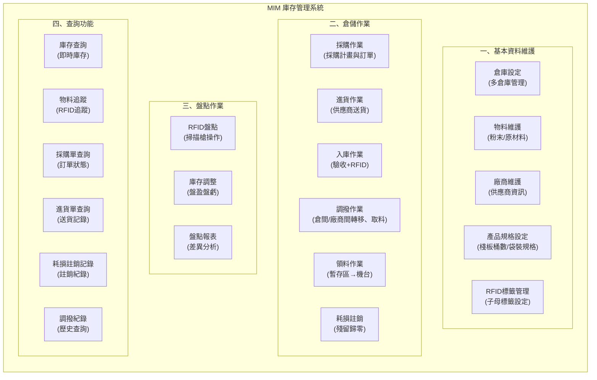

### 2.2 前後端整合架構圖（WTMPLUS）

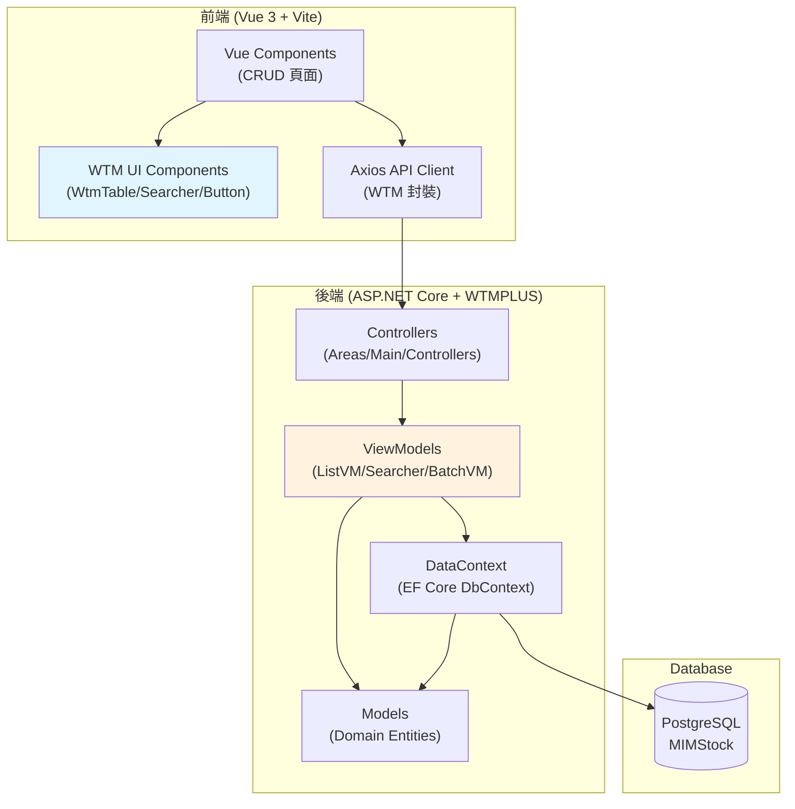

**架構說明**
1. **前端**：使用 Vue3 Composition API + WTM 專用組件（WtmTable、WtmSearcher 等）
2. **後端**：WTM ViewModel 模式，自動處理 CRUD 操作
3. **API**：Controller 直接返回 ViewModel 結果，自動序列化為 JSON
4. **資料層**：EF Core + PostgreSQL

### 2.3 模組依賴關係圖（WTMPLUS）

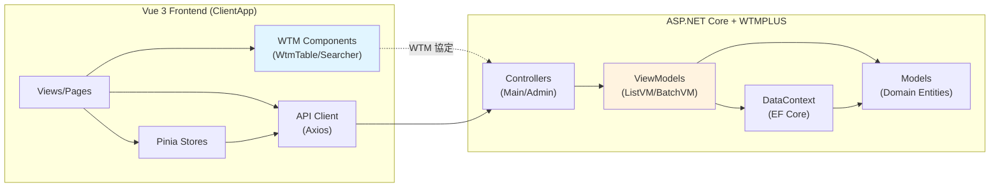

### 2.4 資料流程概觀

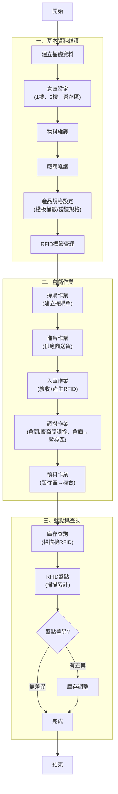

### 2.5 採購到入庫流程圖

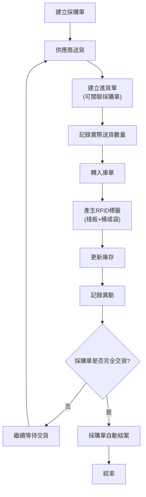

**流程說明**：
1. **採購階段**：建立採購單，記錄預計訂購的物料、數量、價格、交期
2. **進貨階段**：供應商送貨時建立進貨單，記錄實際送貨數量（可多次交貨）
3. **入庫階段**：進貨單轉入庫單，產生RFID並更新庫存
4. **自動結案**：當採購單所有明細都已交貨完成時，系統自動將採購單標記為已結案
5. **直接入庫**：也支援不經過採購單，直接建立入庫單的流程（臨時採購）

---

## 3. 資料庫設計

> 資料庫：PostgreSQL (MIMStock_v3)

### 3.1 ER 關聯圖

```mermaid
erDiagram
    WAREHOUSE ||--o{ INVENTORY : contains
    VENDOR ||--o{ INVENTORY : supplies
    VENDOR ||--o{ PURCHASE_ORDER : purchase_from
    MATERIAL ||--o{ INVENTORY : stored
    MATERIAL ||--o{ MATERIAL_BRAND_SPEC : has
    BRAND ||--o{ MATERIAL_BRAND_SPEC : defines
    MATERIAL ||--o{ PALLET : has
    BRAND ||--o{ PALLET : from
    PALLET ||--o{ BUCKET : contains
    PALLET ||--o{ INVENTORY : tracks
    WAREHOUSE ||--o{ TRANSFER_ORDER : from
    WAREHOUSE ||--o{ TRANSFER_ORDER : to
    PURCHASE_ORDER ||--o{ DELIVERY_ORDER : delivers
    DELIVERY_ORDER ||--o{ RECEIVING_ORDER : converts_to
    WAREHOUSE ||--o{ RECEIVING_ORDER : receives
    WAREHOUSE ||--o{ ISSUING_ORDER : issues
    WAREHOUSE ||--o{ WRITE_OFF_RECORD : write_off_from
    INVENTORY_CHECK_ORDER ||--o{ INVENTORY_CHECK_DETAIL : contains
    PURCHASE_ORDER ||--o{ PURCHASE_DETAIL : contains
    DELIVERY_ORDER ||--o{ DELIVERY_DETAIL : contains
    
    WAREHOUSE {
      long id PK
      string warehouse_code
      string warehouse_c_name
      string warehouse_v_name
        string location
        boolean is_active
    }
    
    VENDOR {
      long id PK
      string vendor_code
      string vendor_c_name
      string vendor_v_name
        string contact_info
        boolean is_active
    }
    
    MATERIAL {
      long id PK
      string material_code
      string material_c_name
      string material_v_name
        string material_spec
        string unit
        decimal unit_price
        boolean is_active
    }
    
    BRAND {
      long id PK
      string brand_code
      string brand_c_name
      string brand_v_name
        string country
        boolean is_active
    }
    
    MATERIAL_BRAND_SPEC {
      long id PK
        int material_id FK
        int brand_id FK
        string spec_type
        int buckets_per_pallet
        decimal weight_per_bag
        boolean use_pallet_system
    }
    
    PURCHASE_ORDER {
      long id PK
      string purchase_no
      int vendor_id FK
      date purchase_date
      date expected_delivery_date
      decimal total_amount
      boolean is_closed
    }
    
    PURCHASE_DETAIL {
      long id PK
      int purchase_id FK
      int material_id FK
      int brand_id FK
      decimal ordered_qty
      decimal unit_price
      decimal delivered_qty
    }
    
    DELIVERY_ORDER {
      long id PK
      string delivery_no
      int purchase_id FK
      int vendor_id FK
      date delivery_date
      string status
    }
    
    DELIVERY_DETAIL {
      long id PK
      int delivery_id FK
      int purchase_detail_id FK
      int material_id FK
      int brand_id FK
      decimal delivery_qty
    }
    
    RECEIVING_ORDER {
      long id PK
      string diff_voucherno
      int warehouse_id FK
      int vendor_id FK
      int delivery_id FK
      date receiving_date
    }
    
    PALLET {
      long id PK
        string pallet_rfid
        int material_id FK
        int brand_id FK
        int vendor_id FK
        int warehouse_id FK
        string status
        datetime created_at
    }
    
    BUCKET {
      long id PK
        string bucket_rfid
        int pallet_id FK
        decimal weight
        boolean is_active
    }
    
    INVENTORY {
      long id PK
        int warehouse_id FK
        int material_id FK
        int vendor_id FK
        int pallet_id FK
        int bucket_id FK
        decimal quantity
        string unit
        datetime updated_at
    }
    
    TRANSFER_ORDER {
      long id PK
        string diff_voucherno
        int from_warehouse_id FK
        int to_warehouse_id FK
        int from_vendor_id FK
        int to_vendor_id FK
        datetime transfer_date
        string status
    }
    
    RECEIVING_ORDER {
      long id PK
        string diff_voucherno
        int warehouse_id FK
        int vendor_id FK
        datetime receiving_date
        string status
    }
    
    ISSUING_ORDER {
      long id PK
        string diff_voucherno
        int warehouse_id FK
        string destination
        string machine_no
        datetime issuing_date
        string status
    }
    
    INVENTORY_CHECK_ORDER {
      long id PK
        string diff_voucherno
        int warehouse_id FK
        datetime stocktaking_date
        string status
        int total_scanned
    }
    
    INVENTORY_CHECK_DETAIL {
      long id PK
        int inventory_check_id FK
        string rfid_code
        decimal scanned_qty
        decimal system_qty
        decimal variance
    }
    
    WRITE_OFF_RECORD {
      long id PK
        string diff_voucherno
        int warehouse_id FK
        int material_id FK
        int vendor_id FK
        string bucket_rfid
        decimal write_off_weight
        string write_off_reason
        date write_off_date
    }
```

### 3.2 資料表規格

#### 3.2.1 warehouse（倉庫主檔）
| 欄位名稱 | 型別 | 說明 | 備註 |
|----------|------|------|------|
| id | BIGSERIAL | 倉庫ID | PK |
| warehouse_code | VARCHAR(255) | 倉庫代碼 | UNIQUE, NOT NULL |
| warehouse_c_name | VARCHAR(255) | 倉庫中文名稱 | NULLABLE |
| warehouse_v_name | VARCHAR(255) | 倉庫越南文名稱 | NULLABLE |
| location | VARCHAR(50) | 位置（1樓/2樓/3樓） | |
| vendor_id | LONG | 廠商ID | FK
| warehouse_type | INT | 倉庫類型 | STORAGE/STAGING |
| create_by | VARCHAR(50) | 建立人員 | |
| create_time | TIMESTAMP | 建立時間 | |
| update_by | VARCHAR(50) | 更新人員 | |
| update_time | TIMESTAMP | 更新時間 | |

#### 3.2.2 brand（廠牌主檔）
| 欄位名稱 | 型別 | 說明 | 備註 |
|----------|------|------|------|
| id | BIGSERIAL | 廠牌ID | PK |
| brand_code | VARCHAR(50) | 廠牌代碼 | UNIQUE, NOT NULL |
| brand_c_name | VARCHAR(100) | 廠牌中文名稱 | NULLABLE |
| brand_v_name | VARCHAR(100) | 廠牌越南文名稱 | NULLABLE |
| country | VARCHAR(50) | 產地/國家 | 廠牌所在國家 |
| create_by | VARCHAR(50) | 建立人員 | |
| create_time | TIMESTAMP | 建立時間 | |
| update_by | VARCHAR(50) | 更新人員 | |
| update_time | TIMESTAMP | 更新時間 | |

#### 3.2.3 vendor（廠商主檔）
| 欄位名稱 | 型別 | 說明 | 備註 |
|----------|------|------|------|
| id | BIGSERIAL | 廠商ID | PK |
| vendor_code | VARCHAR(255) | 廠商代碼 | UNIQUE, NOT NULL |
| vendor_c_name | VARCHAR(255) | 廠商中文名稱 | NULLABLE |
| vendor_v_name | VARCHAR(255) | 廠商越南文名稱 | NULLABLE |
| contact_person | VARCHAR(100) | 聯絡人 | |
| contact_phone | VARCHAR(50) | 聯絡電話 | |
| contact_email | VARCHAR(100) | 聯絡Email | |
| create_by | VARCHAR(50) | 建立人員 | |
| create_time | TIMESTAMP | 建立時間 | |
| update_by | VARCHAR(50) | 更新人員 | |
| update_time | TIMESTAMP | 更新時間 | |

#### 3.2.4 material（物料主檔）
| 欄位名稱 | 型別 | 說明 | 備註 |
|----------|------|------|------|
| id | BIGSERIAL | 物料ID | PK |
| material_code | VARCHAR(50) | 物料代碼 | UNIQUE, NOT NULL |
| material_c_name | VARCHAR(100) | 物料中文名稱 | NULLABLE |
| material_v_name | VARCHAR(100) | 物料越南文名稱 | NULLABLE |
| material_spec | VARCHAR(200) | 物料規格 | |
| unit | VARCHAR(10) | 單位 | KG/G/L |
| unit_price | DECIMAL(18,2) | 單價 | |
| minimum_stock | DECIMAL(18,3) | 最低庫存量 | 低於此值時警示 |
| create_by | VARCHAR(50) | 建立人員 | |
| create_time | TIMESTAMP | 建立時間 | |
| update_by | VARCHAR(50) | 更新人員 | |
| update_time | TIMESTAMP | 更新時間 | |

#### 3.2.5 material_brand_spec（物料廠牌規格設定）
| 欄位名稱 | 型別 | 說明 | 備註 |
|----------|------|------|------|
| id | BIGSERIAL | 規格ID | PK |
| material_id | INT | 物料ID | FK |
| brand_id | INT | 廠牌ID | FK |
| spec_type | VARCHAR(20) | 規格類型 | PALLET/BAG/SPECIAL |
| buckets_per_pallet | INT | 每棧板桶數 | spec_type=PALLET時使用 |
| weight_per_bucket | DECIMAL(18,3) | 每桶重量(kg) | spec_type=PALLET時使用 |
| weight_per_bag | DECIMAL(18,3) | 每袋重量(kg) | spec_type=BAG時使用 |
| is_pallet | BOOLEAN | 使用子母標籤 | PALLET=true, BAG=false |
| remark | TEXT | 備註 | |
| create_by | VARCHAR(50) | 建立人員 | |
| create_time | TIMESTAMP | 建立時間 | |
| update_by | VARCHAR(50) | 更新人員 | |
| update_time | TIMESTAMP | 更新時間 | |

**說明**
- material_id + brand_id 組合唯一
- 一個物料可對應多個廠牌，每個廠牌有不同的包裝規格

#### 3.2.6 pallet（棧板主檔-母標籤）
| 欄位名稱 | 型別 | 說明 | 備註 |
|----------|------|------|------|
| id | BIGSERIAL | 棧板ID | PK |
| pallet_rfid | VARCHAR(100) | 棧板RFID | UNIQUE, NOT NULL |
| material_id | INT | 物料ID | FK |
| brand_id | INT | 廠牌ID | FK |
| vendor_id | INT | 廠商ID | FK |
| warehouse_id | INT | 所在倉庫ID | FK |
| status | VARCHAR(20) | 狀態 | ACTIVE/EMPTY/TRANSFERRED |
| is_unsealed | BOOLEAN | 是否已拆封 | DEFAULT FALSE，true表示已拆封可貼桶標籤 |
| unsealed_at | TIMESTAMP | 拆封時間 | 拆封作業時記錄 |
| unsealed_by | VARCHAR(50) | 拆封人員 | 拆封作業時記錄 |
| create_by | VARCHAR(50) | 建立人員 | |
| create_time | TIMESTAMP | 建立時間 | |
| update_by | VARCHAR(50) | 更新人員 | |
| update_time | TIMESTAMP | 更新時間 | |

#### 3.2.7 bucket（桶主檔-子標籤 / 袋裝標籤）
| 欄位名稱 | 型別 | 說明 | 備註 |
|----------|------|------|------|
| id | BIGSERIAL | 桶ID/袋ID | PK |
| bucket_rfid | VARCHAR(100) | 桶RFID/袋RFID | UNIQUE, NOT NULL |
| pallet_id | INT | 所屬棧板ID | FK, nullable（袋裝為null）|
| material_id | INT | 物料ID | FK |
| initial_weight | DECIMAL(18,3) | 初始重量(kg) | |
| current_weight | DECIMAL(18,3) | 當前重量(kg) | |
| warehouse_id | INT | 所在倉庫ID | FK |
| container_type | VARCHAR(20) | 容器類型 | BUCKET/BAG |
| status | VARCHAR(20) | 狀態 | FULL/PARTIAL/EMPTY/WRITTEN_OFF |
| label_printed | BOOLEAN | 標籤是否已列印 | DEFAULT FALSE，袋裝入庫時為true，棧板制拆封時才為true |
| label_printed_at | TIMESTAMP | 標籤列印時間 | |
| create_time | TIMESTAMP | 建立時間 | |
| create_by | VARCHAR(50) | 建立人員 | NULLABLE |
| update_by | VARCHAR(50) | 更新人員 | NULLABLE |
| update_time | TIMESTAMP | 更新時間 | |

**說明**
- 棧板制：pallet_id有值，container_type=BUCKET
- 袋裝：pallet_id=null，container_type=BAG

#### 3.2.8 inventory（庫存主檔）
| 欄位名稱 | 型別 | 說明 | 備註 |
|----------|------|------|------|
| id | BIGSERIAL | 庫存ID | PK |
| warehouse_id | INT | 倉庫ID | FK |
| material_id | INT | 物料ID | FK |
| vendor_id | INT | 廠商ID | FK |
| qty | DECIMAL(18,3) | 總庫存數量 | 彙總數據 |
| unit | VARCHAR(10) | 單位 | KG/G/PCS |
| create_by | VARCHAR(50) | 建立人員 | |
| create_time | TIMESTAMP | 建立時間 | |
| update_by | VARCHAR(50) | 更新人員 | |
| update_time | TIMESTAMP | 更新時間 | |

唯一鍵：(warehouse_id, material_id, vendor_id)

#### 3.2.9 purchase_order（採購單）
| 欄位名稱 | 型別 | 說明 | 備註 |
|----------|------|------|------|
| id | BIGSERIAL | 採購單ID | PK |
| purchase_no | VARCHAR(50) | 採購單號 | UNIQUE, NOT NULL, 格式：PUR-YYYYMMDD-XXX |
| vendor_id | INT | 供應商ID | FK |
| purchase_date | DATE | 採購日期 | |
| expected_delivery_date | DATE | 預計交貨日期 | |
| total_amount | DECIMAL(18,2) | 採購總金額 | |
| is_closed | BOOLEAN | 是否已結案 | DEFAULT FALSE |
| is_valid | BOOLEAN | 是否有效 | DEFAULT TRUE，FALSE表示已刪除 |
| remark | TEXT | 備註 | |
| create_by | VARCHAR(50) | 建立人員 | |
| create_time | TIMESTAMP | 建立時間 | |
| update_by | VARCHAR(50) | 更新人員 | |
| update_time | TIMESTAMP | 更新時間 | |

**說明**：
- is_closed = FALSE：未結案（可修改、可刪除）
- is_closed = TRUE：已結案（不可修改、不可刪除）
- 結案方式：手動結案或當所有明細都已完成進貨時自動結案

#### 3.2.10 purchase_detail（採購明細）
| 欄位名稱 | 型別 | 說明 | 備註 |
|----------|------|------|------|
| id | BIGSERIAL | 明細ID | PK |
| purchase_id | INT | 採購單ID | FK |
| material_id | INT | 物料ID | FK |
| brand_id | INT | 廠牌ID | FK |
| ordered_qty | DECIMAL(18,3) | 訂購數量 | |
| unit | VARCHAR(10) | 單位 | KG/G/L |
| unit_price | DECIMAL(18,2) | 單價 | |
| delivered_qty | DECIMAL(18,3) | 已交貨數量 | 累計進貨數量 |
| subtotal | DECIMAL(18,2) | 小計 | ordered_qty × unit_price |

#### 3.2.11 delivery_order（進貨單）
| 欄位名稱 | 型別 | 說明 | 備註 |
|----------|------|------|------|
| id | BIGSERIAL | 進貨單ID | PK |
| delivery_no | VARCHAR(50) | 進貨單號 | UNIQUE, NOT NULL, 格式：DEL-YYYYMMDD-XXX |
| purchase_id | INT | 採購單ID | FK, NULLABLE（允許無採購單直接進貨） |
| vendor_id | INT | 供應商ID | FK |
| delivery_date | DATE | 送貨日期 | |
| is_valid | BOOLEAN | 是否有效 | DEFAULT TRUE，FALSE表示已刪除 |
| remark | TEXT | 備註 | |
| create_by | VARCHAR(50) | 建立人員 | |
| create_time | TIMESTAMP | 建立時間 | |
| update_by | VARCHAR(50) | 更新人員 | |
| update_time | TIMESTAMP | 更新時間 | |

**說明**：
- 儲存即生效，無狀態欄位（與入庫單設計一致）
- 可轉為入庫單，轉入庫後在receiving_order記錄delivery_id
- 可修改、可刪除（檢查是否已轉入庫）

#### 3.2.12 delivery_detail（進貨明細）
| 欄位名稱 | 型別 | 說明 | 備註 |
|----------|------|------|------|
| id | BIGSERIAL | 明細ID | PK |
| delivery_id | INT | 進貨單ID | FK |
| purchase_detail_id | INT | 採購明細ID | FK, NULLABLE（允許無採購單） |
| material_id | INT | 物料ID | FK |
| brand_id | INT | 廠牌ID | FK |
| delivery_qty | DECIMAL(18,3) | 送貨數量 | |
| unit | VARCHAR(10) | 單位 | KG/G/L |

#### 3.2.13 receiving_order（入庫單）
| 欄位名稱 | 型別 | 說明 | 備註 |
|----------|------|------|------|
| id | BIGSERIAL | 入庫單ID | PK |
| diff_voucherno | VARCHAR(50) | 入庫單號 | UNIQUE, NOT NULL |
| warehouse_id | INT | 入庫倉庫ID | FK |
| vendor_id | INT | 廠商ID | FK，從倉庫自動帶入 |
| delivery_id | INT | 進貨單ID | FK, NULLABLE（允許直接入庫） |
| receiving_date | DATE | 入庫日期 | |
| is_valid | BOOLEAN | 是否有效 | DEFAULT TRUE，FALSE表示已刪除 |
| remark | TEXT | 備註 | |
| create_by | VARCHAR(50) | 建立人員 | |
| create_time | TIMESTAMP | 建立時間 | |
| update_by | VARCHAR(50) | 更新人員 | |
| update_time | TIMESTAMP | 更新時間 | |

**說明**：
- 儲存即入庫，不需要status欄位
- vendor_id從warehouse表自動帶入，確保倉庫與廠商的對應關係
- delivery_id為NULLABLE，支援兩種入庫方式：
  - 從進貨單轉入庫（有delivery_id）
  - 直接入庫（delivery_id為NULL）

#### 3.2.14 receiving_detail（入庫明細）
| 欄位名稱 | 型別 | 說明 | 備註 |
|----------|------|------|------|
| id | BIGSERIAL | 明細ID | PK |
| receiving_id | INT | 入庫單ID | FK |
| material_id | INT | 物料ID | FK |
| brand_id | INT | 廠牌ID | FK |
| pallet_rfid | VARCHAR(100) | 棧板RFID | 棧板制時使用，袋裝時為NULL |
| bucket_rfid | VARCHAR(100) | 桶/袋RFID | 袋裝時使用，棧板制時為NULL |
| quantity | DECIMAL(18,3) | 數量 | 棧板制=該棧板總重量，袋裝=該袋重量 |
| unit | VARCHAR(10) | 單位 | |

**明細粒度說明**
- **棧板制（spec_type=PALLET）**：每筆明細代表**一個完整棧板**（包含該棧板下的所有桶）
  - pallet_rfid 有值（例：PALLET-20260130-001）
  - bucket_rfid 為 NULL
  - quantity = buckets_per_pallet × weight_per_bucket（該棧板總重量）
  - 例：1個棧板有10桶，每桶25kg，則 quantity = 250kg
  
- **袋裝（spec_type=BAG）**：每筆明細代表**一個袋子**
  - pallet_rfid 為 NULL
  - bucket_rfid 有值（例：BAG-20260130-001）
  - quantity = 該袋實際重量（通常等於 weight_per_bag，最後一袋可能較少）
  - 例：每袋10kg，最後一袋5kg

#### 3.2.15 transfer_order（調撥單）
| 欄位名稱 | 型別 | 說明 | 備註 |
|----------|------|------|------|
| id | BIGSERIAL | 調撥單ID | PK |
| diff_voucherno | VARCHAR(50) | 調撥單號 | UNIQUE, NOT NULL |
| from_warehouse_id | INT | 調出倉庫ID | FK |
| to_warehouse_id | INT | 調入倉庫ID | FK |
| from_vendor_id | INT | 調出廠商ID | FK |
| to_vendor_id | INT | 調入廠商ID | FK |
| transfer_date | DATE | 調撥日期 | |
| is_valid | BOOLEAN | 是否有效 | DEFAULT TRUE，FALSE表示已刪除 |
| remark | TEXT | 備註 | |
| create_by | VARCHAR(50) | 建立人員 | |
| create_time | TIMESTAMP | 建立時間 | |
| update_by | VARCHAR(50) | 更新人員 | |
| update_time | TIMESTAMP | 更新時間 | |

**說明**：儲存即執行調撥，不需要status欄位

#### 3.2.16 transfer_detail（調撥明細）
| 欄位名稱 | 型別 | 說明 | 備註 |
|----------|------|------|------|
| id | BIGSERIAL | 明細ID | PK |
| transfer_id | INT | 調撥單ID | FK |
| material_id | INT | 物料ID | FK |
| vendor_id | INT | 廠商ID | FK |
| pallet_rfid | VARCHAR(100) | 棧板RFID | 棧板調撥時使用，桶調撥時為NULL |
| bucket_rfid | VARCHAR(100) | 桶RFID | 桶調撥時使用，棧板調撥時為NULL |
| quantity | DECIMAL(18,3) | 數量 | |
| unit | VARCHAR(10) | 單位 | |

#### 3.2.17 issuing_order（領料單）
| 欄位名稱 | 型別 | 說明 | 備註 |
|----------|------|------|------|
| id | BIGSERIAL | 領料單ID | PK |
| diff_voucherno | VARCHAR(50) | 領料單號 | UNIQUE, NOT NULL |
| warehouse_id | INT | 倉庫ID（暫存區） | FK |
| issuing_date | DATE | 領料日期 | |
| destination | VARCHAR(50) | 目的地 | 機台A/機台B等 |
| machine_no | VARCHAR(50) | 機台編號 | 必填 |
| issued_by | VARCHAR(50) | 領料人員 | |
| is_valid | BOOLEAN | 是否有效 | DEFAULT TRUE，FALSE表示已刪除 |
| remark | TEXT | 備註 | |
| create_by | VARCHAR(50) | 建立人員 | |
| create_time | TIMESTAMP | 建立時間 | |
| update_by | VARCHAR(50) | 更新人員 | |
| update_time | TIMESTAMP | 更新時間 | |

**說明**：儲存即執行領料，不需要status欄位

#### 3.2.18 issuing_detail（領料明細）
| 欄位名稱 | 型別 | 說明 | 備註 |
|----------|------|------|------|
| id | BIGSERIAL | 明細ID | PK |
| issuing_id | INT | 領料單ID | FK |
| material_id | INT | 物料ID | FK |
| vendor_id | INT | 廠商ID | FK |
| bucket_rfid | VARCHAR(100) | 桶RFID | |
| issued_weight | DECIMAL(18,6) | 領出重量(g) | 最小單位g，實際領出的重量 |
| unit | VARCHAR(10) | 單位 | G |

#### 3.2.19 write_off_record（註銷記錄）
| 欄位名稱 | 型別 | 說明 | 備註 |
|----------|------|------|------|
| id | BIGSERIAL | 註銷記錄ID | PK |
| diff_voucherno | VARCHAR(50) | 註銷單號 | UNIQUE, NOT NULL |
| warehouse_id | INT | 倉庫ID | FK |
| material_id | INT | 物料ID | FK |
| vendor_id | INT | 廠商ID | FK |
| bucket_rfid | VARCHAR(100) | 桶RFID | |
| write_off_weight | DECIMAL(18,6) | 註銷重量(g) | 當作耗損歸零的重量 |
| write_off_reason | TEXT | 註銷原因 | 例：包裝沾黏、實際已空但有殘留數據等 |
| write_off_date | DATE | 註銷日期 | |
| create_by | VARCHAR(50) | 建立人員 | |
| create_time | TIMESTAMP | 建立時間 | |
| remark | TEXT | 備註 | |

#### 3.2.20 inventory_check_order（盤點單）
| 欄位名稱 | 型別 | 說明 | 備註 |
|----------|------|------|------|
| id | BIGSERIAL | 盤點單ID | PK |
| diff_voucherno | VARCHAR(50) | 盤點單號 | UNIQUE, NOT NULL |
| warehouse_id | INT | 盤點倉庫ID | FK |
| stocktaking_date | DATE | 盤點日期 | |
| status | VARCHAR(20) | 狀態 | IN_PROGRESS/COMPLETED/ADJUSTED |
| is_valid | BOOLEAN | 是否有效 | DEFAULT TRUE，FALSE表示已刪除 |
| total_scanned | INT | 總掃描數 | |
| remark | TEXT | 備註 | |
| create_by | INT | 建立人員 | |
| create_time | TIMESTAMP | 建立時間 | |

#### 3.2.21 inventory_check_detail（盤點明細）
| 欄位名稱 | 型別 | 說明 | 備註 |
|----------|------|------|------|
| id | BIGSERIAL | 明細ID | PK |
| inventory_check_id | INT | 盤點單ID | FK |
| rfid_type | VARCHAR(20) | RFID類型 | PALLET/BUCKET |
| rfid_code | VARCHAR(100) | RFID代碼 | |
| material_id | INT | 物料ID | FK |
| vendor_id | INT | 廠商ID | FK |
| scanned_qty | DECIMAL(18,3) | 掃描數量 | |
| system_qty | DECIMAL(18,3) | 系統數量 | |
| variance | DECIMAL(18,3) | 差異量 | scanned_qty - system_qty |
| scanned_at | TIMESTAMP | 掃描時間 | |

#### 3.2.22 pallet_unseal_record（棧板拆封記錄）
| 欄位名稱 | 型別 | 說明 | 備註 |
|----------|------|------|------|
| id | BIGSERIAL | 拆封記錄ID | PK |
| unseal_no | VARCHAR(50) | 拆封單號 | UNIQUE, NOT NULL, 格式：UNSEAL-YYYYMMDD-XXX |
| pallet_id | INT | 棧板ID | FK |
| pallet_rfid | VARCHAR(100) | 棧板RFID | 冗餘欄位，方便查詢 |
| warehouse_id | INT | 倉庫ID | FK |
| material_id | INT | 物料ID | FK |
| vendor_id | INT | 廠商ID | FK |
| bucket_count | INT | 桶數 | 該棧板的桶數 |
| unseal_date | DATE | 拆封日期 | |
| unseal_reason | TEXT | 拆封原因 | 例如：準備領料使用、盤點需要等 |
| created_by | VARCHAR(50) | 拆封人員 | |
| created_at | TIMESTAMP | 拆封時間 | |
| remark | TEXT | 備註 | |

#### 3.2.23 inventory_movements（庫存異動紀錄）
| 欄位名稱 | 型別 | 說明 | 備註 |
|----------|------|------|------|
| id | BIGSERIAL | 記錄ID | PK |
| transaction_type | VARCHAR(20) | 異動類型 | RECEIVING/TRANSFER/ISSUING/ADJUST/WRITE_OFF |
| diff_code | VARCHAR(50) | 參考單號 | 單據號碼（如入庫單號、轉移單號） |
| main_id | BIGINT | 單據主表ID | FK，對應各單據的主表 ID（receiving_order/transfer_order/issuing_order） |
| dtl_id | BIGINT | 單據明細ID | FK，對應各單據的明細表 ID |
| warehouse_id | INT | 倉庫ID | FK |
| material_id | INT | 物料ID | FK |
| vendor_id | INT | 廠商ID | FK |
| adflag | TINYINT | 增減標誌 | 1=增加、2=減少 |
| qty | DECIMAL(18,3) | 異動數量 | 正數，實際增減數量 |
| pallet_rfid | VARCHAR(100) | 棧板RFID | 若有棧板異動 |
| bucket_rfid | VARCHAR(100) | 桶RFID | 若有桶異動 |
| rfid_code | VARCHAR(100) | RFID代碼 | 通用RFID字段 |
| created_by | VARCHAR(50) | 操作人員 | |
| created_at | TIMESTAMP | 異動時間 | |

**追蹤邏輯：**
- `main_id` 對應關係：
  - RECEIVING → receiving_order.id
  - TRANSFER → transfer_order.id
  - ISSUING → issuing_order.id
  - ADJUST → inventory_check_order.id
  - WRITE_OFF → write_off_record.id
- `dtl_id` 對應各單據的明細表 ID（receiving_detail.id / transfer_detail.id 等）
- 透過 `main_id` 和 `dtl_id` 可直接追蹤某筆異動來自於哪個單據的哪一筆明細

**軟刪除規則：**
- 作業單設有 `is_valid` 欄位（DEFAULT TRUE）
- 當 `is_valid=FALSE` 時，表示該單據已被刪除（軟刪除）
- 查詢作業單時應加上條件 `WHERE is_valid=TRUE`
- 已完成的單據若需刪除，設為 `is_valid=FALSE` 但保留歷史紀錄用於審計追蹤

---

## 4. 模組說明

### 4.1 Domain（領域模型）

- Entities：
  - Warehouse（倉庫）
  - Vendor（廠商）
  - Material（物料）
  - Brand（廠牌）
  - MaterialBrandSpec（物料廠牌規格 - 支援不同廠牌規格）
  - Pallet（棧板-母標籤）
  - Bucket（桶-子標籤）
  - Inventory（庫存）
  - ReceivingOrder（入庫單）
  - TransferOrder（調撥單）
  - IssuingOrder（領料單）
  - InventoryCheckOrder（盤點單）
  - InventoryMovement（庫存異動紀錄）
  - WriteOffRecord（耗損註銷記錄）

- Enums：
  - WarehouseType（STORAGE=儲存倉, STAGING=暫存區）
  - SpecType（PALLET=棧板制, BAG=袋裝, SPECIAL=特殊規格）
  - PalletStatus（ACTIVE=使用中, EMPTY=棧板上已無桶, TRANSFERRED=已調撥）
  - PalletUnsealStatus（SEALED=未拆封, UNSEALED=已拆封）
  - BucketStatus（FULL=滿桶, PARTIAL=部分使用, EMPTY=空桶, WRITTEN_OFF=已註銷）
  - DocumentStatus（DRAFT=草稿, CONFIRMED=已確認, COMPLETED=已完成）
  - TransactionType（RECEIVING=入庫, TRANSFER=調撥, ISSUING=領料, ADJUST=盤點調整, WRITE_OFF=註銷）
  - IssuingDestination（MACHINE=機台）
  - RfidType（PALLET=棧板RFID, BUCKET=桶RFID, BAG=袋裝RFID）
  - ContainerType（BUCKET=桶裝, BAG=袋裝）

- Domain Rules：
  - 庫存不得為負（除非設定允許超領）
  - 領料只能從暫存區領出
  - 最小領料單位為克(g)
  - 同一棧板的桶必須屬於相同物料和廠商
  - **棧板拆封規則**：
    - 入庫時棧板制只列印棧板標籤（母標籤），桶標籤（子標籤）暫不列印
    - 入庫時袋裝制直接列印所有袋標籤（無拆封問題）
    - 棧板必須拆封後才能列印桶標籤
    - 已拆封的棧板不可重複拆封
    - 拆封作業會記錄拆封時間、人員、原因
  - 調撥支援同倉庫不同廠商的轉換
  - RFID 唯一性（pallet_rfid、bucket_rfid、bag_rfid 不可重複）
  - 袋裝規格不使用子母標籤系統（無母標籤，每袋獨立RFID）
  - 袋裝RFID數量 = 總重量 / 每袋重量（向上取整）
  - **廠牌規格管理**：廠牌作為獨立主檔，支援多個物料採用同一廠牌規格，保證廠牌信息統一
  - **物料廠牌規格多對多**：一個物料可對應多個廠牌規格，一個廠牌可被多個物料使用
  - **不同廠牌物料支援不同規格**：通過 `material_brand_specs` 表管理，棧板、袋裝等配置按廠牌區分
  - **庫存主檔只記錄彙總數據**：`inventory` 表儲存 (warehouse, material, vendor) 的總和，不存儲個別 RFID 記錄
  - **子母標籤狀態管理規則（Q1-Q7决策）**：
    - **棧板狀態轉移（Q1）**：領料單COMPLETED時，系統自動判斷該棧板上的桶是否已全部取出；若所有子桶均已取出（EMPTY或WRITTEN_OFF），則自動改為EMPTY
    - **棧板EMPTY的定義**：棧板上物理上已無桶（所有子桶均已取出或報廢），不以桶內是否有料為判定依據
    - **桶狀態自動更新（Q3）**：領料單COMPLETED時自動扣除領出重量，若current_weight變為0則改為EMPTY；若current_weight>0但<initial_weight則改為PARTIAL；更新updated_at和updated_by
    - **袋裝邏輯（Q7）**：袋裝（container_type=BAG, pallet_id=NULL）的狀態轉移邏輯與棧板制相同（FULL/PARTIAL/EMPTY/WRITTEN_OFF），領料後自動扣除重量並改狀態
    - **報廢（WRITTEN_OFF）處理（Q6）**：發現桶/袋損壞、報廢可直接改為WRITTEN_OFF；若懷疑遺失需先查詢系統確認未被記錄領出
    - **盤點不一致處理（Q4）**：盤點單COMPLETED時自動掃描比對，發現系統與實際不符時，自動檢測並提示異常（如系統FULL但掃描為EMPTY、或系統記錄100kg但實際80kg）；由用戶判斷是否修正current_weight、改status或改為WRITTEN_OFF
    - **EMPTY棧板生命週期（Q5）**：棧板EMPTY為終態，不需系統自動處理回收；現場人員查看系統發現空棧板時會自行處理
  - **庫存預留機制（Q9）**：不使用預留機制（reserved_qty字段保留但不使用），直接判斷是否有足夠的桶/袋可領，領料時不得超過系統可用庫存
  - **庫存警示規則**：
    - 當物料庫存 < 最低庫存量時，自動標記為庫存不足狀態
    - 嚴重等級：當前庫存 < 最低庫存量 × 50%
    - 警告等級：當前庫存 < 最低庫存量且 ≥ 最低庫存量 × 50%
    - 系統首頁即時顯示庫存不足數量
    - 掃描查詢時若庫存不足，立即顯示警示訊息

### 4.2 Infrastructure（EF Core / Repository）

- `MimStockDbContext`：映射資料表
- Migration：採用 `dotnet ef migrations add InitialCreate_v3`
- Repository（可選）：
  - WarehouseRepository
  - VendorRepository
  - MaterialRepository
  - ProductRepository
  - InventoryRepository
  - RfidRepository（棧板、桶RFID管理）
  - DocumentRepository（各種單據）
  - UnitOfWork（交易管理）

### 4.3 Application（UseCases / Services）

對應業務邏輯層：
- **基本資料服務**
  - WarehouseService（倉庫管理）
  - VendorService（廠商管理）
  - MaterialService（物料管理）
  - ProductService（產品與規格設定）
  - RfidService（RFID標籤管理）

- **倉儲作業服務**
  - ReceivingService（入庫作業）
  - TransferService（調撥作業，含取料）
  - IssuingService（領料作業）

- **盤點服務**
  - InventoryCheckService（盤點作業）
  - InventoryAdjustmentService（庫存調整）

- **查詢服務**
  - InventoryQueryService（庫存查詢）
  - MaterialTrackingService（物料追蹤）
  - WriteOffRecordService（耗損註銷記錄）
  - ReportService（報表匯出）

- **MAUI行動應用支援服務**
  - MobileSyncService（離線數據同步）
  - DeviceAuthService（裝置認證）

### 4.4 作業自動化邏輯（根據 Q3、Q4 決策）

#### 4.4.1 領料單完成時的自動更新流程（Q3 決策 - C1：完全自動）

**觸發條件**：issuing_order.status 改為 COMPLETED

**自動執行步驟**（事務內，確保原子性）：

1. **逐筆處理領料明細**
   ```
   FOR EACH issuing_detail d WHERE issuing_id = ?:
     
     // 查詢該桶的當前信息
     bucket b = SELECT * FROM bucket WHERE bucket_rfid = d.bucket_rfid
     
     // 扣除領出重量（d.issued_weight 單位為 g，轉換為 kg）
     new_weight = b.current_weight - (d.issued_weight / 1000)
     
     // 根據新重量判斷狀態
     IF new_weight <= 0:
       b.status = 'EMPTY'
       b.current_weight = 0
     ELSE IF new_weight < b.initial_weight:
       b.status = 'PARTIAL'
       b.current_weight = new_weight
     ELSE:
       b.current_weight = new_weight  // 保持原狀態（通常不會發生）
     
     // 更新桶記錄
     UPDATE bucket SET 
       current_weight = new_weight,
       status = b.status,
       updated_at = NOW(),
       updated_by = current_user
     WHERE id = b.id
   
     // 檢查該桶所屬的棧板
     IF b.pallet_id IS NOT NULL:
       // 統計棧板上還有多少活動桶（非 EMPTY 和非 WRITTEN_OFF）
       active_bucket_count = SELECT COUNT(*) FROM bucket 
                             WHERE pallet_id = b.pallet_id 
                             AND status NOT IN ('EMPTY', 'WRITTEN_OFF')
       
       IF active_bucket_count = 0:
         // 所有子桶都已取空或報廢，棧板改為 EMPTY
         UPDATE pallet SET 
           status = 'EMPTY',
           updated_at = NOW(),
           updated_by = current_user
         WHERE id = b.pallet_id
   ```

2. **記錄庫存異動審計日誌**
   ```
   INSERT INTO inventory_movements (
     transaction_type, main_id, dtl_id, 
     material_id, pallet_rfid, bucket_rfid,
     adflag, qty, from_warehouse_id, to_warehouse_id,
     balance_after, created_at, created_by
   ) VALUES (
     'ISSUING',              // transaction_type
     issuing_id,             // main_id
     dtl_id,                 // dtl_id
     d.material_id,          // material_id
     b.pallet_rfid,          // pallet_rfid（若有）
     d.bucket_rfid,          // bucket_rfid
     2,                      // adflag = 2 表示減少
     d.issued_weight,        // 領出數量（g）
     warehouse_id,           // from_warehouse_id（暫存區）
     NULL,                   // to_warehouse_id（機台無庫位）
     new_weight * 1000,      // balance_after（轉為g）
     NOW(), 
     current_user
   )
   ```

3. **例外處理**
   ```
   異常情景 1：該桶不存在
   → 拋出異常：「桶RFID 無效或不存在：{bucket_rfid}」
   → 動作：回滾整個領料單，提示重新檢查
   
   異常情景 2：領出重量 > 當前庫存
   → 拋出異常：「領出重量 {issued_weight}g 超過現有 {current_weight}kg」
   → 動作：回滾整個領料單，提示修正數量
   
   異常情景 3：該桶已是 EMPTY 或 WRITTEN_OFF
   → 警告（可選）：「該桶已無可用重量」
   → 動作：允許繼續（值為 0），但記錄異常日誌
   
   所有異常均觸發回滾，保證數據一致性
   ```

#### 4.4.2 盤點異常檢測與提示（Q4 決策 - D3：智能模式）

**觸發條件**：inventory_check_order.status 改為 COMPLETED

**自動執行步驟**：

1. **掃描與系統數據對比**
   ```
   FOR EACH inventory_check_detail d WHERE inventory_check_id = ?:
     
     // 查詢系統中該 RFID 的記錄
     bucket b = SELECT * FROM bucket 
                WHERE bucket_rfid = d.bucket_rfid
                AND warehouse_id = inventory_check_order.warehouse_id
     
     IF b IS NULL:
       // 掃到系統無記錄的桶
       discrepancy_type = 'UNKNOWN_RFID'
       异常 = {
         rfid: d.bucket_rfid,
         issue: '系統無此桶記錄',
         scanned_qty: d.scanned_qty,
         system_qty: NULL
       }
     ELSE:
       // 比較重量
       system_qty = b.current_weight
       scanned_qty = d.scanned_qty
       difference = ABS(scanned_qty - system_qty)
       
       tolerance = 0.5  // 允許偏差 0.5kg
       
       IF difference > tolerance:
         discrepancy_type = 'WEIGHT_MISMATCH'
         reason = (scanned_qty > system_qty) 
                  ? '實際重量大於系統記錄' 
                  : '實際重量小於系統記錄'
         异常 = {
           rfid: d.bucket_rfid,
           issue: reason,
           system_qty: system_qty,
           scanned_qty: scanned_qty,
           difference: difference,
           system_status: b.status
         }
       
       ELSE IF (system_status = 'FULL') AND (scanned_qty ≈ 0):
         discrepancy_type = 'STATUS_MISMATCH'
         异常 = {
           rfid: d.bucket_rfid,
           issue: '系統記錄為 FULL，但掃描已空',
           system_status: 'FULL',
           scanned_qty: 0
         }
   ```

2. **異常分類與提示訊息**
   ```
   【異常類型 1】系統有記錄，但掃描不到 RFID
   ├─ 原因：位置錯誤、遺失、報廢、不掃
   ├─ 系統提示：「系統記錄此桶在倉庫，但無法掃到，是否已遺失？」
   └─ 用戶選項：
      ☐ 標記為遺失 → status = WRITTEN_OFF
      ☐ 標記為位置錯誤 → 重新檢查位置
      ☐ 保留原記錄 → 稍後再查
   
   【異常類型 2】系統 FULL，掃描為 EMPTY
   ├─ 原因：記錄有誤、已被領出但未更新
   ├─ 系統提示：「系統記錄此桶為滿（XXkg），但掃描已空」
   └─ 用戶選項：
      ☐ 修正為 EMPTY → UPDATE bucket SET status = 'EMPTY', current_weight = 0
      ☐ 標記為報廢 → status = WRITTEN_OFF
      ☐ 保留 → 稍後追查
   
   【異常類型 3】重量不符（系統 100kg，掃描 80kg）
   ├─ 原因：領料記錄不完整、計量誤差、包裝滲漏
   ├─ 系統提示：「重量差異 20kg（系統 100kg，掃描 80kg），是否修正？」
   └─ 用戶選項：
      ☐ 修正系統：UPDATE bucket SET current_weight = 80
      ☐ 調查原因：稍後追查遺失 20kg 的去向
      ☐ 保留 → 不修改系統值
   
   【異常類型 4】掃到系統無記錄的 RFID
   ├─ 原因：新桶、標籤混亂、系統未同步
   ├─ 系統提示：「掃到未知 RFID，建議檢查標籤或建檔」
   └─ 用戶選項：
      ☐ 新建桶記錄（需選擇物料、廠商等）
      ☐ 忽略 → 不納入系統
   ```

3. **用戶決策與執行**
   ```
   用戶在盤點頁面逐個審視異常，選擇處理方式：
   
   當用戶點擊「確認修正」時：
   
   // 根據用戶選擇，更新 bucket
   IF user_choice = '修正為EMPTY':
     UPDATE bucket SET status = 'EMPTY', current_weight = 0 WHERE id = ?
   ELSE IF user_choice = '標記為遺失':
     UPDATE bucket SET status = 'WRITTEN_OFF', updated_at = NOW() WHERE id = ?
   ELSE IF user_choice = '修正重量':
     UPDATE bucket SET current_weight = user_input_weight WHERE id = ?
   
   // 記錄盤點調整到 inventory_movements
   INSERT INTO inventory_movements (
     transaction_type = 'ADJUST',
     main_id = inventory_check_id,
     bucket_rfid = d.bucket_rfid,
     adflag = ?,  // 1=增加 2=減少（根據調整方向）
     qty = difference_weight,
     remark = '盤點調整：' + user_reason
   )
   
   // 更新 inventory_check_detail 記錄決策
   INSERT INTO inventory_check_detail (
     inventory_check_id, rfid_code, scanned_qty,
     system_qty, variance, scanned_at
   )
   ```

4. **盤點完成統計**
   ```
   UPDATE inventory_check_order SET 
     total_scanned = ?,
     status = 'COMPLETED',
     created_at = NOW()
   WHERE id = ?
   ```

**Q4 選擇說明（D3 - 智能模式的優勢）**：
- ✅ 自動檢測，不卡住流程
- ✅ 智能提示，指引用戶決策
- ✅ 靈活處理，用戶有充分自主權
- ✅ 完整審計，每個決策都有記錄
- ✅ 逐步修正，無需一次到位

### 4.5 API（Controllers）

- REST endpoints + DTO
- Swagger/OpenAPI 自動產生文件與測試介面
- 支援掃描槍專用API（快速查詢、快速操作）

### 4.5 Frontend（Vue 3 - PC端管理介面）

- Pages 對應功能模組
  - 基本資料維護頁面
  - 入庫/調撥/領料作業頁面（單據建立與管理）
  - 盤點作業管理頁面
  - 庫存查詢與報表頁面
- Pinia 管理狀態
- Axios 封裝 API
- 響應式設計（支援各種螢幕尺寸）

### 4.6 Mobile App（.NET MAUI - 掃描槍專用應用）

- **MVVM 架構**
  - Pages：XAML UI 頁面
  - ViewModels：業務邏輯與狀態管理
  - Models：資料模型

- **核心功能**
  - 庫存查詢（掃描RFID即時查詢）
  - 調撥作業（掃描RFID、輸入倉庫廠商產品數量，含取料）
  - 盤點作業（掃描累計、即時差異顯示）
  - 領料作業（掃描+重量輸入）

- **Services**
  - ScannerService：整合條碼掃描器（ZXing.Net.Maui）
  - ApiService：HTTP Client 封裝
  - StorageService：本地資料暫存（SQLite）
  - SyncService：離線同步機制

- **平台支援**
  - Android（主要平台，支援工業級掃描槍）
  - Windows（測試與開發用）

---

## 5. 功能規格

> 本章詳細說明各功能模組的操作流程與業務邏輯。

### 5.0 首頁儀表板（Dashboard）

**功能說明**
- 系統首頁顯示關鍵庫存資訊
- 提供快速導航和警示提醒
- 即時數據統計

**儀表板區塊**

1. **庫存警示卡片**（重要提示區）
   - 🔴 嚴重不足數量：顯示庫存 < 最低庫存量 50% 的物料數
   - 🟡 警告不足數量：顯示庫存 < 最低庫存量但 ≥ 50% 的物料數
   - 點擊可跳轉至庫存不足查詢頁面

2. **庫存統計卡片**
   - 總倉庫數
   - 總物料種類數
   - 總庫存價值
   - 今日異動單據數

3. **快速操作按鈕**
   - 掃描查詢
   - 入庫作業
   - 調撥作業
   - 領料作業
   - 盤點作業

4. **最近異動紀錄**（表格）
   - 顯示最近10筆庫存異動
   - 包含時間、類型、物料、倉庫、數量

**UI 範例（Vue 3）**
```vue
<template>
  <div class="dashboard">
    <el-row :gutter="20">
      <!-- 庫存警示卡片 -->
      <el-col :span="6">
        <el-card class="alert-card critical" @click="goToLowStock('CRITICAL')">
          <div class="card-content">
            <div class="icon">🔴</div>
            <div class="info">
              <div class="label">嚴重庫存不足</div>
              <div class="value">{{ criticalCount }}</div>
            </div>
          </div>
        </el-card>
      </el-col>
      
      <el-col :span="6">
        <el-card class="alert-card warning" @click="goToLowStock('WARNING')">
          <div class="card-content">
            <div class="icon">🟡</div>
            <div class="info">
              <div class="label">庫存警告</div>
              <div class="value">{{ warningCount }}</div>
            </div>
          </div>
        </el-card>
      </el-col>
      
      <!-- 其他統計卡片 -->
      <el-col :span="6">
        <el-card class="info-card">
          <div class="card-content">
            <div class="label">總物料種類</div>
            <div class="value">{{ totalMaterials }}</div>
          </div>
        </el-card>
      </el-col>
      
      <el-col :span="6">
        <el-card class="info-card">
          <div class="card-content">
            <div class="label">今日異動</div>
            <div class="value">{{ todayTransactions }}</div>
          </div>
        </el-card>
      </el-col>
    </el-row>
    
    <!-- 庫存不足詳細列表 -->
    <el-card class="low-stock-list" v-if="lowStockItems.length > 0">
      <template #header>
        <div class="card-header">
          <span>⚠️ 庫存不足提醒</span>
          <el-button type="primary" size="small" @click="goToLowStock()">
            查看全部
          </el-button>
        </div>
      </template>
      <el-table :data="lowStockItems" style="width: 100%">
        <el-table-column prop="materialName" label="物料名稱" />
        <el-table-column prop="warehouseName" label="倉庫" />
        <el-table-column prop="currentStock" label="當前庫存" />
        <el-table-column prop="minimumStock" label="最低庫存" />
        <el-table-column prop="shortage" label="缺口" />
        <el-table-column label="狀態">
          <template #default="{ row }">
            <el-tag :type="row.alertLevel === 'CRITICAL' ? 'danger' : 'warning'">
              {{ row.alertLevelText }}
            </el-tag>
          </template>
        </el-table-column>
      </el-table>
    </el-card>
  </div>
</template>
```

**API**
- `GET /api/dashboard/summary` - 取得儀表板統計數據
- `GET /api/dashboard/low-stock-preview` - 取得庫存不足預覽

---

### 5.1 一、基本資料維護

#### 5.1.1 倉庫設定
**功能說明**
- 維護倉庫基本資料（1樓倉、3樓倉、暫存區）
- 設定倉庫類型、位置等資訊

**新增/編輯倉庫處理細項**

**步驟1：開啟新增/編輯畫面**
- 點擊「新增」按鈕：開啟空白表單
- 點擊「編輯」按鈕：載入現有倉庫資料

**步驟2：填寫倉庫資料**

| 欄位名稱 | 欄位類型 | 必填 | 驗證規則 | 下拉資料來源 | 預設值 |
|---------|---------|------|---------|-------------|--------|
| 倉庫代碼 | 文字輸入框 | 是 | 1. 不可為空<br>2. 長度不超過50字元<br>3. 必須以"WH-"開頭<br>4. 系統唯一（不可重複） | - | 無 |
| 倉庫中文名稱 | 文字輸入框 | 是 | 1. 不可為空<br>2. 長度不超過100字元 | - | 無 |
| 倉庫越南文名稱 | 文字輸入框 | 否 | 長度不超過100字元 | - | 空值 |
| 位置 | 文字輸入框 | 否 | 長度不超過100字元 | - | 無 |
| 倉庫類型 | 下拉選單 | 是 | 必須選擇其中一個 | 固定選項：<br>STORAGE(儲存倉)<br>STAGING(暫存區) | STORAGE |
| 是否啟用 | 核取方塊 | - | - | - | true（勾選） |

**步驟3：驗證與提交**
- 點擊「確定」按鈕時執行驗證：
  1. 檢查必填欄位是否已填寫
  2. 檢查倉庫代碼格式（是否以WH-開頭）
  3. 檢查倉庫代碼是否重複
- 驗證通過：儲存資料並關閉對話框，重新載入列表
- 驗證失敗：顯示錯誤訊息，停留在表單

**步驟4：後端處理流程**
```
新增倉庫：
1. 檢查倉庫代碼唯一性（查詢資料庫）
2. 設定 created_at = 當前時間
3. 設定 created_by = 當前登入使用者
4. 設定 updated_at = 當前時間
5. 設定 updated_by = 當前登入使用者
6. 儲存至資料庫
7. 回傳成功訊息

編輯倉庫：
1. 查詢該倉庫資料
2. 檢查倉庫代碼唯一性（排除自己）
3. 更新 updated_at = 當前時間
4. 更新 updated_by = 當前登入使用者
5. 儲存至資料庫
6. 回傳成功訊息
```

**刪除倉庫處理細項**

**步驟1：檢查是否可刪除**
```sql
-- 檢查該倉庫是否有庫存資料
SELECT COUNT(*) FROM inventory WHERE warehouse_id = ?
```
- 如果有庫存資料：顯示錯誤訊息「此倉庫已有庫存資料，無法刪除」
- 如果沒有庫存資料：繼續刪除流程

**步驟2：確認刪除**
- 顯示確認對話框：「確定要刪除倉庫『XXX』嗎？」
- 點擊「確定」：執行刪除
- 點擊「取消」：取消刪除

**步驟3：執行刪除**
- 從資料庫永久刪除該筆倉庫資料
- 重新載入列表

**API**: 
- `GET /api/Main/Warehouse/Search` - 查詢倉庫列表
- `GET /api/Main/Warehouse/:id` - 取得單筆倉庫資料
- `POST /api/Main/Warehouse/Add` - 新增倉庫
- `PUT /api/Main/Warehouse/Edit` - 編輯倉庫
- `POST /api/Main/Warehouse/BatchDelete` - 刪除倉庫

#### 5.1.2 物料維護
**功能說明**
- 維護物料（粉末）基本資料
- 記錄物料規格、單位、單價等
- 設定最低庫存量用於庫存警示

**新增/編輯物料處理細項**

**步驟1：開啟新增/編輯畫面**
- 點擊「新增」按鈕：開啟空白表單
- 點擊「編輯」按鈕：載入現有物料資料

**步驟2：填寫物料資料**

| 欄位名稱 | 欄位類型 | 必填 | 驗證規則 | 下拉資料來源 | 預設值 |
|---------|---------|------|---------|-------------|--------|
| 物料代碼 | 文字輸入框 | 是 | 1. 不可為空<br>2. 長度不超過50字元<br>3. 系統唯一（不可重複） | - | 無 |
| 物料中文名稱 | 文字輸入框 | 是 | 1. 不可為空<br>2. 長度不超過100字元 | - | 無 |
| 物料越南文名稱 | 文字輸入框 | 否 | 長度不超過100字元 | - | 空值 |
| 物料規格 | 文字輸入框 | 否 | 長度不超過200字元 | - | 空值 |
| 單位 | 下拉選單 | 是 | 必須選擇其中一個 | 固定選項：<br>KG(公斤)<br>G(公克)<br>L(公升)<br>PCS(件) | KG |
| 單價 | 數字輸入框 | 否 | 1. 必須為數字<br>2. 最多2位小數<br>3. 不可為負數 | - | 0 |
| 最低庫存量 | 數字輸入框 | 否 | 1. 必須為數字<br>2. 最多3位小數<br>3. 不可為負數 | - | 0 |
| 是否啟用 | 核取方塊 | - | - | - | true（勾選） |

**單位下拉選單資料**
```json
[
  { "value": "KG", "text": "公斤(KG)" },
  { "value": "G", "text": "公克(G)" },
  { "value": "L", "text": "公升(L)" },
  { "value": "PCS", "text": "件(PCS)" }
]
```

**步驟3：最低庫存量說明**
- 最低庫存量設定後，系統會自動監控
- 當該物料的總庫存 < 最低庫存量時：
  - 在庫存查詢頁面顯示紅色警示標記
  - 在首頁儀表板顯示庫存不足警告
  - 在庫存不足查詢頁面列出

**步驟4：驗證與提交**
- 點擊「確定」按鈕時執行驗證：
  1. 檢查必填欄位是否已填寫
  2. 檢查物料代碼是否重複
  3. 檢查數字欄位格式是否正確
- 驗證通過：儲存資料並關閉對話框
- 驗證失敗：顯示錯誤訊息

**步驟5：後端處理流程**
```
新增物料：
1. 檢查物料代碼唯一性
2. 設定 created_at = 當前時間
3. 設定 created_by = 當前登入使用者
4. 設定 updated_at = 當前時間
5. 設定 updated_by = 當前登入使用者
6. 儲存至資料庫
7. 回傳成功訊息

編輯物料：
1. 查詢該物料資料
2. 檢查物料代碼唯一性（排除自己）
3. 更新 updated_at = 當前時間
4. 更新 updated_by = 當前登入使用者
5. 儲存至資料庫
6. 回傳成功訊息
```

**刪除物料處理細項**

**步驟1：檢查是否可刪除**
```sql
-- 檢查該物料是否有庫存
SELECT COUNT(*) FROM inventory WHERE material_id = ?
-- 檢查該物料是否有入庫記錄
SELECT COUNT(*) FROM receiving_detail WHERE material_id = ?
```
- 如果有相關資料：顯示錯誤訊息「此物料已有庫存或交易記錄，無法刪除」
- 如果沒有相關資料：繼續刪除流程

**步驟2：確認並執行刪除**
- 顯示確認對話框
- 從資料庫永久刪除
- 重新載入列表

**API**: 
- `GET /api/Main/Material/Search` - 查詢物料列表
- `GET /api/Main/Material/:id` - 取得單筆物料資料
- `POST /api/Main/Material/Add` - 新增物料
- `PUT /api/Main/Material/Edit` - 編輯物料
- `POST /api/Main/Material/BatchDelete` - 刪除物料
- `POST /api/Main/Material/Import` - 匯入Excel
- `GET /api/Main/Material/ExportExcel` - 匯出Excel

#### 5.1.3 廠商維護
**功能說明**
- 維護供應商資料
- 用於區分不同廠商的物料存放
- 管理廠商聯絡資訊

**新增/編輯廠商處理細項**

**步驟1：開啟新增/編輯畫面**
- 點擊「新增」按鈕：開啟空白表單
- 點擊「編輯」按鈕：載入現有廠商資料

**步驟2：填寫廠商資料**

| 欄位名稱 | 欄位類型 | 必填 | 驗證規則 | 下拉資料來源 | 預設值 |
|---------|---------|------|---------|-------------|--------|
| 廠商代碼 | 文字輸入框 | 是 | 1. 不可為空<br>2. 長度不超過50字元<br>3. 系統唯一（不可重複） | - | 無 |
| 廠商中文名稱 | 文字輸入框 | 是 | 1. 不可為空<br>2. 長度不超過100字元 | - | 無 |
| 廠商越南文名稱 | 文字輸入框 | 否 | 長度不超過100字元 | - | 空值 |
| 聯絡人 | 文字輸入框 | 否 | 長度不超過50字元 | - | 空值 |
| 聯絡電話 | 文字輸入框 | 否 | 1. 長度不超過50字元<br>2. 格式驗證（選用） | - | 空值 |
| 聯絡Email | 文字輸入框 | 否 | 1. 長度不超過100字元<br>2. Email格式驗證 | - | 空值 |
| 是否啟用 | 核取方塊 | - | - | - | true（勾選） |

**步驟3：驗證與提交**
- 點擊「確定」按鈕時執行驗證：
  1. 檢查必填欄位是否已填寫
  2. 檢查廠商代碼是否重複
  3. 檢查Email格式是否正確（若有填寫）
- 驗證通過：儲存資料並關閉對話框
- 驗證失敗：顯示錯誤訊息

**步驟4：後端處理流程**
```
新增廠商：
1. 檢查廠商代碼唯一性
2. 驗證Email格式（若有填寫）
3. 設定 created_at = 當前時間
4. 設定 created_by = 當前登入使用者
5. 設定 updated_at = 當前時間
6. 設定 updated_by = 當前登入使用者
7. 儲存至資料庫
8. 回傳成功訊息

編輯廠商：
1. 查詢該廠商資料
2. 檢查廠商代碼唯一性（排除自己）
3. 驗證Email格式（若有填寫）
4. 更新 updated_at = 當前時間
5. 更新 updated_by = 當前登入使用者
6. 儲存至資料庫
7. 回傳成功訊息
```

**刪除廠商處理細項**

**步驟1：檢查是否可刪除**
```sql
-- 檢查該廠商是否有庫存
SELECT COUNT(*) FROM inventory WHERE vendor_id = ?
-- 檢查該廠商是否有交易記錄
SELECT COUNT(*) FROM receiving_order WHERE vendor_id = ?
```
- 如果有相關資料：顯示錯誤訊息「此廠商已有庫存或交易記錄，無法刪除」
- 如果沒有相關資料：繼續刪除流程

**步驟2：確認並執行刪除**
- 顯示確認對話框
- 從資料庫永久刪除
- 重新載入列表

**API**: 
- `GET /api/Main/Vendor/Search` - 查詢廠商列表
- `GET /api/Main/Vendor/:id` - 取得單筆廠商資料
- `POST /api/Main/Vendor/Add` - 新增廠商
- `PUT /api/Main/Vendor/Edit` - 編輯廠商
- `POST /api/Main/Vendor/BatchDelete` - 刪除廠商
- `GET /api/Main/Vendor/GetSelectItems` - 取得廠商下拉選單資料

#### 5.1.4 廠牌維護
**功能說明**
- 維護物料廠牌資料
- 記錄廠牌產地、國家等資訊
- 用於區分不同來源的物料

**新增/編輯廠牌處理細項**

**步驟1：開啟新增/編輯畫面**
- 點擊「新增」按鈕：開啟空白表單
- 點擊「編輯」按鈕：載入現有廠牌資料

**步驟2：填寫廠牌資料**

| 欄位名稱 | 欄位類型 | 必填 | 驗證規則 | 預設值 |
|---------|---------|------|---------|--------|
| 廠牌代碼 | 文字輸入框 | 是 | 1. 不可為空<br>2. 長度不超過50字元<br>3. 系統唯一（不可重複） | 無 |
| 廠牌中文名稱 | 文字輸入框 | 是 | 1. 不可為空<br>2. 長度不超過100字元 | 無 |
| 廠牌越南文名稱 | 文字輸入框 | 否 | 長度不超過100字元 | 空值 |
| 產地/國家 | 文字輸入框 | 否 | 長度不超過50字元 | 空值 |
| 是否啟用 | 核取方塊 | - | - | true（勾選） |

**API**: 
- `GET /api/Main/Brand/Search` - 查詢廠牌列表
- `GET /api/Main/Brand/:id` - 取得單筆廠牌資料
- `POST /api/Main/Brand/Add` - 新增廠牌
- `PUT /api/Main/Brand/Edit` - 編輯廠牌
- `POST /api/Main/Brand/BatchDelete` - 刪除廠牌
- `GET /api/Main/Brand/GetSelectItems` - 取得廠牌下拉選單資料

#### 5.1.5 物料廠牌規格設定
**功能說明**
- 設定物料的包裝規格（依廠牌區分）
- 不同廠牌的同一物料可能有不同的包裝規格
- 設定棧板制或袋裝等規格
- 用於入庫時自動計算RFID標籤數量

**規格類型說明**

1. **棧板制（PALLET）**
   - 使用子母標籤系統
   - 設定每棧板桶數（例如：10桶/棧板）
   - 1個棧板RFID（母標籤）+ N個桶RFID（子標籤）
   - 入庫時列印：1個棧板標籤 + N個桶標籤

2. **袋裝（BAG）**
   - 不使用子母標籤系統（沒有母標籤）
   - 設定每袋重量
   - 計算方式：袋數 = 總重量 / 每袋重量（無條件進位）
   - 列印對應袋數的RFID標籤（例如：100kg總重 / 10kg每袋 = 10個袋裝RFID標籤）
   - 每個袋子獨立RFID，可單獨追蹤

3. **特殊規格（SPECIAL）**
   - 客製化規格
   - 視需求設定

**新增/編輯產品規格處理細項**

**步驟1：開啟新增/編輯畫面**
- 點擊「新增」按鈕：開啟空白表單
- 點擊「編輯」按鈕：載入現有產品規格資料

**步驟2：選擇物料和廠牌**

| 欄位名稱 | 欄位類型 | 必填 | 驗證規則 | 下拉資料來源 | 預設值 |
|---------|---------|------|---------|-------------|--------|
| 物料 | 下拉選單 | 是 | 必須選擇 | `GET /api/Main/Material/GetSelectItems`<br>回傳：物料列表<br>範例：<br>[{"value":1, "text":"MIM粉末A"}, <br>{"value":2, "text":"MIM粉末B"}] | 無 |
| 廠牌 | 下拉選單 | 是 | 必須選擇 | `GET /api/Main/Brand/GetSelectItems`<br>回傳：廠牌列表<br>範例：<br>[{"value":1, "text":"廠牌A"}, <br>{"value":2, "text":"廠牌B"}] | 無 |

**步驟3：選擇規格類型並填寫對應欄位**

| 欄位名稱 | 欄位類型 | 必填 | 驗證規則 | 顯示條件 | 預設值 |
|---------|---------|------|---------|----------|--------|
| 規格類型 | 下拉選單 | 是 | 必須選擇 | 永遠顯示 | PALLET |
| 每棧板桶數 | 數字輸入框 | 條件必填 | 1. 規格類型=PALLET時必填<br>2. 必須為正整數<br>3. 範圍：1-100 | 規格類型=PALLET時顯示 | 10 |
| 每桶重量(kg) | 數字輸入框 | 條件必填 | 1. 規格類型=PALLET時必填<br>2. 必須為正數<br>3. 最多3位小數 | 規格類型=PALLET時顯示 | 25.0 |
| 每袋重量(kg) | 數字輸入框 | 條件必填 | 1. 規格類型=BAG時必填<br>2. 必須為正數<br>3. 最多3位小數 | 規格類型=BAG時顯示 | 10.0 |
| 備註 | 多行文字框 | 否 | 長度不超過500字元 | 永遠顯示 | 空值 |

**說明**
- 同一個物料+廠牌組合只能有一個規格設定
- 不同廠牌的同一物料可以有不同規格（例如：廠牌A是10桶/棧板，廠牌B是12桶/棧板）

**規格類型下拉選單資料**
```json
[
  { "value": "PALLET", "text": "棧板制（子母標籤）" },
  { "value": "BAG", "text": "袋裝（獨立標籤）" },
  { "value": "SPECIAL", "text": "特殊規格" }
]
```

**步驟4：規格類型切換時的UI變化**
```
當使用者選擇規格類型時：

選擇「棧板制（PALLET）」：
  - 顯示「每棧板桶數」欄位（必填）
  - 顯示「每桶重量」欄位（必填）
  - 隱藏「每袋重量」欄位
  - 提示：「入庫時將產生1個棧板RFID + N個桶RFID」

選擇「袋裝（BAG）」：
  - 隱藏「每棧板桶數」欄位
  - 隱藏「每桶重量」欄位
  - 顯示「每袋重量」欄位（必填）
  - 提示：「入庫時根據總重量÷每袋重量計算袋數，產生對應數量的袋裝RFID」

選擇「特殊規格（SPECIAL）」：
  - 顯示所有欄位
  - 允許彈性設定
```

**步驟5：驗證與提交**
- 點擊「確定」按鈕時執行驗證：
  1. 檢查必填欄位是否已填寫
  2. 檢查該物料+廠牌組合是否已存在規格設定（新增時）
  3. 檢查數字欄位格式是否正確
  4. 根據規格類型檢查對應欄位是否已填寫
- 驗證通過：儲存資料並關閉對話框
- 驗證失敗：顯示錯誤訊息

**步驟6：後端處理流程**
```
新增物料廠牌規格：
1. 檢查該物料+廠牌組合是否已存在
2. 根據規格類型驗證必填欄位
3. 計算 is_pallet = (spec_type == 'PALLET')
4. 設定 created_at = 當前時間
5. 設定 created_by = 當前登入使用者
6. 儲存至資料庫 material_brand_spec 表
7. 回傳成功訊息

編輯物料廠牌規格：
1. 查詢該規格設定資料
2. 檢查物料+廠牌組合是否與其他記錄重複（排除自己）
3. 根據規格類型驗證必填欄位
4. 計算 is_pallet = (spec_type == 'PALLET')
5. 設定 updated_at = 當前時間
6. 設定 updated_by = 當前登入使用者
7. 儲存至資料庫
8. 回傳成功訊息
```

**入庫時如何使用規格設定**
```
當使用者在入庫單選擇物料和廠牌後：

1. 系統查詢對應的規格設定：
   SELECT * FROM material_brand_spec 
   WHERE material_id = ? AND brand_id = ?

2. 根據規格類型計算RFID數量：

   棧板制（PALLET）：
   - RFID標籤數 = 1個棧板RFID + buckets_per_pallet個桶RFID
   - 例如：每棧板10桶，則需列印11個RFID（1個母標籤 + 10個子標籤）

   袋裝（BAG）：
   - 袋數 = CEILING(總重量 / weight_per_bag)
   - RFID標籤數 = 袋數（無母標籤）
   - 例如：總重量105kg，每袋10kg，則需列印11個袋裝RFID

3. 產生RFID編號並列印標籤
```

**API**: 
- `GET /api/Main/MaterialBrandSpec/Search` - 查詢物料廠牌規格列表
- `GET /api/Main/MaterialBrandSpec/:id` - 取得單筆規格資料
- `POST /api/Main/MaterialBrandSpec/Add` - 新增規格
- `PUT /api/Main/MaterialBrandSpec/Edit` - 編輯規格
- `POST /api/Main/MaterialBrandSpec/BatchDelete` - 刪除規格
- `GET /api/Main/MaterialBrandSpec/GetByMaterialAndBrand?materialId=&brandId=` - 根據物料和廠牌取得規格

#### 5.1.6 RFID標籤管理
**功能說明**
- 管理棧板RFID（母標籤）
- 管理桶RFID（子標籤）
- 管理袋裝RFID（獨立標籤）
- 建立子母標籤關聯
- 查詢RFID使用狀態

**RFID編碼規則**

| 類型 | 編碼格式 | 範例 | 說明 |
|------|---------|------|------|
| 棧板RFID（母標籤） | PALLET-YYYYMMDD-XXX | PALLET-20260130-001 | 前綴+日期+流水號 |
| 桶RFID（子標籤） | BUCKET-YYYYMMDD-XXX | BUCKET-20260130-001 | 前綴+日期+流水號 |
| 袋裝RFID（獨立標籤） | BAG-YYYYMMDD-XXX | BAG-20260130-001 | 前綴+日期+流水號 |

**RFID產生邏輯**
```
1. 取得當前日期：YYYYMMDD
2. 查詢當日該類型的最大流水號：
   SELECT MAX(CAST(SUBSTRING(rfid, -3) AS INTEGER)) 
   FROM bucket 
   WHERE rfid LIKE 'BUCKET-20260130-%'
3. 計算新流水號 = 最大流水號 + 1
4. 組合RFID = 類型前綴 + '-' + 日期 + '-' + 補零流水號
   例如：BUCKET-20260130-025
```

**棧板RFID查詢功能**

**查詢條件**
- 棧板RFID（支援模糊搜尋）
- 物料
- 廠牌
- 廠商
- 所在倉庫
- 棧板狀態（ACTIVE/EMPTY/TRANSFERRED）

**查詢結果顯示**
- 棧板RFID
- 物料名稱
- 廠牌名稱
- 廠商名稱
- 所在倉庫
- 棧板狀態
- 建立時間
- 子桶數量（關聯的桶數）
- 操作按鈕：查看子桶、查看歷史

**桶RFID查詢功能**

**查詢條件**
- 桶RFID（支援模糊搜尋）
- 所屬棧板RFID
- 物料
- 所在倉庫
- 容器類型（BUCKET/BAG）
- 桶狀態（FULL/PARTIAL/EMPTY/WRITTEN_OFF）

**查詢結果顯示**
- 桶RFID
- 所屬棧板RFID（若為棧板制）
- 物料名稱
- 初始重量
- 當前重量
- 所在倉庫
- 容器類型
- 桶狀態
- 建立時間
- 操作按鈕：查看歷史、查看母標籤

**子母標籤關聯查詢**

**步驟1：輸入棧板RFID**
- 使用掃描槍掃描或手動輸入棧板RFID

**步驟2：查詢關聯的子桶**
```sql
SELECT b.bucket_rfid, b.initial_weight, b.current_weight, 
       b.status, b.created_at, m.material_c_name, w.warehouse_c_name
FROM bucket b
LEFT JOIN pallet p ON b.pallet_id = p.id
LEFT JOIN material m ON b.material_id = m.id
LEFT JOIN warehouse w ON b.warehouse_id = w.id
WHERE p.pallet_rfid = ?
ORDER BY b.created_at
```

**步驟3：顯示結果**
- 棧板資訊（頂部卡片）：
  - 棧板RFID
  - 物料名稱
  - 所在倉庫
  - 棧板狀態
  - 子桶總數
- 子桶列表（表格）：
  - 桶RFID
  - 初始重量
  - 當前重量
  - 桶狀態
  - 建立時間

**RFID歷史記錄查詢**

**步驟1：輸入RFID**
- 支援棧板RFID、桶RFID、袋裝RFID

**步驟2：查詢異動歷史**
```sql
SELECT transaction_type, diff_code, warehouse_id, 
       adflag, qty, created_at, created_by
FROM inventory_movements
WHERE pallet_rfid = ? OR bucket_rfid = ? OR rfid_code = ?
ORDER BY created_at DESC
```

**步驟3：顯示歷史記錄**
- 異動時間
- 異動類型（入庫/調撥/領料/註銷/盤點調整）
- 參考單號（可點擊查看單據詳情）
- 倉庫
- 增減標誌（增加/減少）
- 異動數量
- 操作人員

**RFID標籤列印（入庫時自動處理）**

入庫作業中會自動：
1. 根據產品規格設定計算RFID數量
2. 產生RFID編號（棧板+桶 或 純袋裝）
3. 呼叫列印服務列印標籤
4. 將RFID資料寫入資料庫

**API**: 
- `GET /api/Main/Pallet/Search` - 查詢棧板RFID列表
- `GET /api/Main/Pallet/:id` - 取得棧板詳情
- `GET /api/Main/Pallet/GetBuckets/:palletRfid` - 取得棧板的所有子桶
- `GET /api/Main/Bucket/Search` - 查詢桶RFID列表
- `GET /api/Main/Bucket/:id` - 取得桶詳情
- `GET /api/Main/Bucket/GetHistory/:rfid` - 取得RFID歷史記錄
- `POST /api/Main/Rfid/GenerateCodes` - 產生RFID編號（入庫時使用）

---

### 5.2 二、倉儲作業

#### 5.2.1 採購作業

**作業流程**
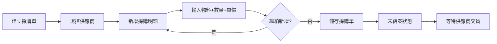

**功能說明**
- 建立採購單，向供應商訂購物料
- 記錄採購計畫：物料、數量、單價、預計交期
- 儲存即生效，無需審核或確認
- 追蹤交貨進度（訂購數量、已進貨數量、未進數量）
- 未結案的採購單可修改和刪除
- 已結案的採購單不可修改和刪除
- 可查詢採購單執行狀況

**新增採購單處理細項**

**步驟1：建立採購單表頭**

| 欄位名稱 | 欄位類型 | 必填 | 驗證規則 | 下拉資料來源 | 預設值 |
|---------|---------|------|---------|-------------|--------|
| 採購單號 | 文字顯示 | - | 自動產生（PUR-YYYYMMDD-XXX） | - | 自動產生 |
| 採購日期 | 日期選擇器 | 是 | 不可為空 | - | 今日 |
| 供應商 | 下拉選單 | 是 | 必須選擇 | `GET /api/Main/Vendor/GetSelectItems` | 無 |
| 預計交貨日期 | 日期選擇器 | 是 | 不可早於採購日期 | - | 採購日期+7天 |
| 備註 | 多行文字框 | 否 | - | - | 空值 |

**步驟2：新增採購明細**

| 欄位名稱 | 欄位類型 | 必填 | 驗證規則 |
|---------|---------|------|---------|
| 物料 | 下拉選單 | 是 | 必須選擇 |
| 廠牌 | 下拉選單 | 是 | 必須選擇 |
| 訂購數量 | 數字輸入框 | 是 | 必須大於0 |
| 單位 | 文字顯示 | - | 自動帶入物料單位 |
| 單價 | 數字輸入框 | 是 | 必須大於或等於0 |
| 小計 | 文字顯示 | - | 自動計算（數量×單價） |

**步驟3：儲存採購單**

```
POST /api/Main/Purchase/Add

請求參數：
{
  "purchase_no": "PUR-20260203-001",
  "vendor_id": 1,
  "purchase_date": "2026-02-03",
  "expected_delivery_date": "2026-02-10",
  "remark": "",
  "details": [
    {
      "material_id": 1,
      "brand_id": 1,
      "ordered_qty": 1000,
      "unit": "KG",
      "unit_price": 50.00
    }
  ]
}

系統處理（交易內）：

1. 驗證必填欄位
2. 驗證至少有一筆明細
3. 驗證預計交貨日期不可早於採購日期

4. 新增採購單主檔：
   INSERT INTO purchase_order (
     purchase_no, vendor_id,
     purchase_date, expected_delivery_date,
     total_amount, is_closed, is_valid,
     created_by, created_at
   ) VALUES (?, ?, ?, ?, ?, FALSE, TRUE, ?, NOW())

5. 逐筆新增採購明細：
   FOR EACH detail:
     subtotal = detail.ordered_qty × detail.unit_price
     total_amount += subtotal
     
     INSERT INTO purchase_detail (
       purchase_id, material_id, brand_id,
       ordered_qty, unit, unit_price,
       delivered_qty, subtotal
     ) VALUES (
       purchase_id, material_id, brand_id,
       ordered_qty, unit, unit_price,
       0,  -- delivered_qty 初始為 0
       subtotal
     )

6. 更新採購單總金額：
   UPDATE purchase_order 
   SET total_amount = ?
   WHERE id = purchase_id

7. COMMIT 交易

8. 回傳採購單資訊

回應：
{
  "success": true,
  "message": "採購單建立成功",
  "purchase_id": 123,
  "purchase_no": "PUR-20260203-001"
}
```

**步驟4：修改採購單**（僅未結案狀態）

```
PUT /api/Main/Purchase/Edit/:id

請求參數：
{
  "id": 1,
  "purchase_date": "2026-02-03",
  "expected_delivery_date": "2026-02-10",
  "remark": "修改後的備註",
  "details": [
    {
      "id": 1,  // 既有明細
      "material_id": 1,
      "brand_id": 1,
      "ordered_qty": 1200,  // 修改數量
      "unit": "KG",
      "unit_price": 55.00   // 修改單價
    },
    {
      "id": null,  // 新增明細
      "material_id": 2,
      "brand_id": 2,
      "ordered_qty": 500,
      "unit": "KG",
      "unit_price": 60.00
    }
  ]
}

系統處理（交易內）：

1. 驗證採購單 is_closed = FALSE（只有未結案可以修改）
2. 找出要刪除的明細並刪除
3. 更新既有明細的數量和單價
4. 新增新明細
5. 重新計算total_amount
6. 更新主檔
```

**步驟5：結案採購單**

手動結案或自動結案（當所有明細都已完成進貨時）：

```
POST /api/Main/Purchase/Close/:id

系統處理：
1. 更新 is_closed = TRUE
2. 記錄結案時間和結案人

UPDATE purchase_order 
SET 
  is_closed = TRUE,
  updated_at = NOW(),
  updated_by = current_user
WHERE id = ? AND is_closed = FALSE
```

**自動結案邏輯**（當進貨單更新時觸發）：
```
// 檢查該採購單是否所有明細都已完全進貨
all_delivered = (
  SELECT COUNT(*) = 0 
  FROM purchase_detail 
  WHERE purchase_id = ? AND ordered_qty > delivered_qty
)

IF all_delivered:
  UPDATE purchase_order 
  SET is_closed = TRUE
  WHERE id = ?
```

#### 5.2.2 進貨作業

**作業流程**
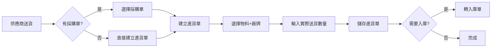

**功能說明**
- 記錄供應商實際送貨資訊
- 支援兩種模式：
  - 從採購單建立進貨單（有計畫的採購）
  - 直接建立進貨單（臨時採購）
- 記錄實際送貨數量
- 儲存即生效，無需審核
- 可轉入庫單
- 自動更新採購單交貨進度
- 未轉入庫的進貨單可修改和刪除

**新增進貨單處理細項**

**步驟1：建立進貨單表頭**

| 欄位名稱 | 欄位類型 | 必填 | 驗證規則 | 下拉資料來源 | 預設值 |
|---------|---------|------|---------|-------------|--------|
| 進貨單號 | 文字顯示 | - | 自動產生（DEL-YYYYMMDD-XXX） | - | 自動產生 |
| 送貨日期 | 日期選擇器 | 是 | 不可為空 | - | 今日 |
| 供應商 | 下拉選單 | 是 | 必須選擇 | `GET /api/Main/Vendor/GetSelectItems` | 無 |
| 關聯採購單 | 下拉選單 | 否 | 可選擇 | `GET /api/Main/Purchase/GetPendingOrders?vendorId=1` | 無 |
| 備註 | 多行文字框 | 否 | - | - | 空值 |

**步驟2：新增進貨明細**

**情境A：從採購單帶入（有關聯採購單）**

當使用者選擇採購單後：
```
GET /api/Main/Purchase/GetPendingItems/:purchaseId

回應：
{
  "purchase_no": "PUR-20260203-001",
  "vendor_name": "供應商甲",
  "items": [
    {
      "purchase_detail_id": 1,
      "material_id": 1,
      "material_name": "MIM粉末A",
      "brand_id": 1,
      "brand_name": "廠牌A",
      "ordered_qty": 1000,
      "delivered_qty": 500,
      "pending_qty": 500,  // 未交數量 = 訂購數量 - 已交數量
      "unit": "KG"
    }
  ]
}
```

系統自動列出未交貨項目，使用者輸入本次送貨數量：

| 欄位名稱 | 欄位類型 | 必填 | 驗證規則 |
|---------|---------|------|---------|
| 物料 | 文字顯示 | - | 自動帶入 |
| 廠牌 | 文字顯示 | - | 自動帶入 |
| 訂購數量 | 文字顯示 | - | 顯示參考 |
| 已交數量 | 文字顯示 | - | 顯示參考 |
| 未交數量 | 文字顯示 | - | 顯示參考 |
| 本次送貨數量 | 數字輸入框 | 是 | 必須大於0且不可超過未交數量 |
| 單位 | 文字顯示 | - | 自動帶入 |

**驗證規則**：
```javascript
// 本次送貨數量驗證
function validateDeliveryQty(qty, pendingQty) {
  if (qty <= 0) {
    return "送貨數量必須大於0";
  }
  if (qty > pendingQty) {
    return `送貨數量不可超過未交數量 ${pendingQty}`;
  }
  return null;
}
```

**情境B：直接輸入（無採購單）**

| 欄位名稱 | 欄位類型 | 必填 | 驗證規則 |
|---------|---------|------|---------|
| 物料 | 下拉選單 | 是 | 必須選擇 |
| 廠牌 | 下拉選單 | 是 | 必須選擇 |
| 送貨數量 | 數字輸入框 | 是 | 必須大於0 |
| 單位 | 文字顯示 | - | 自動帶入物料單位 |

**步驟3：儲存進貨單**

```
POST /api/Main/Delivery/Add

請求參數：
{
  "delivery_no": "DEL-20260203-001",
  "vendor_id": 1,
  "purchase_id": 123,  // 可為null
  "delivery_date": "2026-02-03",
  "remark": "",
  "details": [
    {
      "purchase_detail_id": 456,  // 如果有採購單
      "material_id": 1,
      "brand_id": 1,
      "delivery_qty": 500,
      "unit": "KG"
    }
  ]
}

系統處理（交易內）：

1. 驗證必填欄位
2. 驗證至少有一筆明細
3. 如果有關聯採購單，驗證送貨數量不超過未交數量

4. 新增進貨單主檔：
   INSERT INTO delivery_order (
     delivery_no, vendor_id, purchase_id,
     delivery_date, is_valid,
     created_by, created_at
   ) VALUES (?, ?, ?, ?, TRUE, ?, NOW())

5. 逐筆新增進貨明細：
   FOR EACH detail:
     INSERT INTO delivery_detail (
       delivery_id, purchase_detail_id, 
       material_id, brand_id,
       delivery_qty, unit
     ) VALUES (?, ?, ?, ?, ?, ?)

6. 如果有關聯採購單，更新採購明細的已交數量：
   IF purchase_id IS NOT NULL:
     FOR EACH detail WITH purchase_detail_id:
       UPDATE purchase_detail
       SET delivered_qty = delivered_qty + detail.delivery_qty
       WHERE id = detail.purchase_detail_id
     
     // 檢查是否所有明細都已完全交貨，自動結案
     all_delivered = (
       SELECT COUNT(*) = 0 
       FROM purchase_detail 
       WHERE purchase_id = ? AND ordered_qty > delivered_qty
     )
     
     IF all_delivered:
       UPDATE purchase_order 
       SET is_closed = TRUE
       WHERE id = purchase_id

7. COMMIT 交易

8. 回傳進貨單資訊

回應：
{
  "success": true,
  "message": "進貨單建立成功",
  "delivery_id": 789,
  "delivery_no": "DEL-20260203-001"
}
```

**步驟4：轉入庫單**

點擊「轉入庫」按鈕：

```
POST /api/Main/Delivery/ConvertToReceiving

請求參數：
{
  "delivery_id": 789,
  "warehouse_id": 1,
  "receiving_date": "2026-02-03"
}

系統處理（交易內）：

1. 驗證進貨單存在且 is_valid = TRUE
2. 檢查該進貨單是否已轉入庫（避免重複轉入庫）：
   existing = SELECT id FROM receiving_order WHERE delivery_id = ?
   IF existing IS NOT NULL:
     RETURN ERROR "此進貨單已轉入庫，不可重複轉入庫"

3. 建立入庫單主檔：
   INSERT INTO receiving_order (
     diff_voucherno, warehouse_id, vendor_id,
     delivery_id, receiving_date, is_valid,
     created_by, created_at
   ) VALUES (
     GenerateReceivingNo(),  // RCV-YYYYMMDD-XXX
     warehouse_id, 
     (SELECT vendor_id FROM delivery_order WHERE id = delivery_id),
     delivery_id, receiving_date, TRUE,
     current_user, NOW()
   )

4. 根據進貨明細建立入庫明細並產生RFID：
   （此處邏輯與入庫單完全相同，詳見 5.2.3 入庫作業）
   
   FOR EACH delivery_detail:
     // 取得物料廠牌規格
     spec = SELECT * FROM material_brand_spec 
            WHERE material_id = ? AND brand_id = ?
     
     IF spec.spec_type = 'PALLET':
       // 棧板制：產生棧板RFID和桶RFID
       // 計算棧板數
       pallet_count = CEILING(delivery_qty / (buckets_per_pallet × weight_per_bucket))
       
       FOR i = 1 TO pallet_count:
         pallet_rfid = GeneratePalletRFID()
         // 新增棧板記錄
         INSERT INTO pallet (...)
         
         // 產生桶RFID
         FOR j = 1 TO buckets_per_pallet:
           bucket_rfid = GenerateBucketRFID()
           INSERT INTO bucket (...)
         
         // 新增入庫明細（每個棧板一筆）
         INSERT INTO receiving_detail (...)
     
     ELSE IF spec.spec_type = 'BAG':
       // 袋裝：產生袋RFID
       bag_count = CEILING(delivery_qty / weight_per_bag)
       
       FOR i = 1 TO bag_count:
         bag_rfid = GenerateBagRFID()
         INSERT INTO bucket (...)
         INSERT INTO receiving_detail (...)

5. 更新或新增庫存：
   FOR EACH receiving_detail:
     existing = SELECT * FROM inventory 
                WHERE warehouse_id = ? AND material_id = ? AND vendor_id = ?
     
     IF existing:
       UPDATE inventory SET qty = qty + detail.quantity
     ELSE:
       INSERT INTO inventory (...)

6. 記錄庫存異動：
   FOR EACH receiving_detail:
     INSERT INTO inventory_movements (
       transaction_type = 'RECEIVING',
       adflag = 1,  -- 增加
       ...
     )

7. COMMIT 交易

8. 回傳入庫單資訊

回應：
{
  "success": true,
  "message": "已成功轉入庫單",
  "receiving_id": 456,
  "diff_voucherno": "RCV-20260203-001",
  "rfid_count": {
    "pallets": 4,
    "buckets": 40
  }
}
```

#### 5.2.3 入庫作業

**作業流程**
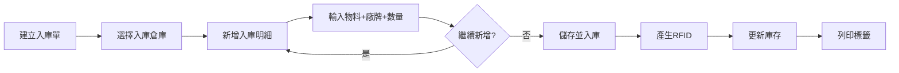

**功能說明**
- 建立入庫單，選擇入庫倉庫（廠商由倉庫自動帶入）
- 新增明細：選擇物料+廠牌，輸入數量（棧板數或總重量）
- 系統根據規格自動產生多筆明細（棧板制：每棧板一筆，袋裝：每袋一筆）
- 儲存時立即執行入庫：產生RFID、更新庫存、記錄異動
- 可列印RFID標籤（棧板制：僅棧板標籤，袋裝：所有袋標籤）
- 支援修改（新增/刪除明細）和刪除已入庫單據（需驗證RFID未被使用）

**新增入庫單處理細項**

**步驟1：建立入庫單表頭**

| 欄位名稱 | 欄位類型 | 必填 | 驗證規則 | 下拉資料來源 | 預設值 |
|---------|---------|------|---------|-------------|--------|
| 入庫單號 | 文字顯示 | - | 自動產生（RCV-YYYYMMDD-XXX） | - | 自動產生 |
| 入庫日期 | 日期選擇器 | 是 | 不可為空 | - | 今日 |
| 入庫倉庫 | 下拉選單 | 是 | 必須選擇 | `GET /api/Main/Warehouse/GetSelectItems`<br>範例：<br>[{"value":1, "text":"１樓倉", "vendor_id":1, "vendor_name":"廠商甲"}, <br>{"value":2, "text":"３樓倉", "vendor_id":2, "vendor_name":"廠商乙"}] | 無 |
| 所屬廠商 | 文字顯示 | - | 選擇倉庫後自動帶入 | - | 自動帶入 |
| 備註 | 多行文字框 | 否 | - | - | 空值 |

**操作說明**：
- 選擇入庫倉庫後，系統自動帶入該倉庫的所屬廠商
- 所屬廠商欄位為唯讀，不可編輯
- 如需更換廠商，請選擇其他倉庫

**步驟2：新增入庫明細（可多次新增不同物料）**

點擊「新增明細」按鈕，開啟明細輸入對話框：

| 欄位名稱 | 欄位類型 | 必填 | 驗證規則 | 下拉資料來源 | 預設值 |
|---------|---------|------|---------|-------------|--------|
| 物料 | 下拉選單 | 是 | 必須選擇 | `GET /api/Main/Material/GetSelectItems`<br>範例：<br>[{"value":1, "text":"MIM粉末A"}, <br>{"value":2, "text":"MIM粉末B"}] | 無 |
| 廠牌 | 下拉選單 | 是 | 必須選擇 | `GET /api/Main/Brand/GetSelectItems`<br>範例：<br>[{"value":1, "text":"廠牌A"}, <br>{"value":2, "text":"廠牌B"}] | 無 |

**步驟3：選擇物料+廠牌後自動取得規格設定**

當使用者選擇物料和廠牌後，系統自動呼叫：
```
GET /api/Main/MaterialBrandSpec/GetByMaterialAndBrand?materialId=1&brandId=1

回傳範例（棧板制）：
{
  "id": 1,
  "material_id": 1,
  "brand_id": 1,
  "spec_type": "PALLET",
  "buckets_per_pallet": 10,
  "weight_per_bucket": 25.0,
  "is_pallet": true
}

回傳範例（袋裝）：
{
  "id": 2,
  "material_id": 2,
  "brand_id": 2,
  "spec_type": "BAG",
  "weight_per_bag": 10.0,
  "is_pallet": false
}
```

**步驟4：根據規格類型顯示不同的輸入欄位**

**情境A：棧板制（spec_type = PALLET）**

| 欄位名稱 | 欄位類型 | 必填 | 說明 | 預設值 |
|---------|---------|------|------|--------|
| 棧板數 | 數字輸入框 | 是 | 本次入庫幾個棧板 | 1 |
| 每棧板桶數 | 文字顯示 | - | 自動顯示規格 | 10（來自規格設定） |
| 每桶重量(kg) | 文字顯示 | - | 自動顯示規格 | 25.0（來自規格設定） |
| 總重量(kg) | 文字顯示 | - | 自動計算：棧板數 × 桶數 × 每桶重量 | 250（1×10×25） |

**使用者輸入範例：**
```
棧板數 = 4

系統自動計算並顯示：
- 總桶數 = 40（4個棧板 × 10桶/棧板）
- 總重量 = 1000kg（40桶 × 25kg/桶）
- 將產生：4個棧板RFID + 40個桶RFID
```

**情境B：袋裝（spec_type = BAG）**

| 欄位名稱 | 欄位類型 | 必填 | 說明 | 預設值 |
|---------|---------|------|------|--------|
| 總重量(kg) | 數字輸入框 | 是 | 本次入庫總重量 | 0 |
| 每袋重量(kg) | 文字顯示 | - | 自動顯示規格 | 10.0（來自規格設定） |
| 袋數 | 文字顯示 | - | 自動計算：CEILING(總重量 / 每袋重量) | - |

**使用者輸入範例：**
```
總重量 = 105kg

系統自動計算並顯示：
- 袋數 = 11（CEILING(105 / 10)）
- 最後一袋重量 = 5kg（105 - 10×10）
- 將產生：11個袋RFID
```

**步驟5：加入明細到列表**

在明細輸入對話框中，點擊「確定」按鈕後，系統根據輸入自動產生多筆明細並加入到明細列表：

**重要**：此步驟只是將明細加入到編輯中的列表，**還未真正儲存到資料庫**，可以繼續新增其他物料的明細。

**棧板制產生邏輯：**
```javascript
// 使用者輸入：棧板數 = 4
for (i = 1; i <= 4; i++) {
  產生第 i 筆明細：
  {
    material_id: 1,
    brand_id: 1,
    pallet_rfid: `PALLET-20260130-${序號}`,  // 先預留，確認入庫時才真正產生
    bucket_rfid: null,
    quantity: 250,  // 每棧板總重量（10桶 × 25kg）
    unit: 'KG'
  }
}

結果：產生4筆明細，每筆代表一個棧板
```

**袋裝產生邏輯：**
```javascript
// 使用者輸入：總重量 = 105kg
袋數 = Math.ceil(105 / 10) = 11;

for (i = 1; i <= 11; i++) {
  if (i < 11) {
    袋重量 = 10;  // 前10袋都是滿的
  } else {
    袋重量 = 105 - (10 * 10) = 5;  // 最後一袋
  }
  
  產生第 i 筆明細：
  {
    material_id: 2,
    brand_id: 2,
    pallet_rfid: null,
    bucket_rfid: `BAG-20260130-${序號}`,  // 先預留，確認入庫時才真正產生
    quantity: 袋重量,
    unit: 'KG'
  }
}

結果：產生11筆明細，每筆代表一個袋子
```

**步驟6：明細列表顯示**

明細列表以**物料+廠牌**分組顯示：

明細列表顯示欄位：
- 物料名稱 + 廠牌名稱（分組標題）
- 規格類型（棧板制/袋裝）
- 數量資訊
- 操作按鈕：**刪除整組**（刪除該物料+廠牌的所有明細）

**明細刪除規則**：
- **棧板制**：一個棧板的桶數由規格表固定（例如：10桶/棧板），**不允許單筆刪除**或修改數量
  - 只能刪除整組（刪除該物料+廠牌的所有棧板）
  - 如果要調整數量，需先刪除整組，再重新輸入正確的棧板數
  
- **袋裝**：每袋重量固定，**可單筆刪除**最後一袋（因為最後一袋可能不足額）
  - 前面的袋子（足額）不允許單筆刪除
  - 或直接刪除整組重新輸入

**棧板制明細範例：**
```
┌─────────────────────────────────────────────────────────────────┐
│ 📦 MIM粉末A - 廠牌A  [棧板制]                         [刪除整組] │
│─────────────────────────────────────────────────────────────────│
│ • 規格：10桶/棧板，每桶25kg                                      │
│ • 棧板數：4個棧板                                                │
│ • 總桶數：40桶                                                   │
│ • 總重量：1000 KG                                                │
│                                                                  │
│ 明細清單：                                                       │
│   1. PALLET-001 (10桶) - 250 KG                                 │
│   2. PALLET-002 (10桶) - 250 KG                                 │
│   3. PALLET-003 (10桶) - 250 KG                                 │
│   4. PALLET-004 (10桶) - 250 KG                                 │
└─────────────────────────────────────────────────────────────────┘

⚠️ 注意：棧板制不可單筆刪除或修改數量（違背規格表設定）
         如需調整，請刪除整組後重新輸入
```

**袋裝明細範例：**
```
┌─────────────────────────────────────────────────────────────────┐
│ 📦 MIM粉末B - 廠牌B  [袋裝]                           [刪除整組] │
│─────────────────────────────────────────────────────────────────│
│ • 規格：10kg/袋                                                  │
│ • 袋數：11袋                                                     │
│ • 總重量：105 KG                                                 │
│                                                                  │
│ 明細清單：                                                       │
│   1.  BAG-001 - 10 KG                                           │
│   2.  BAG-002 - 10 KG                                           │
│   ...                                                            │
│   10. BAG-010 - 10 KG                                           │
│   11. BAG-011 - 5 KG                                [可單筆刪除] │
└─────────────────────────────────────────────────────────────────┘

💡 提示：袋裝可刪除最後一袋（不足額），其他袋不可單筆刪除

**前端驗證邏輯**：
```javascript
// 刪除驗證
function canDeleteDetail(detail, allDetails) {
  // 取得同組明細（相同物料+廠牌）
  const sameGroup = allDetails.filter(d => 
    d.material_id === detail.material_id && 
    d.brand_id === detail.brand_id
  );
  
  if (detail.spec_type === 'PALLET') {
    // 棧板制：不允許單筆刪除
    return {
      allowed: false,
      message: '棧板制不可單筆刪除，請使用「刪除整組」功能'
    };
  }
  
  if (detail.spec_type === 'BAG') {
    // 袋裝：只允許刪除最後一袋
    const isLastBag = detail === sameGroup[sameGroup.length - 1];
    if (!isLastBag) {
      return {
        allowed: false,
        message: '只能刪除最後一袋，其他袋請使用「刪除整組」功能'
      };
    }
    return { allowed: true };
  }
}

// 刪除整組
function deleteGroup(material_id, brand_id) {
  // 刪除該物料+廠牌的所有明細
  details = details.filter(d => 
    !(d.material_id === material_id && d.brand_id === brand_id)
  );
  
  顯示訊息 = `已刪除 ${物料名稱} - ${廠牌名稱} 的所有明細`;
}
```

**步驟7：儲存整個入庫單並執行入庫**

當所有物料的明細都新增完畢後，點擊主畫面的「儲存」按鈕，系統立即執行以下作業：

**此步驟會：**
1. 儲存入庫單表頭和所有明細到資料庫
2. 自動產生RFID編號（棧板/桶/袋）
3. 更新庫存數量
4. 記錄庫存異動
5. 完成入庫

**注意**：點擊此「儲存」按鈕後，入庫作業即完成，不需要再有其他「確認」步驟。

```
POST /api/Main/Receiving/Add

請求參數：
{
  "diff_voucherno": "RCV-20260130-001",
  "receiving_date": "2026-01-30",
  "warehouse_id": 1,
  "vendor_id": 1,  // 從倉庫資料中自動帶入
  "remark": "",
  "details": [
    {
      "material_id": 1,
      "brand_id": 1,
      "quantity": 250,
      "unit": "KG"
    },
    // ... 更多明細
  ]
}

系統處理（交易內）：

1. 驗證必填欄位
2. 驗證至少有一筆明細

3. 新增入庫單主檔：
   INSERT INTO receiving_order (diff_voucherno, receiving_date, warehouse_id, vendor_id, remark)
   VALUES (?, ?, ?, ?, ?)

4. 逐筆處理明細並產生RFID：
   FOR EACH detail:
     // 4.1 取得物料廠牌規格
     spec = SELECT * FROM material_brand_spec 
            WHERE material_id = ? AND brand_id = ?
     
     IF spec.spec_type = 'PALLET':
       // 棧板制：產生棧板RFID和桶RFID
       pallet_rfid = 產生編號("PALLET-20260130-XXX")
       
       // 新增棧板記錄
       INSERT INTO pallet (pallet_rfid, warehouse_id, status, is_unsealed)
       VALUES (pallet_rfid, warehouse_id, 'ACTIVE', FALSE)
       
       // 產生桶RFID
       FOR i = 1 TO spec.buckets_per_pallet:
         bucket_rfid = 產生編號("BUCKET-20260130-XXX")
         INSERT INTO bucket (bucket_rfid, pallet_id, warehouse_id, 
                            weight, status, container_type, label_printed)
         VALUES (bucket_rfid, pallet_id, warehouse_id,
                spec.weight_per_bucket, 'FULL', 'BUCKET', FALSE)
       
       // 新增入庫明細
       INSERT INTO receiving_detail (receiving_id, material_id, brand_id,
                                     pallet_rfid, bucket_rfid, quantity, unit)
       VALUES (receiving_id, material_id, brand_id,
              pallet_rfid, NULL, quantity, unit)
     
     ELSE IF spec.spec_type = 'BAG':
       // 袋裝：產生袋RFID
       bag_rfid = 產生編號("BAG-20260130-XXX")
       
       INSERT INTO bucket (bucket_rfid, warehouse_id, weight, 
                          status, container_type, label_printed)
       VALUES (bag_rfid, warehouse_id, quantity, 
              'FULL', 'BAG', TRUE)
       
       // 新增入庫明細
       INSERT INTO receiving_detail (receiving_id, material_id, brand_id,
                                     pallet_rfid, bucket_rfid, quantity, unit)
       VALUES (receiving_id, material_id, brand_id,
              NULL, bag_rfid, quantity, unit)

5. 更新或新增庫存：
   FOR EACH detail:
     existing = SELECT * FROM inventory 
                WHERE warehouse_id = ? AND material_id = ? AND vendor_id = ?
     
     IF existing:
       UPDATE inventory SET 
         qty = qty + detail.quantity,
         updated_at = NOW()
       WHERE id = existing.id
     ELSE:
       INSERT INTO inventory (warehouse_id, material_id, vendor_id, qty, unit)
       VALUES (?, ?, ?, ?, ?)

6. 記錄庫存異動：
   FOR EACH detail:
     INSERT INTO inventory_movements (
       transaction_type, diff_code, main_id, dtl_id,
       warehouse_id, material_id, vendor_id,
       adflag, qty, pallet_rfid, bucket_rfid,
       created_at, created_by
     ) VALUES (
       'RECEIVING', receiving_order.diff_voucherno, receiving_id, detail_id,
       warehouse_id, material_id, vendor_id,
       1,  -- adflag = 1 表示增加
       quantity, pallet_rfid, bucket_rfid,
       NOW(), current_user
     )

7. COMMIT 交易

8. 回傳入庫單資訊（包含所有RFID）
```

**步驟8：列印RFID標籤**

點擊「列印標籤」按鈕：

**7.1 產生RFID編號**
```
POST /api/Main/Receiving/GenerateRfids

請求參數：
{
  "receiving_id": 1,
  "detail_id": 1
}

系統處理：
1. 取得該明細的產品規格設定
2. 根據規格類型產生RFID：

   棧板制：
   - 產生 1 個棧板RFID：PALLET-20260130-001
   - 產生 N 個桶RFID：BUCKET-20260130-001 ~ BUCKET-20260130-010
   - 將棧板RFID寫入 pallet 表
   - 將桶RFID寫入 bucket 表，並關聯 pallet_id
   - 更新 receiving_detail.pallet_rfid = PALLET-20260130-001

   袋裝：
   - 計算袋數 = CEILING(數量 / 每袋重量)
   - 產生 N 個袋裝RFID：BAG-20260130-001 ~ BAG-20260130-011
   - 將袋裝RFID寫入 bucket 表，pallet_id = NULL, container_type = 'BAG'

回傳：
{
  "pallet_rfid": "PALLET-20260130-001",
  "bucket_rfids": [
    "BUCKET-20260130-001",
    "BUCKET-20260130-002",
    ...
    "BUCKET-20260130-010"
  ]
}
```

**7.2 列印標籤**
```
POST /api/Main/Receiving/PrintLabels

請求參數：
{
  "receiving_id": 1,
  "detail_id": 1,
  "rfid_list": [
    {"type": "PALLET", "code": "PALLET-20260130-001"},
    // 棧板制：只列印棧板標籤，不包含桶標籤
    // 袋裝制：列印所有袋標籤
  ]
}

系統處理：
1. 判斷規格類型：
   
   棧板制（PALLET）：
   - 只產生棧板標籤PDF
   - 桶標籤暫不列印（等待拆封作業）
   - 更新 pallet.is_unsealed = FALSE
   - 更新 bucket.label_printed = FALSE（所有子桶）
   
   袋裝制（BAG）：
   - 產生所有袋標籤PDF
   - 更新 bucket.label_printed = TRUE（所有袋子）
   - 更新 bucket.label_printed_at = NOW()

2. 產生標籤PDF（包含RFID條碼、物料名稱、廠商等資訊）
3. 呼叫印表機列印或下載PDF
```

**修改入庫單處理細項**

點擊「修改」按鈕，開啟編輯視窗：

```
PUT /api/Main/Receiving/Edit/:id

請求參數：
{
  "id": 1,
  "receiving_date": "2026-01-30",
  "warehouse_id": 1,
  "vendor_id": 1,
  "remark": "修改後的備註",
  "details": [
    {
      "id": 1,  // 既有明細，保留
      "material_id": 1,
      "brand_id": 1,
      "quantity": 250,
      "unit": "KG"
    },
    {
      "id": null,  // 新增明細
      "material_id": 2,
      "brand_id": 2,
      "quantity": 100,
      "unit": "KG"
    }
    // 刪除的明細不包含在請求中
  ]
}

系統處理（交易內）：

1. 檢查入庫單是否存在且is_valid = TRUE

2. 找出要刪除的明細（原有但不在新的details中）：
   deleted_details = 原有明細 - 請求中的明細
   
   FOR EACH deleted_detail:
     // 2.1 反寫庫存（扣減）
     UPDATE inventory SET 
       qty = qty - deleted_detail.quantity
     WHERE warehouse_id = ? AND material_id = ? AND vendor_id = ?
     
     // 2.2 刪除RFID記錄
     IF deleted_detail.pallet_rfid IS NOT NULL:
       DELETE FROM bucket WHERE pallet_id = (
         SELECT id FROM pallet WHERE pallet_rfid = ?
       )
       DELETE FROM pallet WHERE pallet_rfid = ?
     ELSE:
       DELETE FROM bucket WHERE bucket_rfid = ?
     
     // 2.3 記錄庫存異動（負數）
     INSERT INTO inventory_movements (
       transaction_type, diff_code, adflag, qty, ...
     ) VALUES (
       'RECEIVING_CANCEL', diff_voucherno, -1, -quantity, ...
     )
     
     // 2.4 刪除明細
     DELETE FROM receiving_detail WHERE id = ?

3. 新增明細（id = null 的項目）：
   FOR EACH new_detail:
     // 產生RFID、新增明細、更新庫存（同步驟7）
     ... 同新增入庫單的邏輯 ...

4. 更新主檔：
   UPDATE receiving_order SET 
     receiving_date = ?,
     warehouse_id = ?,
     vendor_id = ?,
     remark = ?,
     updated_at = NOW(),
     updated_by = current_user
   WHERE id = ?

5. COMMIT 交易

6. 回傳成功訊息
```

**業務規則**：
- 可修改入庫日期、倉庫、廠商、備註
- 可新增明細（會產生新的RFID並更新庫存）
- 可刪除明細（會刪除RFID並反寫庫存）
- 不可修改既有明細的物料、廠牌、數量（只能刪除後重新新增）

**刪除入庫單處理細項**

點擊「刪除」按鈕：

```
DELETE /api/Main/Receiving/Delete/:id

請求參數：
{
  "id": 1
}

系統處理（交易內）：

1. 檢查入庫單是否存在且is_valid = TRUE

2. 檢查RFID是否已被使用：
   - 檢查是否有移倉記錄（transfer_detail）
   - 檢查是否有領料記錄（issuing_detail）
   - 如果已被使用：回傳錯誤「此入庫單的RFID已被使用，無法刪除」

3. 反寫庫存：
   FOR EACH receiving_detail:
     UPDATE inventory SET 
       qty = qty - detail.quantity
     WHERE warehouse_id = ? AND material_id = ? AND vendor_id = ?
     
     // 如果庫存歸零，刪除該筆記錄
     DELETE FROM inventory WHERE qty <= 0

4. 記錄庫存異動（負數）：
   FOR EACH receiving_detail:
     INSERT INTO inventory_movements (
       transaction_type, diff_code, main_id, dtl_id,
       adflag, qty, pallet_rfid, bucket_rfid,
       created_at, created_by
     ) VALUES (
       'RECEIVING_DELETE', diff_voucherno, receiving_id, detail_id,
       -1,  -- adflag = -1 表示減少
       -quantity,  -- 負數
       pallet_rfid, bucket_rfid,
       NOW(), current_user
     )

5. 刪除RFID記錄：
   FOR EACH receiving_detail:
     IF pallet_rfid IS NOT NULL:
       DELETE FROM bucket WHERE pallet_id = (
         SELECT id FROM pallet WHERE pallet_rfid = ?
       )
       DELETE FROM pallet WHERE pallet_rfid = ?
     ELSE:
       DELETE FROM bucket WHERE bucket_rfid = ?

6. 軟刪除入庫單：
   UPDATE receiving_order SET 
     is_valid = FALSE,
     updated_at = NOW(),
     updated_by = current_user
   WHERE id = ?

7. COMMIT 交易

8. 回傳成功訊息
```

**業務規則**：
- 只能刪除未被使用的入庫單（RFID未出現在其他單據）
- 刪除時自動反寫庫存
- 軟刪除（設定is_valid = FALSE）
- 刪除記錄保留在inventory_movements中供追溯

**查詢入庫單列表**

**查詢條件**
- 入庫單號
- 入庫日期區間
- 入庫倉庫
- 廠商

**查詢結果**
- 入庫單號
- 入庫日期
- 入庫倉庫
- 廠商
- 總數量
- 建立時間
- 操作按鈕：查看明細、列印標籤、修改、刪除

**業務規則**
- 棧板制：自動產生1個棧板RFID（母標籤）+ N個桶RFID（子標籤）
  - 入庫時只列印棧板標籤，桶標籤等拆封時再列印
- 袋裝制：根據「總重量÷每袋重量」計算袋數（無條件進位），產生對應數量的袋裝RFID
  - 例如：總重量100kg，每袋10kg，產生10個袋裝RFID
  - 入庫時直接列印所有袋標籤
- 儲存時立即入庫，自動更新庫存和產生RFID
- 可隨時修改入庫單（新增或刪除明細）
- 刪除入庫單時會檢查RFID是否已被使用（移倉、領料）
- 所有異動都會記錄在inventory_movements中

**API**: 
- `GET /api/Main/Receiving/Search` - 查詢入庫單列表
- `GET /api/Main/Receiving/:id` - 取得入庫單詳情
- `POST /api/Main/Receiving/Add` - 新增入庫單（直接入庫）
- `PUT /api/Main/Receiving/Edit/:id` - 修改入庫單
- `DELETE /api/Main/Receiving/Delete/:id` - 刪除入庫單
- `POST /api/Main/Receiving/PrintLabels/:id` - 列印RFID標籤

#### 5.2.4 調撥作業（含取料）

**作業流程**
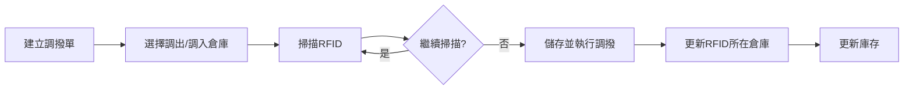

**功能說明**
- 倉庫間數量轉移
- 支援同倉庫不同廠商調換
- **包含取料作業：從儲存倉（1樓/3樓）調撥至暫存區**
- 使用掃描槍快速操作
- **調撥單位根據目標倉庫類型自動判斷**
- 儲存即執行調撥，自動更新RFID所在倉庫和庫存數量

**調撥類型**
1. **倉庫間調撥（STORAGE → STORAGE）**
   - 儲存倉之間的庫存轉移
   - 可以掃描**棧板RFID**（整個棧板移動）
   - 也可以掃描**桶RFID**（單桶移動）
   - 支援同倉不同廠商調換

2. **取料作業（STORAGE → STAGING）**
   - 從儲存倉調撥至暫存區，為領料做準備
   - **只能掃描桶RFID**，不能掃描棧板RFID
   - 原因：暫存區是臨時存放，不適合放整個棧板
   - 必須拆封後才能取料

**介面欄位**
- 調撥單號（自動產生）
- 調撥日期（必填）
- 調出倉庫（必填）
- 調入倉庫（必填）
- 調出廠商（必填）
- 調入廠商（必填）
- 調撥類型（一般調撥/取料作業）
- 調撥明細
  - 物料
  - 棧板RFID（掃描）
  - 桶RFID（掃描）
  - 數量
  - 單位

**新增調撥單處理細項**

**步驟1：建立調撥單表頭**

| 欄位名稱 | 欄位類型 | 必填 | 驗證規則 | 下拉資料來源 | 預設值 |
|---------|---------|------|---------|-------------|--------|
| 調撥單號 | 文字顯示 | - | 自動產生（TRF-YYYYMMDD-XXX） | - | 自動產生 |
| 調撥日期 | 日期選擇器 | 是 | 不可為空 | - | 今日 |
| 調出倉庫 | 下拉選單 | 是 | 必須選擇 | `GET /api/Main/Warehouse/GetSelectItems`<br>範例：<br>[{"value":1, "text":"１樓倉", "type":"STORAGE"}, <br>{"value":3, "text":"暫存區", "type":"STAGING"}] | 無 |
| 調入倉庫 | 下拉選單 | 是 | 必須選擇 | `GET /api/Main/Warehouse/GetSelectItems`<br>**排除調出倉庫** | 無 |
| 調撥類型 | 文字顯示 | - | 根據倉庫類型自動判斷 | - | 自動判斷 |
| 備註 | 多行文字框 | 否 | - | - | 空值 |

**欄位聯動邏輯**：
```javascript
// 當選擇調入倉庫後，自動判斷調撥類型
if (調出倉庫.type === 'STORAGE' && 調入倉庫.type === 'STAGING') {
  調撥類型 = '取料作業';
  允許RFID類型 = ['桶RFID'];  // 只能掃桶
  提示訊息 = '取料至暫存區，請掃描桶RFID（不可掃描棧板）';
} else if (調出倉庫.type === 'STORAGE' && 調入倉庫.type === 'STORAGE') {
  調撥類型 = '倉庫間調撥';
  允許RFID類型 = ['棧板RFID', '桶RFID'];  // 棧板或桶都可以
  提示訊息 = '倉庫間調撥，可掃描棧板RFID或桶RFID';
}
```

**步驟2：新增調撥明細**

**方式A：掃描RFID（主要方式）**

| 欄位名稱 | 欄位類型 | 必填 | 驗證規則 | 說明 |
|---------|---------|------|---------|------|
| RFID掃描框 | 文字輸入框 | 是 | 必須是有效的RFID | 自動聚焦，掃描槍輸入 |
| RFID類型 | 文字顯示 | - | 自動識別 | 棧板/桶/袋 |
| 物料名稱 | 文字顯示 | - | 自動帶入 | 從RFID查詢 |
| 廠商名稱 | 文字顯示 | - | 自動帶入 | 從RFID查詢 |
| 當前倉庫 | 文字顯示 | - | 自動帶入 | 從RFID查詢 |
| 數量 | 文字顯示 | - | 自動帶入 | 棧板=總重量，桶=桶重量 |
| 單位 | 文字顯示 | - | 自動帶入 | KG/G |

**掃描驗證規則**：
```javascript
// 1. 驗證RFID是否存在
if (!RFID存在於系統) {
  顯示錯誤 = 'RFID不存在，請確認條碼是否正確';
  return false;
}

// 2. 驗證RFID所在倉庫是否為調出倉庫
if (RFID當前倉庫 !== 調出倉庫) {
  顯示錯誤 = `此RFID目前在${RFID當前倉庫}，不在調出倉庫${調出倉庫}`;
  return false;
}

// 3. 驗證RFID類型是否允許（取料時只能掃桶）
if (調撥類型 === '取料作業' && RFID類型 === '棧板') {
  顯示錯誤 = '取料作業不可移動整個棧板，請掃描桶RFID';
  return false;
}

// 4. 如果是桶RFID，檢查所屬棧板是否已拆封
if (RFID類型 === '桶' && 所屬棧板.is_unsealed === false) {
  顯示錯誤 = '此桶所屬棧板尚未拆封，請先執行拆封作業';
  return false;
}

// 5. 檢查是否已在明細中
if (RFID已在明細列表) {
  顯示錯誤 = '此RFID已加入，請勿重複掃描';
  return false;
}
```

**方式B：手動選擇（備用方式）**

| 欄位名稱 | 欄位類型 | 必填 | 下拉資料來源 |
|---------|---------|------|-----------|
| 物料 | 下拉選單 | 是 | `GET /api/Main/Material/GetSelectItems` |
| 棧板/桶 | 下拉選單 | 是 | `GET /api/Main/Bucket/GetByWarehouseAndMaterial?warehouse_id={調出倉庫}&material_id={物料}` |

**步驟3：明細列表顯示**

明細列表欄位：
- 序號
- RFID編號
- RFID類型（棧板/桶）
- 物料名稱
- 廠商名稱
- 數量 + 單位
- 當前倉庫
- 操作：刪除

**步驟4：儲存並執行調撥**

點擊「儲存」按鈕：

```
POST /api/Main/Transfer/Add

請求參數：
{
  "diff_voucherno": "TRF-20260130-001",
  "transfer_date": "2026-01-30",
  "from_warehouse_id": 1,
  "to_warehouse_id": 3,
  "remark": "",
  "details": [
    {
      "pallet_rfid": "PALLET-20260130-001",  // 棧板調撥
      "bucket_rfid": null,
      "quantity": 250,
      "unit": "KG"
    },
    {
      "pallet_rfid": null,
      "bucket_rfid": "BUCKET-20260130-005",  // 桶調撥
      "quantity": 25,
      "unit": "KG"
    }
  ]
}

系統處理（交易內）：

1. 驗證必填欄位
2. 驗證至少有一筆明細

3. 新增調撥單：
   INSERT INTO transfer_order (...)

4. 逐筆處理明細：
   FOR EACH detail:
     // 4.1 更新RFID所在倉庫
     IF detail.pallet_rfid IS NOT NULL:
       UPDATE pallet SET warehouse_id = to_warehouse_id WHERE pallet_rfid = ?
       UPDATE bucket SET warehouse_id = to_warehouse_id WHERE pallet_id = ?
     ELSE:
       UPDATE bucket SET warehouse_id = to_warehouse_id WHERE bucket_rfid = ?
     
     // 4.2 調出倉庫庫存扣減
     UPDATE inventory SET qty = qty - detail.quantity
     WHERE warehouse_id = from_warehouse_id AND material_id = ? AND vendor_id = ?
     
     // 4.3 調入倉庫庫存增加
     existing = SELECT * FROM inventory 
                WHERE warehouse_id = to_warehouse_id AND material_id = ? AND vendor_id = ?
     IF existing:
       UPDATE inventory SET qty = qty + detail.quantity
     ELSE:
       INSERT INTO inventory (...)
     
     // 4.4 記錄異動（調出）
     INSERT INTO inventory_movements (
       transaction_type = 'TRANSFER_OUT',
       adflag = -1,
       qty = -detail.quantity,
       ...
     )
     
     // 4.5 記錄異動（調入）
     INSERT INTO inventory_movements (
       transaction_type = 'TRANSFER_IN',
       adflag = 1,
       qty = detail.quantity,
       ...
     )

5. COMMIT 交易
```

**操作**
- 新增調撥單
- 掃描RFID
- 確認調撥
- 取消調撥

**API**: 
- `POST /api/transfers`
- `POST /api/transfers/{id}/scan-rfid`（掃描槍操作）
- `POST /api/transfers/{id}/confirm`

**業務規則**
- 調出倉庫庫存需足夠
- 支援同倉不同廠商調撥
- **取料作業：調出倉庫必須是儲存倉（STORAGE），調入倉庫必須是暫存區（STAGING）**
- 確認後同時更新調出/調入倉庫存

**RFID掃描單位判斷邏輯**：
```javascript
// 前端判斷邏輯
if (調入倉庫.warehouse_type === 'STAGING') {
  // 取料作業：只能掃描桶RFID
  允許掃描 = ['桶RFID'];
  顯示提示 = '取料至暫存區，請掃描桶RFID（不可掃描棧板）';
  
  // 檢查棧板是否已拆封
  if (掃描的是棧板RFID) {
    顯示錯誤 = '取料作業不可移動整個棧板，請掃描桶RFID';
    return false;
  }
  
  // 檢查桶所屬棧板是否已拆封
  if (桶所屬棧板.is_unsealed === false) {
    顯示錯誤 = '此桶所屬棧板尚未拆封，請先執行拆封作業';
    return false;
  }
  
} else if (調入倉庫.warehouse_type === 'STORAGE') {
  // 倉庫間調撥：可以掃描棧板或桶
  允許掃描 = ['棧板RFID', '桶RFID'];
  顯示提示 = '倉庫間調撥，可掃描棧板RFID或桶RFID';
}
```

**系統驗證**：
- 取料至暫存區時，後端需驗證 `pallet_rfid IS NULL` 且 `bucket_rfid IS NOT NULL`
- 倉庫間調撥時，可接受 `pallet_rfid` 或 `bucket_rfid`（兩者擇一）

#### 5.2.5 領料作業

**作業流程**
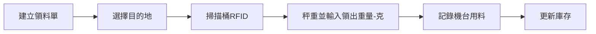

**功能說明**
- 只能從暫存區領料
- 最小單位為克(g)
- 只需輸入實際領出重量即可
- 註銷功能是獨立的，用於處理桶已領完但系統還有殘留數據的情況

**介面欄位**
- 領料單號（自動產生）
- 領料日期（必填）
- 來源倉庫（暫存區，固定）
- 目的地（機台）
- 機台編號（目的地為機台時必填）
- 領料明細
  - 物料
  - 桶RFID
  - 領出重量(g)（必填）
  - 單位（G）

**新增領料單處理細項**

**步驟1：建立領料單表頭**

| 欄位名稱 | 欄位類型 | 必填 | 驗證規則 | 下拉資料來源 | 預設值 |
|---------|---------|------|---------|-------------|--------|
| 領料單號 | 文字顯示 | - | 自動產生（ISU-YYYYMMDD-XXX） | - | 自動產生 |
| 領料日期 | 日期選擇器 | 是 | 不可為空 | - | 今日 |
| 來源倉庫 | 文字顯示 | - | 固定為暫存區 | - | 暫存區 |
| 目的地 | 下拉選單 | 是 | 必須選擇 | ["機台A", "機台B", "機台C", "其他"] | 無 |
| 機台編號 | 文字輸入框 | 條件必填 | 目的地為"機台"時必填 | - | 空值 |
| 領料人員 | 文字輸入框 | 是 | 不可為空 | - | 當前登入者 |
| 備註 | 多行文字框 | 否 | - | - | 空值 |

**步驟2：掃描桶RFID並輸入領出重量**

| 欄位名稱 | 欄位類型 | 必填 | 驗證規則 | 說明 |
|---------|---------|------|---------|------|
| 桶RFID | 文字輸入框 | 是 | 必須是有效的桶RFID | 掃描槍輸入，自動聚焦 |
| 物料名稱 | 文字顯示 | - | 自動帶入 | 從RFID查詢 |
| 廠商名稱 | 文字顯示 | - | 自動帶入 | 從RFID查詢 |
| 當前庫存(g) | 文字顯示 | - | 自動帶入 | 該桶的剩餘重量 |
| 領出重量(g) | 數字輸入框 | 是 | 1. 不可為空<br>2. 必須大於0<br>3. 不可大於當前庫存<br>4. 最多1位小數 | 秤重後手動輸入 |
| 領出後餘量(g) | 文字顯示 | - | 自動計算 | 當前庫存 - 領出重量 |

**掃描驗證規則**：
```javascript
// 1. 驗證桶RFID是否存在
if (!桶RFID存在於系統) {
  顯示錯誤 = '桶RFID不存在，請確認條碼是否正確';
  return false;
}

// 2. 驗證桶是否在暫存區
if (桶當前倉庫 !== '暫存區') {
  顯示錯誤 = `此桶目前在${桶當前倉庫}，只能從暫存區領料`;
  return false;
}

// 3. 驗證桶是否有庫存
if (桶當前庫存 <= 0) {
  顯示錯誤 = '此桶已無庫存，無法領料';
  return false;
}

// 4. 檢查是否已在明細中
if (桶RFID已在明細列表) {
  顯示錯誤 = '此桶已加入，請勿重複掃描';
  return false;
}
```

**領出重量驗證規則**：
```javascript
// 即時驗證
function validateIssuingWeight(inputWeight, currentStock) {
  if (inputWeight <= 0) {
    return '領出重量必須大於0';
  }
  if (inputWeight > currentStock) {
    return `領出重量不可大於當前庫存${currentStock}g`;
  }
  if (inputWeight > currentStock * 0.95) {
    // 如果領出量接近庫存，提示確認
    顯示警告 = `領出後僅剩${currentStock - inputWeight}g，是否確定？`;
  }
  return null;  // 驗證通過
}
```

**步驟3：明細列表顯示**

明細列表欄位：
- 序號
- 桶RFID
- 物料名稱
- 廠商名稱
- 領出前庫存(g)
- 領出重量(g)
- 領出後餘量(g)
- 操作：刪除、修改領出重量

**步驟4：儲存並執行領料**

點擊「儲存」按鈕：

```
POST /api/Main/Issuing/Add

請求參數：
{
  "diff_voucherno": "ISU-20260130-001",
  "issuing_date": "2026-01-30",
  "warehouse_id": 3,  // 暫存區
  "destination": "機台A",
  "machine_no": "A-001",
  "issued_by": "張三",
  "remark": "",
  "details": [
    {
      "bucket_rfid": "BUCKET-20260130-001",
      "issuing_weight": 500.5,  // 克
      "unit": "G"
    }
  ]
}

系統處理（交易內）：

1. 驗證必填欄位
2. 驗證至少有一筆明細

3. 新增領料單：
   INSERT INTO issuing_order (...)

4. 逐筆處理明細：
   FOR EACH detail:
     // 4.1 更新桶的剩餘重量
     UPDATE bucket SET 
       current_weight = current_weight - detail.issuing_weight,
       updated_at = NOW()
     WHERE bucket_rfid = detail.bucket_rfid
     
     // 4.2 如果桶已空，更新狀態
     IF bucket.current_weight <= 0:
       UPDATE bucket SET status = 'EMPTY' WHERE bucket_rfid = ?
     
     // 4.3 更新庫存（轉換為kg）
     issuing_weight_kg = detail.issuing_weight / 1000
     UPDATE inventory SET 
       qty = qty - issuing_weight_kg
     WHERE warehouse_id = 暫存區 AND material_id = ? AND vendor_id = ?
     
     // 4.4 記錄異動
     INSERT INTO inventory_movements (
       transaction_type = 'ISSUING',
       adflag = -1,
       qty = -issuing_weight_kg,
       bucket_rfid = detail.bucket_rfid,
       destination = ?,
       machine_no = ?,
       ...
     )
     
     // 4.5 新增領料明細
     INSERT INTO issuing_detail (...)

5. COMMIT 交易
```

**操作**
- 新增領料單
- 掃描桶RFID
- 秤重並輸入領出重量（克）
- 確認領料

**API**: 
- `POST /api/issuing-lists`
- `POST /api/issuing-lists/{id}/scan-bucket`
- `POST /api/issuing-lists/{id}/record-weight`
- `POST /api/issuing-lists/{id}/confirm`

**業務規則**
- 只能從暫存區領料
- 最小單位為克(g)
- 只需輸入實際領出重量
- 領出後自動扣減庫存

**註銷處理說明**
```
情境：桶已經實際上是空的，但系統還有殘留數據5g

註銷使用時機：
- 桶已領取完畢（實際已經空了）
- 但系統中還有殘留的克數（例如5g、10g等）
- 這些殘留是因為包裝沾黏等因素造成的耗損

處理方式（使用獨立的註銷功能）：
1. 確認桶已經物理上為空
2. 使用註銷功能將殘留的5g當作耗損處理
3. 系統直接將該桶的庫存歸零
4. 更新桶狀態為WRITTEN_OFF（已註銷）
5. 記錄註銷重量5g和註銷原因（包裝沾黏等耗損）
6. 保留註銷記錄供追蹤查詢

注意：註銷是獨立功能，不在領料流程中，只有當桶已領完但還有殘留數據時才使用
```

#### 5.2.6 棧板拆封作業

**作業流程**
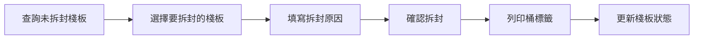

**功能說明**
- 查詢並選擇未拆封的棧板（is_unsealed = false）
- 執行拆封作業並列印桶標籤
- 記錄拆封時間、人員、原因
- 更新棧板拆封狀態
- **⚠️ 此功能只能在網頁端操作，不支援PDA操作**

**使用時機**
- 棧板入庫後，準備使用前需要拆封
- 拆封後才能在每個桶上貼RFID標籤
- 拆封後才能進行後續的調撥、領料等作業

**為什麼只能在網頁端操作？**
- 拆封作業需要**立即列印桶標籤**（每個桶的RFID條碼）
- 現場PDA無法連接標籤印表機
- 如果在現場用PDA拆封，就無法列印條碼，無法貼標籤
- 因此必須在辦公室使用網頁系統操作，拆封後立即列印標籤
- 列印完標籤後，帶到現場貼在每個桶上

**棧板拆封處理細項**

**步驟1：查詢未拆封的棧板**

查詢條件：
- 棧板RFID（支援掃描輸入或模糊搜尋）
- 倉庫
- 物料
- 廠商
- 入庫日期區間
- 拆封狀態：固定查詢 is_unsealed = false

查詢結果顯示：
- 棧板RFID
- 物料名稱
- 廠商名稱
- 所在倉庫
- 桶數
- 入庫日期
- 入庫單號（可點擊查看）
- 選擇框（支援多選）

API：
```
GET /api/Main/Pallet/GetUnsealedPallets

查詢參數：
?warehouse_id=1
&material_id=2
&vendor_id=3
&pallet_rfid=PALLET-20260130
&date_from=2026-01-01
&date_to=2026-01-30

回傳範例：
{
  "items": [
    {
      "pallet_id": 1,
      "pallet_rfid": "PALLET-20260130-001",
      "material_name": "MIM粉末A",
      "vendor_name": "廠商甲",
      "warehouse_name": "1樓倉",
      "bucket_count": 10,
      "receiving_no": "RCV-20260130-001",
      "receiving_date": "2026-01-30",
      "is_unsealed": false
    }
  ],
  "total_count": 1
}
```

**步驟2：選擇要拆封的棧板**

- 可單選或多選棧板
- 顯示選中的棧板資訊總覽：
  - 已選擇棧板數
  - 總桶數
  - 將列印的標籤總數

**步驟3：填寫拆封資訊**

| 欄位名稱 | 欄位類型 | 必填 | 說明 | 預設值 |
|---------|---------|------|------|--------|
| 拆封日期 | 日期選擇器 | 是 | 拆封日期 | 今日 |
| 拆封原因 | 文字輸入框 | 是 | 例如：準備領料使用、盤點需要 | 空值 |
| 備註 | 多行文字框 | 否 | 其他說明 | 空值 |

**步驟4：確認拆封**

點擊「確認拆封」按鈕：

```
POST /api/Main/Pallet/Unseal

請求參數：
{
  "pallet_ids": [1, 2, 3],
  "unseal_date": "2026-01-30",
  "unseal_reason": "準備領料使用",
  "remark": ""
}

系統處理（交易內）：

1. 驗證所有棧板都是未拆封狀態
   IF ANY pallet WHERE id IN (?) AND is_unsealed = TRUE:
     回傳錯誤：「棧板 XXX 已經拆封過，無法重複拆封」

2. 逐筆處理每個棧板：
   FOREACH pallet_id IN pallet_ids:
   
     // 產生拆封單號
     unseal_no = 'UNSEAL-' + YYYYMMDD + '-' + 序號
     
     // 取得該棧板的所有桶
     buckets = SELECT * FROM bucket WHERE pallet_id = ?
     
     // 記錄拆封作業
     INSERT INTO pallet_unseal_record (
       unseal_no, pallet_id, pallet_rfid,
       warehouse_id, material_id, vendor_id,
       bucket_count, unseal_date, unseal_reason,
       created_by, created_at, remark
     ) VALUES (
       unseal_no, pallet.id, pallet.pallet_rfid,
       pallet.warehouse_id, pallet.material_id, pallet.vendor_id,
       COUNT(buckets), unseal_date, unseal_reason,
       current_user, NOW(), remark
     )
     
     // 更新棧板拆封狀態
     UPDATE pallet SET 
       is_unsealed = TRUE,
       unsealed_at = NOW(),
       unsealed_by = current_user,
       updated_at = NOW()
     WHERE id = pallet_id
     
     // 準備列印桶標籤（標記為待列印）
     UPDATE bucket SET 
       updated_at = NOW()
     WHERE pallet_id = pallet_id

3. COMMIT 交易

4. 回傳拆封成功及桶RFID清單

回傳範例：
{
  "success": true,
  "message": "拆封成功，共處理 3 個棧板，30 個桶",
  "unseal_records": [
    {
      "unseal_no": "UNSEAL-20260130-001",
      "pallet_rfid": "PALLET-20260130-001",
      "bucket_rfids": [
        "BUCKET-20260130-001",
        "BUCKET-20260130-002",
        ...
      ]
    }
  ]
}
```

**步驟5：列印桶標籤**

拆封成功後自動觸發列印：

```
POST /api/Main/Pallet/PrintBucketLabels

請求參數：
{
  "pallet_ids": [1, 2, 3]
}

系統處理：

1. 取得所有棧板的桶RFID清單：
   SELECT b.bucket_rfid, b.initial_weight, 
          m.material_c_name, v.vendor_c_name, p.pallet_rfid
   FROM bucket b
   LEFT JOIN pallet p ON b.pallet_id = p.id
   LEFT JOIN material m ON b.material_id = m.id
   LEFT JOIN vendor v ON p.vendor_id = v.id
   WHERE b.pallet_id IN (?)
   ORDER BY b.bucket_rfid

2. 產生桶標籤PDF：
   - 每個標籤包含：
     - 桶RFID條碼
     - 桶RFID編號（文字）
     - 物料名稱
     - 廠商名稱
     - 初始重量
     - 所屬棧板RFID

3. 更新標籤列印狀態：
   UPDATE bucket SET 
     label_printed = TRUE,
     label_printed_at = NOW(),
     updated_at = NOW()
   WHERE pallet_id IN (?)

4. 呼叫印表機列印或下載PDF
```

**查詢拆封記錄**

查詢條件：
- 拆封單號
- 棧板RFID
- 拆封日期區間
- 倉庫
- 物料
- 拆封人員

查詢結果：
- 拆封單號
- 棧板RFID
- 物料名稱
- 廠商名稱
- 倉庫名稱
- 桶數
- 拆封日期
- 拆封原因
- 拆封人員
- 拆封時間
- 備註

**業務規則**
- 只有未拆封的棧板（is_unsealed = false）才能執行拆封作業
- 已拆封的棧板不可重複拆封
- 拆封後立即列印所有桶標籤
- 拆封作業會記錄到 pallet_unseal_record 表
- 袋裝制不需要拆封作業（入庫時就已列印所有標籤）
- **只能在網頁端操作（需要連接標籤印表機），PDA端不提供此功能**
- 拆封前必須確認標籤印表機正常運作
- 建議一次拆封多個棧板，批次列印標籤以提高效率

**API**:
- `GET /api/Main/Pallet/GetUnsealedPallets` - 查詢未拆封棧板列表
- `POST /api/Main/Pallet/Unseal` - 執行拆封作業
- `POST /api/Main/Pallet/PrintBucketLabels` - 列印桶標籤
- `GET /api/Main/PalletUnseal/Search` - 查詢拆封記錄
- `GET /api/Main/PalletUnseal/:id` - 取得拆封記錄詳情

---

#### 5.2.7 耗損註銷作業

**作業流程**
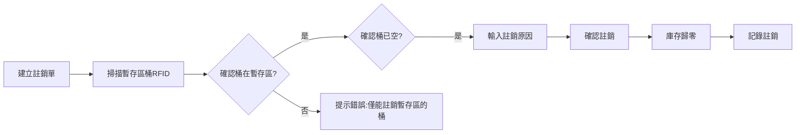

**功能說明**
- 處理暫存區中桶已領完但系統還有殘留數據的情況
- 將殘留重量當作耗損，直接歸零
- 獨立於領料作業，是另一個專門處理耗損的功能
- **僅限暫存區的桶**：只能對位於暫存區的桶進行註銷操作

**使用時機**
- 桶已經實際上是空的，且位於暫存區
- 但系統庫存還顯示有少量重量（如5g、10g等）
- 這些殘留是因為包裝沾黏、測量誤差等因素造成的耗損

**介面欄位**
- 註銷單號（自動產生）
- 註銷日期（必填）
- 註銷明細
  - 物料
  - 廠商
  - 桶RFID（掃描）
  - 所在位置（系統自動帶出，僅顯示暫存區）
  - 當前庫存重量(g)（系統自動帶出）
  - 註銷重量(g)（自動等於當前庫存）
  - 註銷原因（必填，如：包裝沾黏、實際已空等）

**新增註銷單處理細項**

**步驟1：建立註銷單表頭**

| 欄位名稱 | 欄位類型 | 必填 | 驗證規則 | 預設值 |
|---------|---------|------|---------|--------|
| 註銷單號 | 文字顯示 | - | 自動產生（WO-YYYYMMDD-XXX） | 自動產生 |
| 註銷日期 | 日期選擇器 | 是 | 不可為空 | 今日 |
| 註銷人員 | 文字輸入框 | 是 | 不可為空 | 當前登入者 |
| 備註 | 多行文字框 | 否 | - | 空值 |

**步驟2：掃描桶RFID並確認註銷資訊**

| 欄位名稱 | 欄位類型 | 必填 | 驗證規則 | 說明 |
|---------|---------|------|---------|------|
| 桶RFID | 文字輸入框 | 是 | 必須是有效的桶RFID | 掃描槍輸入 |
| 物料名稱 | 文字顯示 | - | 自動帶入 | 從RFID查詢 |
| 廠商名稱 | 文字顯示 | - | 自動帶入 | 從RFID查詢 |
| 所在倉庫 | 文字顯示 | - | 自動帶入，必須是暫存區 | 從RFID查詢 |
| 當前庫存(g) | 文字顯示 | - | 自動帶入 | 該桶的剩餘重量 |
| 註銷重量(g) | 文字顯示 | - | 自動等於當前庫存 | 全部註銷 |
| 註銷原因 | 下拉選單+文字 | 是 | 必須選擇或輸入 | 常見原因：<br>- 包裝沾黏耗損<br>- 測量誤差<br>- 實際已空<br>- 桶體損壞<br>- 其他（請說明） |

**掃描驗證規則**：
```javascript
// 1. 驗證桶RFID是否存在
if (!桶RFID存在於系統) {
  顯示錯誤 = '桶RFID不存在，請確認條碼是否正確';
  return false;
}

// 2. ⭐ 關鍵驗證：桶是否在暫存區
if (桶當前倉庫.warehouse_type !== 'STAGING') {
  顯示錯誤 = `此桶目前在${桶當前倉庫}，僅能註銷暫存區的桶`;
  顯示提示 = '註銷功能僅限暫存區使用，其他倉庫請使用盤點調整功能';
  return false;
}

// 3. 驗證桶是否有庫存
if (桶當前庫存 <= 0) {
  顯示錯誤 = '此桶已無庫存，無需註銷';
  return false;
}

// 4. 驗證桶狀態
if (桶狀態 === 'WRITTEN_OFF') {
  顯示錯誤 = '此桶已經註銷過，無法重複註銷';
  return false;
}

// 5. 檢查是否已在明細中
if (桶RFID已在明細列表) {
  顯示錯誤 = '此桶已加入，請勿重複掃描';
  return false;
}
```

**步驟3：明細列表顯示**

明細列表欄位：
- 序號
- 桶RFID
- 物料名稱
- 廠商名稱
- 所在倉庫（應顯示"暫存區"）
- 註銷重量(g)
- 註銷原因
- 操作：刪除、修改原因

**步驟4：確認註銷**

點擊「確認註銷」按鈕前，顯示確認對話框：
```
【註銷確認】
即將註銷以下桶的庫存：
- 桶RFID：BUCKET-20260130-001
- 物料：MIM粉末A
- 註銷重量：5.5g
- 註銷原因：包裝沾黏耗損

⚠️ 註銷後該桶庫存將歸零，此操作無法撤銷！

[取消] [確認註銷]
```

確認後執行：

```
POST /api/Main/WriteOff/Add

請求參數：
{
  "diff_voucherno": "WO-20260130-001",
  "write_off_date": "2026-01-30",
  "written_off_by": "張三",
  "remark": "",
  "details": [
    {
      "bucket_rfid": "BUCKET-20260130-001",
      "material_id": 1,
      "vendor_id": 1,
      "warehouse_id": 3,  // 暫存區
      "write_off_weight": 5.5,  // 克
      "write_off_reason": "包裝沾黏耗損",
      "unit": "G"
    }
  ]
}

系統處理（交易內）：

1. 驗證必填欄位
2. 驗證至少有一筆明細
3. ⭐ 再次驗證所有桶都在暫存區

4. 逐筆處理明細：
   FOR EACH detail:
     // 4.1 ⭐ 最後檢查：確認桶在暫存區
     bucket = SELECT * FROM bucket WHERE bucket_rfid = ?
     IF bucket.warehouse_id != 暫存區ID:
       回傳錯誤 = '桶不在暫存區，無法註銷'
       ROLLBACK
     
     // 4.2 更新桶狀態和重量
     UPDATE bucket SET 
       current_weight = 0,
       status = 'WRITTEN_OFF',
       written_off_at = NOW(),
       written_off_by = detail.written_off_by,
       updated_at = NOW()
     WHERE bucket_rfid = detail.bucket_rfid
     
     // 4.3 更新庫存（轉換為kg）
     write_off_weight_kg = detail.write_off_weight / 1000
     UPDATE inventory SET 
       qty = qty - write_off_weight_kg
     WHERE warehouse_id = 暫存區 AND material_id = ? AND vendor_id = ?
     
     // 4.4 記錄異動
     INSERT INTO inventory_movements (
       transaction_type = 'WRITE_OFF',
       adflag = -1,
       qty = -write_off_weight_kg,
       bucket_rfid = detail.bucket_rfid,
       remark = detail.write_off_reason,
       ...
     )
     
     // 4.5 新增註銷記錄
     INSERT INTO write_off_record (...)

5. COMMIT 交易
```

**操作**
- 新增註銷單
- 掃描桶RFID
- 確認當前庫存數據
- 輸入註銷原因
- 確認註銷（庫存歸零）

**API**: 
- `POST /api/write-off-records/add`
- `POST /api/write-off-records/{id}/scan-bucket`
- `POST /api/write-off-records/{id}/confirm`
- `GET /api/write-off-records/query`（查詢註銷記錄）

**業務規則**
- **僅限暫存區**：只能註銷位於暫存區的桶，其他倉庫的桶不允許註銷
- 掃描桶時，系統會檢查桶的所在位置，若不在暫存區則提示錯誤
- 只能註銷已在系統中有庫存的桶
- 註銷後庫存直接歸零
- 桶狀態更新為WRITTEN_OFF（已註銷）
- 必須輸入註銷原因
- 註銷記錄永久保留供查詢追蹤

**註銷範例**
```
步驟1：掃描桶RFID "BUCKET-20260115-001"
步驟2：系統顯示當前庫存：5g
步驟3：確認桶實際上已經空了
步驟4：輸入註銷原因：「包裝沾黏，實際已空但系統有殘留」
步驟5：確認註銷
步驟6：系統執行：
  - 將該桶庫存從5g歸零為0g
  - 更新桶狀態為WRITTEN_OFF
  - 記錄註銷重量5g
  - 生成註銷單號WO-20260115-001
  - 記錄到inventory_movements，異動類型為WRITE_OFF
```

---

### 5.3 三、盤點作業

#### 5.3.1 RFID盤點

**作業流程**
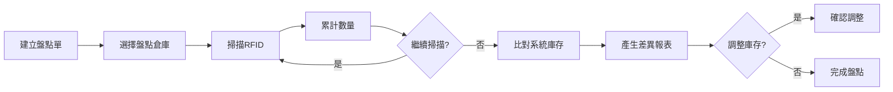

**功能說明**
- 使用掃描槍掃描RFID
- 顯示當前系統庫存數量
- 累計掃描數量
- 比對差異

**介面欄位**
- 盤點單號（自動產生）
- 盤點日期（必填）
- 盤點倉庫（必填）
- 狀態（進行中/已完成/已調整）
- 總掃描數（自動累計）

**新增盤點單處理細項**

**步驟1：建立盤點單表頭**

| 欄位名稱 | 欄位類型 | 必填 | 驗證規則 | 下拉資料來源 | 預設值 |
|---------|---------|------|---------|-------------|--------|
| 盤點單號 | 文字顯示 | - | 自動產生（INV-YYYYMMDD-XXX） | - | 自動產生 |
| 盤點日期 | 日期選擇器 | 是 | 不可為空 | - | 今日 |
| 盤點倉庫 | 下拉選單 | 是 | 必須選擇 | `GET /api/Main/Warehouse/GetSelectItems` | 無 |
| 盤點人員 | 文字輸入框 | 是 | 不可為空 | - | 當前登入者 |
| 盤點狀態 | 文字顯示 | - | 自動設定 | - | 進行中 |
| 總掃描數 | 數字顯示 | - | 自動累計 | - | 0 |
| 備註 | 多行文字框 | 否 | - | - | 空值 |

**步驟2：掃描RFID進行盤點**

| 欄位名稱 | 欄位類型 | 驗證規則 | 說明 |
|---------|---------|---------|------|
| RFID掃描框 | 文字輸入框 | 必須是有效的RFID | 自動聚焦，連續掃描 |
| RFID類型 | 文字顯示 | 自動識別 | 棧板/桶/袋 |
| 物料名稱 | 文字顯示 | 自動帶入 | |
| 廠商名稱 | 文字顯示 | 自動帶入 | |
| 系統倉庫 | 文字顯示 | 自動帶入 | 系統記錄的倉庫 |
| 實際倉庫 | 文字顯示 | 就是盤點倉庫 | |
| 系統數量 | 文字顯示 | 自動帶入 | |
| 盤點數量 | 文字顯示 | 掃描後+1 | |
| 差異 | 文字顯示 | 自動計算 | 實際-系統 |

**掃描處理邏輯**：
```javascript
// 每次掃描RFID後
function onRfidScanned(rfid) {
  // 1. 查詢RFID資訊
  rfidInfo = 查詢RFID(rfid);
  
  // 2. 累加到盤點明細
  if (rfid已在盤點明細中) {
    盤點數量++;
  } else {
    新增盤點明細({
      rfid: rfid,
      系統數量: rfidInfo.quantity,
      盤點數量: 1
    });
  }
  
  // 3. 更新總掃描數
  總掃描數++;
  
  // 4. 播放提示音
  if (系統倉庫 === 盤點倉庫) {
    播放成功音效();  // 位置正確
  } else {
    播放警告音效();  // 位置異常
    標記為異常明細();
  }
}
```

**步驟3：盤點明細列表**

顯示欄位：
- 序號
- RFID編號
- RFID類型
- 物料名稱
- 廠商名稱
- 系統倉庫
- 系統數量
- 盤點數量
- 差異
- 狀態（正常/異常）

篩選選項：
- 全部明細
- 僅顯示有差異
- 僅顯示位置異常

**步驟4：完成盤點並產生差異報表**

點擊「完成盤點」按鈕：

```
POST /api/Main/InventoryCheck/Complete

系統處理：
1. 計算差異
2. 產生差異報表
3. 更新盤點狀態為"已完成"
4. 提示是否要調整庫存
```

**步驟5：調整庫存（可選）**

如果有差異，可選擇調整庫存：

| 調整選項 | 說明 |
|---------|------|
| 全部調整 | 將所有差異調整到實際盤點數量 |
| 選擇性調整 | 只調整勾選的項目 |
| 不調整 | 僅記錄差異，不調整庫存 |

調整確認對話框：
```
【庫存調整確認】
即將調整以下項目的庫存：

物料A - 廠商甲：
  系統：100kg → 實際：98kg（差異：-2kg）
  
物料B - 廠商乙：
  系統：50kg → 實際：52kg（差異：+2kg）

⚠️ 調整後無法撤銷，是否確認？

[取消] [確認調整]
```

**盤點明細**
- RFID類型（棧板/桶）
- RFID代碼
- 物料
- 廠商
- 掃描數量（累計）
- 系統數量（從庫存取得）
- 差異量（掃描-系統）
- 掃描時間

**掃描槍操作**
1. 掃描RFID
2. 系統自動查詢庫存
3. 顯示：
   - 物料名稱
   - 廠商
   - 當前系統庫存
   - 已掃描次數
4. 繼續掃描，累計數量
5. 完成後產生差異報表

**API**: 
- `POST /api/inventorycheck`
- `POST /api/inventorycheck/{id}/scan`（掃描槍專用）
- `GET /api/inventorycheck/{id}/details`（即時盤點明細）
- `POST /api/inventorycheck/{id}/adjust`（庫存調整）

**業務規則**
- 掃描相同RFID累計數量
- 即時顯示差異
- 盤點完成後可選擇是否調整系統庫存

#### 5.3.2 庫存調整

**功能說明**
- 根據盤點差異調整庫存
- 記錄調整原因

**介面欄位**
- 調整單號（自動產生）
- 調整日期
- 倉庫
- 調整明細
  - 物料
  - RFID
  - 調整前數量
  - 調整後數量
  - 調整數量
  - 調整原因

**API**: 
- `POST /api/inventory/adjust`

---

### 5.4 四、查詢功能

#### 5.4.1 庫存查詢

**功能說明**
- 即時庫存查詢
- 支援掃描槍快速查詢
- 多條件查詢
- **庫存不足警示**（低於最低庫存量時標示）

**查詢條件**
- 倉庫
- 物料
- 廠商
- RFID（掃描槍輸入）
- 日期區間
- 庫存狀態（全部/正常/不足）

**查詢結果**
- 倉庫名稱
- 物料名稱
- 廠商名稱
- RFID（棧板/桶）
- 當前數量
- 最低庫存量
- 單位
- **庫存狀態**（正常/不足 - 顯示警示圖示）
- 更新時間

**庫存警示規則**
- 當前數量 < 最低庫存量：顯示紅色警示標記
- 當前數量 ≥ 最低庫存量：顯示綠色正常標記
- 未設定最低庫存量：不顯示警示

**掃描槍查詢**
- 掃描RFID立即顯示庫存資訊
- 若庫存不足，顯示紅色警示提示

**API**: 
- `GET /api/inventory/query`
- `GET /api/inventory/scan/{rfid}`（掃描槍專用）
- `GET /api/inventory/low-stock`（庫存不足查詢）

#### 5.4.2 庫存不足警示

**功能說明**
- 快速查詢低於最低庫存量的物料
- 提供補貨提醒
- 支援匯出報表

**查詢條件**
- 倉庫（可選）
- 物料類別（可選）
- 廠商（可選）

**查詢結果**
- 倉庫名稱
- 物料名稱
- 廠商名稱
- 當前庫存量
- 最低庫存量
- 缺口數量（最低庫存量 - 當前庫存量）
- **警示等級**
  - 🔴 嚴重：當前庫存 < 最低庫存量的50%
  - 🟡 警告：當前庫存 < 最低庫存量但 ≥ 50%
- 最後更新時間

**操作功能**
- 匯出Excel報表
- 直接建立補貨入庫單（快捷功能）
- 發送庫存不足通知

**API**: 
- `GET /api/inventory/low-stock`
- `GET /api/inventory/low-stock/export`
- `POST /api/inventory/low-stock/notify`

#### 5.4.3 物料追蹤

**功能說明**
- 追蹤物料流向
- 顯示RFID完整生命週期

**追蹤資訊**
- 入庫記錄
- 調撥記錄（含倉庫到暫存區的移動）
- 領料記錄
- 當前位置

**API**: 
- `GET /api/materials/{id}/tracking`
- `GET /api/rfid/{rfid}/history`

#### 5.4.4 採購單查詢

**功能說明**
- 查詢採購單執行狀況
- 追蹤交貨進度
- 支援多條件查詢

**查詢條件**
- 採購單號
- 供應商
- 採購日期區間
- 是否結案（未結案/已結案）
- 物料

**查詢結果**
| 欄位名稱 | 說明 |
|---------|------|
| 採購單號 | PUR-YYYYMMDD-XXX |
| 採購日期 | 訂單建立日期 |
| 供應商 | 供應商名稱 |
| 預計交期 | 預計送貨日期 |
| 是否結案 | 未結案/已結案 |
| 訂購總額 | 採購總金額 |
| 交貨進度 | 已交貨數量/訂購數量（百分比） |

**明細查詢**
- 點擊採購單可查看明細
- 顯示每個物料的訂購數量、已交數量、未交數量
- 顯示關聯的進貨單

**操作功能**
- 查看詳細資訊
- 匯出Excel
- 手動結案採購單

**API**: 
- `GET /api/Main/Purchase/Query`
- `GET /api/Main/Purchase/Detail/{id}`
- `POST /api/Main/Purchase/Close/{id}`

#### 5.4.5 進貨單查詢

**功能說明**
- 查詢供應商送貨記錄
- 追蹤進貨與入庫狀況
- 關聯採購單與入庫單

**查詢條件**
- 進貨單號
- 供應商
- 送貨日期區間
- 關聯採購單號
- 物料

**查詢結果**
| 欄位名稱 | 說明 |
|---------|------|
| 進貨單號 | DEL-YYYYMMDD-XXX |
| 送貨日期 | 供應商實際送貨日期 |
| 供應商 | 供應商名稱 |
| 關聯採購單 | 對應的採購單號（如有） |
| 入庫單號 | 轉入庫後的入庫單號（如已入庫） |

**明細查詢**
- 點擊進貨單可查看明細
- 顯示每個物料的送貨數量
- 顯示對應的採購明細（如有）

**操作功能**
- 查看詳細資訊
- 轉入庫單
- 匯出Excel

**API**: 
- `GET /api/Main/Delivery/Query`
- `GET /api/Main/Delivery/Detail/{id}`
- `POST /api/Main/Delivery/ConvertToReceiving`
- `POST /api/Main/Delivery/Reject/{id}`

#### 5.4.6 耗損註銷記錄

**功能說明**
- 查詢耗損註銷記錄
- 追蹤因包裝沾黏等因素導致實際已空但系統有殘留數據而進行註銷的記錄
- 註銷是將殘留的重量當作耗損，直接把庫存歸零

**查詢條件**
- 物料
- 註銷重量範圍
- 註銷日期
- 倉庫

**查詢結果**
- 註銷單號
- 倉庫名稱
- 物料名稱
- 廠商名稱
- 桶RFID
- 註銷重量(g)
- 註銷原因（包裝沾黏、實際已空等）
- 註銷日期
- 操作人員

**API**: 
- `GET /api/write-off-records/query`
- `POST /api/write-off-records/add`（新增註銷記錄）

#### 5.4.7 調撥記錄

**功能說明**
- 查詢歷史調撥記錄

**查詢條件**
- 調撥日期區間
- 調出倉庫
- 調入倉庫
- 廠商
- 物料

**查詢結果**
- 調撥單號
- 調撥日期
- 調出倉庫
- 調入倉庫
- 調出廠商
- 調入廠商
- 物料
- 數量
- 狀態

**API**: 
- `GET /api/transfers/query`

---

## 6. MAUI 行動應用說明

### 6.1 應用概述

**.NET MAUI 掃描槍應用**是專為現場作業人員設計的行動應用程式，整合工業級掃描槍，提供快速的庫存查詢、盤點、調撥、領料等功能。

**主要特點**
- 原生Android應用（支援工業級手持終端機）
- RFID/條碼掃描整合（ZXing.Net.Maui）
- 離線作業支援（SQLite本地儲存）
- 即時API同步
- MVVM架構設計

### 6.2 技術架構

**MAUI 專案結構**
```
MIMStock.Mobile/
├── Platforms/
│   ├── Android/              # Android 平台特定代碼
│   └── Windows/              # Windows 平台（開發測試用）
├── Pages/
│   ├── LoginPage.xaml        # 登入頁面
│   ├── HomePage.xaml         # 首頁（功能選單）
│   ├── ScanQueryPage.xaml    # 掃描查詢頁
│   ├── InventoryCheckPage.xaml  # 盤點作業頁
│   └── IssuingPage.xaml      # 領料作業頁
├── ViewModels/
│   ├── LoginViewModel.cs
│   ├── HomeViewModel.cs
│   ├── ScanQueryViewModel.cs
│   ├── InventoryCheckViewModel.cs
│   └── IssuingViewModel.cs
├── Services/
│   ├── IScannerService.cs    # 掃描器服務介面
│   ├── ScannerService.cs     # ZXing 掃描實作
│   ├── IApiService.cs        # API 服務介面
│   ├── ApiService.cs         # HTTP Client 實作
│   ├── IStorageService.cs    # 本地儲存介面
│   ├── StorageService.cs     # SQLite 實作
│   └── ISyncService.cs       # 同步服務
├── Models/
│   ├── ScanResult.cs
│   ├── InventoryItem.cs
│   ├── InventoryCheckItem.cs
│   └── ApiModels/
└── MauiProgram.cs            # 應用程式進入點
```

### 6.3 核心功能說明

#### 6.3.1 庫存查詢（掃描RFID即時查詢）

**操作流程**
1. 開啟掃描查詢頁面
2. 掃描RFID（棧板或桶）
3. 自動調用API查詢
4. 即時顯示庫存資訊

**顯示資訊**
- RFID代碼
- 物料名稱
- 廠商名稱
- 所在倉庫
- 當前庫存數量
- 最低庫存量
- **庫存狀態**（正常/不足，帶顏色標記）
- 單位
- 最後更新時間

**API調用**
```
GET /api/inventory/scan/{rfid}
```

**XAML UI範例**
```xml
<ContentPage Title="庫存查詢">
    <Grid>
        <StackLayout>
            <Label Text="掃描RFID查詢庫存" FontSize="20" />
            <Button Text="開始掃描" Command="{Binding StartScanCommand}" />
            
            <Frame IsVisible="{Binding HasResult}">
                <StackLayout>
                    <Label Text="{Binding ScanResult.RfidCode}" FontSize="18" />
                    <Label Text="{Binding ScanResult.MaterialName}" />
                    <Label Text="{Binding ScanResult.VendorName}" />
                    <Label Text="{Binding ScanResult.WarehouseName}" />
                    <Label Text="{Binding ScanResult.QuantityDisplay}" FontSize="24" />
                    
                    <!-- 庫存警示 -->
                    <Frame IsVisible="{Binding ScanResult.IsLowStock}" 
                           BackgroundColor="#FFF3CD" 
                           BorderColor="#FF6B6B"
                           Padding="10"
                           Margin="0,10,0,0">
                        <StackLayout>
                            <Label Text="⚠️ 庫存不足警告" 
                                   TextColor="#856404" 
                                   FontAttributes="Bold" />
                            <Label Text="{Binding ScanResult.AlertMessage}" 
                                   TextColor="#856404" />
                            <Label Text="{Binding ScanResult.MinimumStockDisplay}" 
                                   TextColor="#856404" />
                        </StackLayout>
                    </Frame>
                </StackLayout>
            </Frame>
        </StackLayout>
    </Grid>
</ContentPage>
```

#### 6.3.2 盤點作業（掃描累計、即時差異顯示）

**操作流程**
1. 選擇或建立盤點單
2. 選擇倉庫
3. 開始連續掃描RFID
4. 系統自動累計數量
5. 即時顯示差異
6. 完成後上傳結果

**功能特點**
- 重複掃描自動累加
- 即時顯示系統數量vs掃描數量
- 差異警示（盤盈/盤虧）
- 支援離線作業
- 批次上傳盤點結果

**API調用**
```
POST /api/inventorycheck
POST /api/inventorycheck/{id}/scan
GET /api/inventorycheck/{id}/details
```

**ViewModel範例**
```csharp
public class InventoryCheckViewModel : BaseViewModel
{
    private readonly IScannerService _scannerService;
    private readonly IApiService _apiService;
    
    public ObservableCollection<InventoryCheckItem> ScannedItems { get; set; }
    
    public ICommand StartScanCommand { get; }
    public ICommand CompleteScanCommand { get; }
    
    private async void OnRfidScanned(string rfid)
    {
        var result = await _apiService.ScanInventoryCheck(InventoryCheckId, rfid);
        
        // 更新或新增項目
        var existing = ScannedItems.FirstOrDefault(x => x.Rfid == rfid);
        if (existing != null)
        {
            existing.ScannedQty = result.ScannedQty;
            existing.Variance = result.Variance;
        }
        else
        {
            ScannedItems.Add(new InventoryCheckItem
            {
                Rfid = rfid,
                MaterialName = result.MaterialName,
                SystemQty = result.SystemQty,
                ScannedQty = result.ScannedQty,
                Variance = result.Variance
            });
        }
        
        TotalScanned++;
    }
}
```

#### 6.3.3 領料作業（掃描+重量輸入）

**操作流程**
1. 建立領料單
2. 掃描桶RFID
3. 顯示當前重量
4. 輸入需求重量（克）
5. 秤重後輸入領出重量
6. 提交領料單

**重量輸入UI**
```xml
<Entry Placeholder="領出重量(g)" 
       Keyboard="Numeric"
       Text="{Binding IssuedWeight}" />
       
<Button Text="確認領料" 
        Command="{Binding ConfirmIssuingCommand}" />
```

**API調用**
```
POST /api/issuing-lists
POST /api/issuing-lists/{id}/scan-bucket
POST /api/issuing-lists/{id}/record-weight
```

### 6.4 掃描器整合

**ZXing.Net.Maui 設定**

**MauiProgram.cs**
```csharp
public static MauiApp CreateMauiApp()
{
    var builder = MauiApp.CreateBuilder();
    builder
        .UseMauiApp<App>()
        .UseBarcodeReader() // ZXing.Net.Maui
        .ConfigureFonts(fonts =>
        {
            fonts.AddFont("OpenSans-Regular.ttf", "OpenSansRegular");
        });

    // 註冊服務
    builder.Services.AddSingleton<IScannerService, ScannerService>();
    builder.Services.AddSingleton<IApiService, ApiService>();
    builder.Services.AddSingleton<IStorageService, StorageService>();
    
    return builder.Build();
}
```

**ScannerService 實作**
```csharp
public class ScannerService : IScannerService
{
    public event EventHandler<string> OnRfidScanned;
    
    public async Task<string> ScanAsync()
    {
        var scanPage = new ZXingScannerPage();
        scanPage.OnScanResult += (result) =>
        {
            scanPage.IsScanning = false;
            
            // 驗證RFID格式
            if (IsValidRfid(result.Text))
            {
                OnRfidScanned?.Invoke(this, result.Text);
                return result.Text;
            }
        };
        
        await Shell.Current.Navigation.PushAsync(scanPage);
        return null;
    }
    
    private bool IsValidRfid(string rfid)
    {
        return rfid.StartsWith("PALLET-") || 
               rfid.StartsWith("BUCKET-") || 
               rfid.StartsWith("BAG-");
    }
}
```

### 6.5 離線同步機制

**本地資料儲存（SQLite）**
```csharp
public class StorageService : IStorageService
{
    private readonly SQLiteAsyncConnection _database;
    
    public async Task SaveInventoryCheckAsync(InventoryCheckData data)
    {
        await _database.InsertAsync(data);
    }
    
    public async Task<List<InventoryCheckData>> GetPendingSyncAsync()
    {
        return await _database.Table<InventoryCheckData>()
            .Where(x => !x.IsSynced)
            .ToListAsync();
    }
}
```

**同步服務**
```csharp
public class SyncService : ISyncService
{
    private readonly IApiService _apiService;
    private readonly IStorageService _storageService;
    
    public async Task SyncInventoryCheckAsync()
    {
        var pendingData = await _storageService.GetPendingSyncAsync();
        
        foreach (var data in pendingData)
        {
            try
            {
                await _apiService.UploadInventoryCheckAsync(data);
                data.IsSynced = true;
                await _storageService.UpdateAsync(data);
            }
            catch (Exception ex)
            {
                // 記錄錯誤，稍後重試
                await _storageService.LogErrorAsync(ex);
            }
        }
    }
}
```

### 6.6 裝置認證

**登入流程**
```csharp
public class LoginViewModel : BaseViewModel
{
    public async Task LoginAsync(string username, string password)
    {
        var result = await _apiService.LoginAsync(username, password);
        
        if (result.Success)
        {
            // 儲存Token
            await SecureStorage.SetAsync("auth_token", result.Token);
            await SecureStorage.SetAsync("user_id", result.UserId.ToString());
            
            // 導航到首頁
            await Shell.Current.GoToAsync("//HomePage");
        }
    }
}
```

**API Service with Token**
```csharp
public class ApiService : IApiService
{
    private readonly HttpClient _httpClient;
    
    public async Task<T> GetAsync<T>(string endpoint)
    {
        var token = await SecureStorage.GetAsync("auth_token");
        _httpClient.DefaultRequestHeaders.Authorization = 
            new AuthenticationHeaderValue("Bearer", token);
            
        var response = await _httpClient.GetAsync(endpoint);
        response.EnsureSuccessStatusCode();
        
        var json = await response.Content.ReadAsStringAsync();
        return JsonSerializer.Deserialize<T>(json);
    }
}
```

---

## 7. API 參考（WTMPLUS 模式）

以下為 v4.0 API 介面（WTMPLUS ViewModel 模式）。

### 7.0 WTMPLUS API 說明

**API 模式**
- 使用 WTMPLUS 的 Controller + ViewModel 架構
- 前端使用 WTM 封裝的 API Client
- Controller 方法返回標準的 WTM 格式
- 自動處理分頁、排序、匯出等功能

**標準 CRUD 端點**
```
GET  /api/Main/{Entity}/Search        # 列表查詢（分頁）
POST /api/Main/{Entity}/Search        # 列表查詢（POST）
GET  /api/Main/{Entity}/:id           # 取得單筆
POST /api/Main/{Entity}/Add           # 新增
PUT  /api/Main/{Entity}/Edit          # 更新
POST /api/Main/{Entity}/BatchDelete   # 批次刪除
POST /api/Main/{Entity}/BatchEdit     # 批次修改
POST /api/Main/{Entity}/Import        # Excel 匯入
GET  /api/Main/{Entity}/ExportExcel   # Excel 匯出
```

**標準回應格式**
```json
{
  "code": 200,
  "msg": "操作成功",
  "data": { ... }
}
```

### 7.1 基本資料

#### Warehouse（倉庫）
**Controller**: `Main.WarehouseController`  
**ViewModel**: `WarehouseVM`, `WarehouseListVM`, `WarehouseSearcher`

**端點**
- `POST /api/Main/Warehouse/Search` - 列表查詢（使用 WarehouseSearcher）
- `GET /api/Main/Warehouse/:id` - 取得單筆
- `POST /api/Main/Warehouse/Add` - 新增
- `PUT /api/Main/Warehouse/Edit` - 更新
- `POST /api/Main/Warehouse/BatchDelete` - 批次刪除
- `GET /api/Main/Warehouse/ExportExcel` - 匯出 Excel

**WarehouseSearcher（查詢條件）**
```csharp
public class WarehouseSearcher : BaseSearcher
{
    [Display(Name = "倉庫代碼")]
    public string WarehouseCode { get; set; }
    
    [Display(Name = "倉庫名稱")]
    public string WarehouseName { get; set; }
    
    [Display(Name = "倉庫類型")]
    public WarehouseType? WarehouseType { get; set; }
    
    [Display(Name = "是否啟用")]
    public bool? IsActive { get; set; }
}
```

**WarehouseVM（新增/編輯）**
```csharp
public class WarehouseVM : BaseCRUDVM<Warehouse>
{
    [Display(Name = "倉庫代碼")]
    [Required(ErrorMessage = "Validate.{0}required")]
    [RegularExpression("^WH-.*", ErrorMessage = "倉庫代碼必須以 WH- 開頭")]
    public string WarehouseCode { get; set; }
    
    [Display(Name = "倉庫名稱")]
    [Required(ErrorMessage = "Validate.{0}required")]
    [StringLength(100)]
    public string WarehouseName { get; set; }
    
    [Display(Name = "位置")]
    public string Location { get; set; }
    
    [Display(Name = "倉庫類型")]
    [Required(ErrorMessage = "Validate.{0}required")]
    public WarehouseType WarehouseType { get; set; }
    
    [Display(Name = "是否啟用")]
    public bool IsActive { get; set; }
}
```

**前端 API 呼叫範例（Vue3）**
```typescript
// src/api/main/warehouse.ts
import service from '/@/utils/request';

export const warehouseApi = {
  // 列表查詢
  search(params: any) {
    return service.post('/api/Main/Warehouse/Search', params);
  },
  
  // 取得單筆
  get(id: string) {
    return service.get(`/api/Main/Warehouse/${id}`);
  },
  
  // 新增
  add(data: any) {
    return service.post('/api/Main/Warehouse/Add', data);
  },
  
  // 更新
  edit(data: any) {
    return service.put('/api/Main/Warehouse/Edit', data);
  },
  
  // 批次刪除
  batchDelete(ids: string[]) {
    return service.post('/api/Main/Warehouse/BatchDelete', { ids });
  },
  
  // 匯出 Excel
  exportExcel(params: any) {
    return service.post('/api/Main/Warehouse/ExportExcel', params, {
      responseType: 'blob'
    });
  }
};
```

#### Vendor（廠商）
**Controller**: `Main.VendorController`  
**ViewModel**: `VendorVM`, `VendorListVM`, `VendorSearcher`

**端點**
- `POST /api/Main/Vendor/Search`
- `GET /api/Main/Vendor/:id`
- `POST /api/Main/Vendor/Add`
- `PUT /api/Main/Vendor/Edit`
- `POST /api/Main/Vendor/BatchDelete`
- `GET /api/Main/Vendor/ExportExcel`

**VendorSearcher**
```csharp
public class VendorSearcher : BaseSearcher
{
    [Display(Name = "廠商代碼")]
    public string VendorCode { get; set; }
    
    [Display(Name = "廠商名稱")]
    public string VendorName { get; set; }
}
```

#### Material（物料）
**Controller**: `Main.MaterialController`  
**ViewModel**: `MaterialVM`, `MaterialListVM`, `MaterialSearcher`

**端點**
- `POST /api/Main/Material/Search`
- `GET /api/Main/Material/:id`
- `POST /api/Main/Material/Add`
- `PUT /api/Main/Material/Edit`
- `POST /api/Main/Material/BatchDelete`
- `POST /api/Main/Material/Import` - 匯入 Excel
- `GET /api/Main/Material/ExportExcel`

**MaterialVM**
```csharp
public class MaterialVM : BaseCRUDVM<Material>
{
    [Display(Name = "物料代碼")]
    [Required]
    public string MaterialCode { get; set; }
    
    [Display(Name = "物料名稱")]
    [Required]
    [StringLength(100)]
    public string MaterialName { get; set; }
    
    [Display(Name = "規格說明")]
    public string MaterialSpec { get; set; }
    
    [Display(Name = "單位")]
    [Required]
    public string Unit { get; set; }
    
    [Display(Name = "單價")]
    public decimal? UnitPrice { get; set; }
}
```

#### Product 與 ProductSpec（產品與規格）
**Controller**: `Main.ProductController`, `Main.ProductSpecController`  

**端點**
- `POST /api/Main/Product/Search`
- `POST /api/Main/Product/Add`
- `PUT /api/Main/Product/Edit`
- `POST /api/Main/ProductSpec/Search`
- `POST /api/Main/ProductSpec/Add`
- `PUT /api/Main/ProductSpec/Edit`

### 7.2 倉儲作業

#### Purchase（採購）
**Controller**: `Main.PurchaseController`  
**ViewModel**: `PurchaseVM`, `PurchaseListVM`, `PurchaseSearcher`

**端點**
- `POST /api/Main/Purchase/Search` - 列表查詢
- `GET /api/Main/Purchase/:id` - 取得單筆
- `POST /api/Main/Purchase/Add` - 新增採購單
- `PUT /api/Main/Purchase/Edit` - 更新採購單
- `POST /api/Main/Purchase/Close/:id` - 結案採購單
- `GET /api/Main/Purchase/GetPendingOrders?vendorId={vendorId}` - 取得未結案採購單
- `POST /api/Main/Purchase/BatchDelete` - 批次刪除

**PurchaseSearcher（查詢條件）**
```csharp
public class PurchaseSearcher : BaseSearcher
{
    [Display(Name = "採購單號")]
    public string PurchaseNo { get; set; }
    
    [Display(Name = "供應商")]
    public int? VendorId { get; set; }
    
    [Display(Name = "是否結案")]
    public bool? IsClosed { get; set; }
    
    [Display(Name = "採購日期起")]
    public DateTime? PurchaseDateFrom { get; set; }
    
    [Display(Name = "採購日期迄")]
    public DateTime? PurchaseDateTo { get; set; }
}
```

**PurchaseVM（新增/編輯）**
```csharp
public class PurchaseVM : BaseCRUDVM<PurchaseOrder>
{
    [Display(Name = "採購單號")]
    [Required]
    public string PurchaseNo { get; set; }
    
    [Display(Name = "供應商")]
    [Required]
    public int VendorId { get; set; }
    
    [Display(Name = "採購日期")]
    [Required]
    public DateTime PurchaseDate { get; set; }
    
    [Display(Name = "預計交貨日期")]
    [Required]
    public DateTime ExpectedDeliveryDate { get; set; }
    
    [Display(Name = "是否結案")]
    public bool IsClosed { get; set; }
    
    [Display(Name = "採購明細")]
    public List<PurchaseDetailVM> Details { get; set; }
    
    // 自訂動作：結案採購單
    public async Task<ApiResult> Close()
    {
        if (Entity.IsClosed)
            return ApiResult.Error("採購單已結案");
            
        Entity.IsClosed = true;
        Entity.UpdatedAt = DateTime.Now;
        return await base.DoEditAsync();
    }
}
```

#### Delivery（進貨）
**Controller**: `Main.DeliveryController`  
**ViewModel**: `DeliveryVM`, `DeliveryListVM`, `DeliverySearcher`

**端點**
- `POST /api/Main/Delivery/Search` - 列表查詢
- `GET /api/Main/Delivery/:id` - 取得單筆
- `POST /api/Main/Delivery/Add` - 新增進貨單
- `PUT /api/Main/Delivery/Edit` - 更新進貨單（僅待驗收狀態）
- `POST /api/Main/Delivery/ConvertToReceiving` - 轉入庫單
- `POST /api/Main/Delivery/Reject/:id` - 標記驗收失敗
- `POST /api/Main/Delivery/BatchDelete` - 批次刪除

**DeliverySearcher（查詢條件）**
```csharp
public class DeliverySearcher : BaseSearcher
{
    [Display(Name = "進貨單號")]
    public string DeliveryNo { get; set; }
    
    [Display(Name = "供應商")]
    public int? VendorId { get; set; }
    
    [Display(Name = "關聯採購單")]
    public int? PurchaseId { get; set; }
    
    [Display(Name = "送貨日期起")]
    public DateTime? DeliveryDateFrom { get; set; }
    
    [Display(Name = "送貨日期迄")]
    public DateTime? DeliveryDateTo { get; set; }
}
```

**DeliveryVM（新增/編輯）**
```csharp
public class DeliveryVM : BaseCRUDVM<DeliveryOrder>
{
    [Display(Name = "進貨單號")]
    [Required]
    public string DeliveryNo { get; set; }
    
    [Display(Name = "供應商")]
    [Required]
    public int VendorId { get; set; }
    
    [Display(Name = "關聯採購單")]
    public int? PurchaseId { get; set; }
    
    [Display(Name = "送貨日期")]
    [Required]
    public DateTime DeliveryDate { get; set; }
    
    [Display(Name = "進貨明細")]
    public List<DeliveryDetailVM> Details { get; set; }
    
    // 自訂動作：轉入庫單
    public async Task<ApiResult> ConvertToReceiving(int warehouseId, DateTime receivingDate)
    {
        // 檢查是否已轉入庫
        var existing = DC.Set<ReceivingOrder>().FirstOrDefault(x => x.DeliveryId == Entity.ID);
        if (existing != null)
            return ApiResult.Error("此進貨單已轉入庫，不可重複轉入庫");
            
        using var transaction = DC.BeginTransaction();
        try
        {
            // 1. 建立入庫單
            var receiving = new ReceivingOrder
            {
                DiffVoucherno = GenerateReceivingNo(),
                WarehouseId = warehouseId,
                VendorId = Entity.VendorId,
                DeliveryId = Entity.Id,
                ReceivingDate = receivingDate
            };
            DC.Set<ReceivingOrder>().Add(receiving);
            
            // 2. 建立入庫明細並產生RFID
            foreach (var detail in Entity.Details)
            {
                await CreateReceivingDetailWithRFID(receiving, detail);
            }
            
            // 3. 更新庫存
            await UpdateInventory(receiving);
            
            // 4. 更新採購單交貨進度（自動結案）
            if (Entity.PurchaseId.HasValue)
            {
                await UpdatePurchaseProgress(Entity.PurchaseId.Value);
            }
            
            await DC.SaveChangesAsync();
            transaction.Commit();
            
            return ApiResult.Success(new { ReceivingId = receiving.Id });
        }
        catch (Exception ex)
        {
            transaction.Rollback();
            return ApiResult.Error(ex.Message);
        }
    }
}
```

**Controller 動作範例**
```csharp
[ActionDescription("轉入庫單")]
[HttpPost("ConvertToReceiving")]
public async Task<IActionResult> ConvertToReceiving([FromBody] ConvertToReceivingInput input)
{
    var vm = Wtm.CreateVM<DeliveryVM>(input.DeliveryId);
    var result = await vm.ConvertToReceiving(input.WarehouseId, input.ReceivingDate);
    return Ok(result);
}

[ActionDescription("驗收失敗")]
[HttpPost("Reject/{id}")]
public async Task<IActionResult> Reject(Guid id, [FromBody] RejectInput input)
{
    var vm = Wtm.CreateVM<DeliveryVM>(id);
    var result = await vm.Reject(input.Reason);
    return Ok(result);
}
```

#### Receiving（入庫）
**Controller**: `Main.ReceivingController`  
**ViewModel**: `ReceivingVM`, `ReceivingListVM`, `ReceivingSearcher`

**端點**
- `POST /api/Main/Receiving/Search` - 列表查詢
- `GET /api/Main/Receiving/:id` - 取得單筆
- `POST /api/Main/Receiving/Add` - 新增入庫單（直接入庫）
- `PUT /api/Main/Receiving/Edit` - 更新入庫單
- `POST /api/Main/Receiving/PrintLabels` - 列印 RFID 標籤（自訂動作）
- `POST /api/Main/Receiving/BatchDelete` - 批次刪除

**ReceivingVM（自訂動作範例）**
```csharp
public class ReceivingVM : BaseCRUDVM<ReceivingOrder>
{
    // 基本欄位...
    
    [Display(Name = "入庫日期")]
    [Required]
    public DateTime ReceivingDate { get; set; }
    
    [Display(Name = "倉庫")]
    [Required]
    public int WarehouseId { get; set; }
    
    [Display(Name = "廠商")]
    [Required]
    public int VendorId { get; set; }
    
    [Display(Name = "明細")]
    public List<ReceivingDetailVM> Details { get; set; }
    
    // 自訂動作：列印標籤
    public async Task<ApiResult> PrintLabels()
    {
        // 根據產品規格產生 RFID 標籤資料
        var labels = GenerateRFIDLabels();
        return ApiResult.Success(labels);
    }
    
    // 儲存時自動執行入庫（產生RFID、更新庫存）
    public override async Task<ApiResult> DoAddAsync()
    {
        using var transaction = DC.BeginTransaction();
        try
        {
            // 1. 儲存入庫單主檔
            await base.DoAddAsync();
            
            // 2. 產生RFID
            foreach (var detail in Details)
            {
                await GenerateRFIDForDetail(detail);
            }
            
            // 3. 更新庫存
            await UpdateInventory();
            
            // 4. 記錄異動
            await RecordInventoryMovements();
            
            transaction.Commit();
            return ApiResult.Success();
        }
        catch (Exception ex)
        {
            transaction.Rollback();
            return ApiResult.Error(ex.Message);
        }
    }
}
```

**Controller 動作範例**
```csharp
[ActionDescription("列印標籤")]
[HttpPost("PrintLabels")]
public async Task<IActionResult> PrintLabels(Guid id)
{
    var vm = Wtm.CreateVM<ReceivingVM>(id);
    var result = await vm.PrintLabels();
    return Ok(result);
}

[ActionDescription("確認入庫")]
[HttpPost("Confirm")]
public async Task<IActionResult> Confirm(Guid id)
{
    var vm = Wtm.CreateVM<ReceivingVM>(id);
    var result = await vm.Confirm();
    return Ok(result);
}
```

#### Transfer（調撥）
**Controller**: `Main.TransferController`  

**端點**
- `POST /api/Main/Transfer/Search`
- `POST /api/Main/Transfer/Add`
- `POST /api/Main/Transfer/ScanRfid` - 掃描 RFID（自訂）
- `POST /api/Main/Transfer/Confirm` - 確認調撥（自訂）

**掃描 RFID 範例**
```csharp
[HttpPost("ScanRfid")]
public async Task<IActionResult> ScanRfid(Guid transferId, string rfid)
{
    var vm = Wtm.CreateVM<TransferVM>(transferId);
    var result = await vm.ScanAndAddDetail(rfid);
    return Ok(result);
}
```

#### Issuing（領料）
**Controller**: `Main.IssuingController`  

**端點**
- `POST /api/Main/Issuing/Search`
- `POST /api/Main/Issuing/Add`
- `POST /api/Main/Issuing/ScanBucket` - 掃描桶 RFID
- `POST /api/Main/Issuing/RecordWeight` - 記錄重量
- `POST /api/Main/Issuing/Confirm`

**領料記錄重量範例**
```csharp
public class IssuingVM : BaseCRUDVM<IssuingList>
{
    [HttpPost("RecordWeight")]
    public async Task<ApiResult> RecordWeight(Guid detailId, decimal issuedWeight)
    {
        var detail = Entity.Details.FirstOrDefault(x => x.ID == detailId);
        if (detail == null)
            return ApiResult.Error("明細不存在");
        
        detail.IssuedWeight = issuedWeight;
        
        return ApiResult.Success(new {
            issuedWeight
        });
    }
}
```

### 7.3 盤點作業

#### InventoryCheck（盤點）
**Controller**: `Main.InventoryCheckController`  

**端點**
- `POST /api/Main/InventoryCheck/Search`
- `POST /api/Main/InventoryCheck/Add`
- `POST /api/Main/InventoryCheck/Scan` - 掃描 RFID
- `GET /api/Main/InventoryCheck/GetDetails/:id` - 取得即時盤點明細
- `POST /api/Main/InventoryCheck/Complete` - 完成盤點
- `POST /api/Main/InventoryCheck/Adjust` - 庫存調整

**掃描範例**
```csharp
[HttpPost("Scan")]
public async Task<IActionResult> Scan(Guid inventoryCheckId, string rfid)
{
    var vm = Wtm.CreateVM<InventoryCheckVM>(inventoryCheckId);
    var result = await vm.ScanRfid(rfid);
    return Ok(result);
}
```

### 7.4 查詢功能

#### Inventory Query（庫存查詢）
**Controller**: `Main.InventoryController`  

**端點**
- `POST /api/Main/Inventory/Search` - 多條件查詢
- `GET /api/Main/Inventory/ScanRfid/:rfid` - 掃描查詢
- `GET /api/Main/Inventory/GetByWarehouse/:warehouseId` - 依倉庫查詢
- `GET /api/Main/Inventory/GetByVendor/:vendorId` - 依廠商查詢
- `GET /api/Main/Inventory/GetLowStock` - 庫存不足查詢
- `GET /api/Main/Inventory/GetWriteOffRecords` - 餘料註銷記錄查詢
- `GET /api/Main/Inventory/ExportExcel` - 匯出庫存報表
- `GET /api/Main/Inventory/ExportLowStockExcel` - 匯出庫存不足報表

**Query Parameters**
```
?warehouseId=1
&materialId=1
&vendorId=1
&stockStatus=LOW（可選：ALL/NORMAL/LOW）
&dateFrom=2026-01-01
&dateTo=2026-01-15
```

**Query Response**
```json
{
  "items": [
    {
      "warehouseName": "1樓倉",
      "materialName": "MIM粉末A",
      "vendorName": "廠商甲",
      "palletRfid": "PALLET-20260115-001",
      "bucketRfid": "BUCKET-20260115-001",
      "quantity": 10.0,
      "minimumStock": 20.0,
      "unit": "KG",
      "stockStatus": "LOW",
      "stockStatusText": "庫存不足",
      "shortage": 10.0,
      "updatedAt": "2026-01-15T09:00:00"
    }
  ],
  "totalCount": 1
}
```

**庫存不足查詢 Response**
```json
{
  "items": [
    {
      "warehouseName": "1樓倉",
      "materialName": "MIM粉末A",
      "vendorName": "廠商甲",
      "currentStock": 8.5,
      "minimumStock": 20.0,
      "shortage": 11.5,
      "unit": "KG",
      "alertLevel": "CRITICAL",
      "alertLevelText": "嚴重",
      "lastUpdated": "2026-01-15T09:00:00"
    },
    {
      "warehouseName": "3樓倉",
      "materialName": "MIM粉末B",
      "vendorName": "廠商乙",
      "currentStock": 15.0,
      "minimumStock": 25.0,
      "shortage": 10.0,
      "unit": "KG",
      "alertLevel": "WARNING",
      "alertLevelText": "警告",
      "lastUpdated": "2026-01-15T10:30:00"
    }
  ],
  "totalCount": 2,
  "criticalCount": 1,
  "warningCount": 1
}
```

**Scan Response**
```json
{
  "rfidType": "BUCKET",
  "rfidCode": "BUCKET-20260115-001",
  "materialName": "MIM粉末A",
  "vendorName": "廠商甲",
  "warehouseName": "1樓倉",
  "quantity": 10.0,
  "minimumStock": 20.0,
  "stockStatus": "LOW",
  "stockStatusText": "庫存不足",
  "alertMessage": "⚠️ 警告：當前庫存低於最低庫存量，請儘速補貨！",
  "unit": "KG",
  "status": "FULL",
  "updatedAt": "2026-01-15T09:00:00"
}
```

#### Material Tracking（物料追蹤）
- `GET /api/materials/{id}/tracking` - 物料流向
- `GET /api/rfid/{rfid}/history` - RFID歷史記錄

**Tracking Response**
```json
{
  "materialName": "MIM粉末A",
  "rfid": "BUCKET-20260115-001",
  "currentLocation": "暫存區",
  "history": [
    {
      "transactionType": "RECEIVING",
      "referenceNo": "RCV-20260115-001",
      "warehouse": "1樓倉",
      "quantity": 10.0,
      "createdAt": "2026-01-15T08:00:00"
    },
    {
      "transactionType": "TRANSFER",
      "referenceNo": "TRANS-20260115-001",
      "warehouse": "暫存區",
      "quantity": 10.0,
      "createdAt": "2026-01-15T10:00:00"
    }
  ]
}
```

#### Write-off Records（耗損註銷記錄）
- `GET /api/write-off-records/query`
- `POST /api/write-off-records/add`

**Query Response**
```json
{
  "items": [
    {
      "writeOffNo": "WO-20260115-001",
      "warehouseName": "暫存區",
      "materialName": "MIM粉末A",
      "vendorName": "廠商甲",
      "bucketRfid": "BUCKET-20260115-001",
      "writeOffWeight": 5.0,
      "unit": "G",
      "writeOffDate": "2026-01-15",
      "writeOffReason": "實際已空但系統有殘留數據，耗損歸零",
      "status": "WRITTEN_OFF",
      "createdBy": "張三"
    }
  ]
}
```

#### Transfer Records（調撥記錄）
- `GET /api/transfers/query`

**Query Parameters**
```
?dateFrom=2026-01-01
&dateTo=2026-01-15
&fromWarehouseId=1
&toWarehouseId=2
```

---

## 8. 錯誤處理

### 8.1 後端（ASP.NET Core）

建議採用：
- `ExceptionHandlingMiddleware` 統一攔截例外
- 回傳一致的錯誤格式（ProblemDetails 或自訂）
- EF Core 交易（Transaction）確保資料一致性

**錯誤回傳格式**
```json
{
  "traceId": "00-...",
  "code": "VALIDATION_ERROR",
  "message": "欄位驗證失敗",
  "errors": {
    "warehouseCode": ["不可為空", "長度不可超過 50"]
  }
}
```

### 8.2 常見錯誤處理對照

| 錯誤類型 | 觸發條件 | HTTP Status | 處理方式 |
|----------|----------|-------------|----------|
| Validation Error | DTO 驗證失敗 | 400 | 回傳欄位錯誤訊息 |
| Not Found | RFID/資料查無 | 404 | 回傳「查無資料」 |
| Conflict | RFID重複/唯一鍵衝突 | 409 | 回傳衝突訊息 |
| Business Rule | 庫存不足/只能從暫存區領料 | 422 | 回傳業務規則錯誤 |
| Scanner Error | RFID格式錯誤 | 400 | 回傳「無效的RFID格式」 |
| DB Error | 連線/交易失敗 | 500 | 記錄日誌，回傳一般錯誤 |

### 8.3 業務規則錯誤範例

**庫存不足**
```json
{
  "code": "INSUFFICIENT_INVENTORY",
  "message": "庫存不足，無法調撥",
  "details": {
    "materialName": "MIM粉末A",
    "requestedQty": 100,
    "availableQty": 50,
    "warehouse": "1樓倉"
  }
}
```

**領料限制**
```json
{
  "code": "INVALID_ISSUING_WAREHOUSE",
  "message": "只能從暫存區領料",
  "details": {
    "currentWarehouse": "1樓倉",
    "requiredWarehouse": "暫存區"
  }
}
```

**RFID不存在**
```json
{
  "code": "RFID_NOT_FOUND",
  "message": "查無此RFID",
  "details": {
    "rfid": "BUCKET-20260115-999",
    "scannedAt": "2026-01-15T10:30:00"
  }
}
```

**RFID重複**
```json
{
  "code": "DUPLICATE_RFID",
  "message": "RFID已存在",
  "details": {
    "rfid": "BUCKET-20260115-001",
    "existingLocation": "1樓倉"
  }
}
```

---

## 9. 設定說明

### 9.1 後端 appsettings.json

```json
{
  "ConnectionStrings": {
    "MimStock": "Host=localhost;Port=5432;Database=mimstock_v3;Username=postgres;Password=******"
  },
  "Logging": {
    "MinimumLevel": "Information"
  },
  "Cors": {
    "AllowedOrigins": ["http://localhost:5173", "http://localhost:8080"]
  },
  "RfidSettings": {
    "PalletPrefix": "PALLET",
    "BucketPrefix": "BUCKET",
    "DateFormat": "yyyyMMdd",
    "SequenceLength": 3
  },
  "WarehouseSettings": {
    "DefaultStagingWarehouse": "WH-STAGE"
  },
  "MobileApp": {
    "RequireDeviceAuth": true,
    "AllowOfflineMode": true,
    "SyncIntervalMinutes": 30
  }
}
```

### 9.2 RFID 編碼規則

**棧板 RFID 格式（母標籤）**
```
PALLET-YYYYMMDD-XXX
例：PALLET-20260115-001
```

**桶 RFID 格式（子標籤）**
```
BUCKET-YYYYMMDD-XXX
例：BUCKET-20260115-001
```

**袋裝 RFID 格式（獨立標籤）**
```
BAG-YYYYMMDD-XXX
例：BAG-20260115-001
```

**編碼說明**
- PALLET：棧板類型前綴（母標籤）
- BUCKET：桶類型前綴（子標籤，需關聯棧板）
- BAG：袋裝類型前綴（獨立標籤，無母標籤）
- YYYYMMDD：日期（8位）
- XXX：流水號（3位，001-999）

### 9.3 EF Core / Npgsql 設定

**Program.cs**
```csharp
builder.Services.AddDbContext<MimStockDbContext>(options =>
    options.UseNpgsql(builder.Configuration.GetConnectionString("MimStock")));

// RFID 服務
builder.Services.AddScoped<IRfidService, RfidService>();

// 庫存服務
builder.Services.AddScoped<IInventoryService, InventoryService>();

// 行動應用支援
builder.Services.AddScoped<IDeviceAuthService, DeviceAuthService>();
builder.Services.AddScoped<IMobileSyncService, MobileSyncService>();
```

### 9.4 前端環境變數（Vue 3 - PC端）

**.env.development**
```
VITE_API_BASE_URL=http://localhost:5000
```

**.env.production**
```
VITE_API_BASE_URL=https://api.mimstock.com
```

### 9.5 MAUI 應用設定

**appsettings.json（嵌入MAUI專案）**
```json
{
  "ApiSettings": {
    "BaseUrl": "https://api.mimstock.com",
    "Timeout": 30
  },
  "ScannerSettings": {
    "AutoScan": true,
    "ScanDelay": 500,
    "ValidPrefixes": ["PALLET-", "BUCKET-", "BAG-"]
  },
  "OfflineSettings": {
    "Enabled": true,
    "MaxCacheSize": 1000,
    "AutoSyncEnabled": true,
    "SyncIntervalMinutes": 30
  }
}
```

**MauiProgram.cs**
```csharp
public static MauiApp CreateMauiApp()
{
    var builder = MauiApp.CreateBuilder();
    builder
        .UseMauiApp<App>()
        .UseBarcodeReader() // ZXing.Net.Maui
        .ConfigureFonts(fonts =>
        {
            fonts.AddFont("OpenSans-Regular.ttf", "OpenSansRegular");
            fonts.AddFont("OpenSans-Semibold.ttf", "OpenSansSemibold");
        });

    // 註冊服務
    builder.Services.AddSingleton<IScannerService, ScannerService>();
    builder.Services.AddSingleton<IApiService, ApiService>();
    builder.Services.AddSingleton<IStorageService, StorageService>();
    builder.Services.AddSingleton<ISyncService, SyncService>();
    
    // 註冊ViewModels
    builder.Services.AddTransient<LoginViewModel>();
    builder.Services.AddTransient<HomeViewModel>();
    builder.Services.AddTransient<ScanQueryViewModel>();
    builder.Services.AddTransient<InventoryCheckViewModel>();
    builder.Services.AddTransient<IssuingViewModel>();
    
    return builder.Build();
}
```

---

## 10. 附錄

### 10.1 應用啟動（WTMPLUS）

**WTMPLUS 專案啟動**
```bash
# 進入主專案目錄
cd MIMStock

# 還原套件
dotnet restore

# 更新資料庫
dotnet ef database update --project MIMStock.DataAccess

# 啟動應用（前後端整合）
dotnet run
# 預設網址: https://localhost:5001
```

**前端開發模式（ClientApp）**
```bash
# 進入前端目錄
cd MIMStock/ClientApp

# 安裝依賴
npm install

# 開發模式（Hot Reload）
npm run dev
# 預設網址: http://localhost:5173
```

**發布專案**
```bash
# 發布整合應用（包含前端）
dotnet publish -c Release -o ./publish

# 僅構建前端
cd ClientApp
npm run build
```

### 10.2 資料庫初始化（WTMPLUS）

**建立資料庫**
```sql
CREATE DATABASE mimstock_v4;
```

**appsettings.json 設定**
```json
{
  "ConnectionStrings": {
    "DefaultConnection": "Host=localhost;Database=mimstock_v4;Username=postgres;Password=yourpassword"
  },
  "Logging": {
    "LogLevel": {
      "Default": "Information",
      "WalkingTec.Mvvm": "Debug"
    }
  }
}
```

**執行 Migration**
```bash
# 新增 Migration
dotnet ef migrations add InitialCreate_v4 --project MIMStock.DataAccess --startup-project MIMStock

# 更新資料庫
dotnet ef database update --project MIMStock.DataAccess --startup-project MIMStock
```

**初始資料（Seed Data）**
```csharp
// MIMStock.DataAccess/Seed/SeedData.cs
public class SeedData
{
    public static void InitializeData(IDataContext context)
    {
        // 倉庫初始資料
        if (!context.Set<Warehouse>().Any())
        {
            context.Set<Warehouse>().AddRange(
                new Warehouse { WarehouseCode = "WH-1F", WarehouseName = "1樓倉", Location = "1F", WarehouseType = WarehouseType.STORAGE, IsActive = true },
                new Warehouse { WarehouseCode = "WH-3F", WarehouseName = "3樓倉", Location = "3F", WarehouseType = WarehouseType.STORAGE, IsActive = true },
                new Warehouse { WarehouseCode = "WH-STAGE", WarehouseName = "暫存區", Location = "STAGING", WarehouseType = WarehouseType.STAGING, IsActive = true }
            );
            context.SaveChanges();
        }
    }
}
```

### 10.3 相依套件（WTMPLUS）

**Backend（NuGet） - MIMStock.csproj**
```xml
<ItemGroup>
  <!-- WTM 核心套件 -->
  <PackageReference Include="WalkingTec.Mvvm.Mvc" Version="8.1.12" />
  <PackageReference Include="WalkingTec.Mvvm.TagHelpers.LayUI" Version="8.1.12" />
  
  <!-- 資料庫 -->
  <PackageReference Include="Npgsql.EntityFrameworkCore.PostgreSQL" Version="8.0.0" />
  
  <!-- Excel 匯出 -->
  <PackageReference Include="ClosedXML" Version="0.105.0" />
  
  <!-- 其他工具 -->
  <PackageReference Include="QRCoder" Version="1.7.0" />
</ItemGroup>
```

**Frontend（npm） - ClientApp/package.json**
```json
{
  "name": "mimstock-wtm-client",
  "version": "4.0.0",
  "type": "module",
  "scripts": {
    "dev": "vite",
    "build": "vite build",
    "preview": "vite preview"
  },
  "dependencies": {
    "vue": "^3.4.0",
    "vue-router": "^4.2.0",
    "pinia": "^2.1.0",
    "axios": "^1.6.0",
    "element-plus": "^2.5.0",
    "@element-plus/icons-vue": "^2.3.0",
    "js-cookie": "^3.0.5",
    "mitt": "^3.0.0",
    "nprogress": "^0.2.0"
  },
  "devDependencies": {
    "@vitejs/plugin-vue": "^5.0.0",
    "vite": "^5.0.0",
    "typescript": "^5.3.0"
  }
}
```
    <UseMaui>true</UseMaui>
    <SingleProject>true</SingleProject>
  </PropertyGroup>

  <ItemGroup>
    <!-- MAUI -->
    <PackageReference Include="Microsoft.Maui.Controls" Version="8.0.0" />
    <PackageReference Include="Microsoft.Maui.Controls.Compatibility" Version="8.0.0" />
    
    <!-- 掃描器 -->
    <PackageReference Include="ZXing.Net.Maui" Version="0.4.0" />
    <PackageReference Include="ZXing.Net.Maui.Controls" Version="0.4.0" />
    
    <!-- HTTP & JSON -->
    <PackageReference Include="System.Net.Http.Json" Version="8.0.0" />
    
    <!-- 本地資料庫 -->
    <PackageReference Include="sqlite-net-pcl" Version="1.8.116" />
    <PackageReference Include="SQLitePCLRaw.bundle_green" Version="2.1.6" />
    
    <!-- MVVM -->
    <PackageReference Include="CommunityToolkit.Mvvm" Version="8.2.2" />
  </ItemGroup>
</Project>
```

### 10.4 Vue3 Composition API 前端範例（WTMPLUS）

#### 列表頁範例（inventory/index.vue）

```vue
<template>
  <div class="card-fill layout-padding">
    <el-card shadow="hover" class="layout-padding-auto">
      <!-- 搜尋區 -->
      <WtmSearcher v-model="searchData" @search="handleSearch">
        <el-row :gutter="20">
          <el-col :xs="24" :lg="8" class="mb20">
            <el-form-item label="倉庫">
              <el-select v-model="searchData.WarehouseId" clearable placeholder="請選擇倉庫">
                <el-option 
                  v-for="item in state.AllWarehouses" 
                  :key="item.Value" 
                  :value="item.Value" 
                  :label="item.Text"
                />
              </el-select>
            </el-form-item>
          </el-col>
          
          <el-col :xs="24" :lg="8" class="mb20">
            <el-form-item label="物料名稱">
              <el-input v-model="searchData.MaterialName" clearable placeholder="請輸入物料名稱" />
            </el-form-item>
          </el-col>
          
          <el-col :xs="24" :lg="8" class="mb20">
            <el-form-item label="廠商">
              <el-select v-model="searchData.VendorId" clearable placeholder="請選擇廠商">
                <el-option 
                  v-for="item in state.AllVendors" 
                  :key="item.Value" 
                  :value="item.Value" 
                  :label="item.Text"
                />
              </el-select>
            </el-form-item>
          </el-col>
        </el-row>
      </WtmSearcher>

      <!-- 操作按鈕區 -->
      <div style="text-align: right; margin-bottom: 10px;">
        <WtmButton 
          v-auth="'/api/Main/Inventory/Add'" 
          icon="el-icon-plus" 
          type="primary" 
          button-text="新增" 
          @click="handleAdd"
        />
        <WtmButton 
          v-auth="'/api/Main/Inventory/ExportExcel'" 
          icon="el-icon-download" 
          type="success" 
          button-text="匯出Excel" 
          @click="handleExport"
        />
      </div>

      <!-- 列表表格 -->
      <WtmTable ref="tableRef" v-bind="tableData">
        <template #operation>
          <el-table-column label="操作" width="180" fixed="right">
            <template v-slot="scope">
              <WtmButton 
                v-auth="'/api/Main/Inventory/Edit'" 
                :is-text="true" 
                icon="el-icon-edit" 
                type="warning" 
                button-text="編輯" 
                @click="handleEdit(scope.row)"
              />
              <WtmButton 
                v-auth="'/api/Main/Inventory/Details'" 
                :is-text="true" 
                icon="el-icon-view" 
                type="info" 
                button-text="詳情" 
                @click="handleDetails(scope.row)"
              />
            </template>
          </el-table-column>
        </template>
      </WtmTable>
    </el-card>

    <!-- 新增/編輯對話框 -->
    <component :is="EditDialog" v-if="showEditDialog" v-model="showEditDialog" :id="currentId" @success="handleSearch" />
  </div>
</template>

<script setup lang="ts" name="InventoryIndex">
import { defineAsyncComponent, reactive, ref, onMounted } from 'vue';
import { ElMessage, ElMessageBox } from 'element-plus';
import { inventoryApi } from '/@/api/main/inventory';
import { useRouter } from 'vue-router';
import fileApi from '/@/api/file';

const router = useRouter();

// 動態載入編輯對話框
const EditDialog = defineAsyncComponent(() => import('./edit.vue'));

// 狀態管理
const state = reactive({
  AllWarehouses: [] as any[],
  AllVendors: [] as any[],
});

// 搜尋條件
const searchData = ref({
  MaterialName: '',
  WarehouseId: null as number | null,
  VendorId: null as number | null,
});

// 表格引用
const tableRef = ref();

// 表格資料
const tableData = ref({
  data: [],
  header: [
    { title: '倉庫', key: 'warehouseName', type: 'text', isCheck: true },
    { title: '物料代碼', key: 'materialCode', type: 'text', isCheck: true },
    { title: '物料名稱', key: 'materialName', type: 'text', isCheck: true },
    { title: '廠商', key: 'vendorName', type: 'text', isCheck: true },
    { title: '數量', key: 'quantity', type: 'number', isCheck: true },
    { title: '單位', key: 'unit', type: 'text', isCheck: true },
    { title: '更新時間', key: 'updatedAt', type: 'datetime', isCheck: true },
  ],
  loading: false,
  api: inventoryApi.search,
  sort: { prop: 'updatedAt', order: 'descending' },
});

// 編輯對話框
const showEditDialog = ref(false);
const currentId = ref('');

// 搜尋
const handleSearch = () => {
  tableRef.value?.doSearch();
};

// 新增
const handleAdd = () => {
  currentId.value = '';
  showEditDialog.value = true;
};

// 編輯
const handleEdit = (row: any) => {
  currentId.value = row.ID;
  showEditDialog.value = true;
};

// 詳情
const handleDetails = (row: any) => {
  router.push({ 
    name: 'InventoryDetails', 
    params: { id: row.ID } 
  });
};

// 匯出 Excel
const handleExport = async () => {
  try {
    await fileApi.downloadFile(
      '/api/Main/Inventory/ExportExcel',
      searchData.value,
      '庫存清單.xlsx'
    );
    ElMessage.success('匯出成功');
  } catch (error) {
    ElMessage.error('匯出失敗');
  }
};

// 載入下拉選單資料
const loadComboData = async () => {
  try {
    // 載入倉庫下拉選單
    const warehouseRes = await inventoryApi.getAllWarehouses();
    state.AllWarehouses = warehouseRes.data;
    
    // 載入廠商下拉選單
    const vendorRes = await inventoryApi.getAllVendors();
    state.AllVendors = vendorRes.data;
  } catch (error) {
    ElMessage.error('載入下拉選單失敗');
  }
};

onMounted(() => {
  loadComboData();
  handleSearch();
});
</script>

<style scoped lang="scss">
.mb20 {
  margin-bottom: 20px;
}
</style>
```

#### 編輯對話框範例（inventory/edit.vue）

```vue
<template>
  <el-dialog 
    v-model="visible" 
    :title="isEdit ? '編輯庫存' : '新增庫存'" 
    width="600px"
    @close="handleClose"
  >
    <el-form 
      ref="formRef" 
      :model="formData" 
      :rules="rules" 
      label-width="100px"
    >
      <el-form-item label="倉庫" prop="WarehouseId">
        <el-select v-model="formData.WarehouseId" placeholder="請選擇倉庫" style="width: 100%">
          <el-option 
            v-for="item in state.AllWarehouses" 
            :key="item.Value" 
            :value="item.Value" 
            :label="item.Text"
          />
        </el-select>
      </el-form-item>
      
      <el-form-item label="物料" prop="MaterialId">
        <el-select v-model="formData.MaterialId" placeholder="請選擇物料" style="width: 100%">
          <el-option 
            v-for="item in state.AllMaterials" 
            :key="item.Value" 
            :value="item.Value" 
            :label="item.Text"
          />
        </el-select>
      </el-form-item>
      
      <el-form-item label="廠商" prop="VendorId">
        <el-select v-model="formData.VendorId" placeholder="請選擇廠商" style="width: 100%">
          <el-option 
            v-for="item in state.AllVendors" 
            :key="item.Value" 
            :value="item.Value" 
            :label="item.Text"
          />
        </el-select>
      </el-form-item>
      
      <el-form-item label="數量" prop="Quantity">
        <el-input-number 
          v-model="formData.Quantity" 
          :min="0" 
          :precision="3"
          style="width: 100%"
        />
      </el-form-item>
      
      <el-form-item label="單位" prop="Unit">
        <el-select v-model="formData.Unit" placeholder="請選擇單位">
          <el-option label="公斤(KG)" value="KG" />
          <el-option label="公克(G)" value="G" />
          <el-option label="個(PCS)" value="PCS" />
        </el-select>
      </el-form-item>
    </el-form>
    
    <template #footer>
      <span class="dialog-footer">
        <el-button @click="handleClose">取消</el-button>
        <el-button type="primary" @click="handleSubmit" :loading="loading">確定</el-button>
      </span>
    </template>
  </el-dialog>
</template>

<script setup lang="ts">
import { ref, reactive, computed, watch, onMounted } from 'vue';
import { ElMessage } from 'element-plus';
import { inventoryApi } from '/@/api/main/inventory';

interface Props {
  modelValue: boolean;
  id?: string;
}

interface Emits {
  (e: 'update:modelValue', value: boolean): void;
  (e: 'success'): void;
}

const props = withDefaults(defineProps<Props>(), {
  modelValue: false,
  id: '',
});

const emit = defineEmits<Emits>();

const visible = computed({
  get: () => props.modelValue,
  set: (val) => emit('update:modelValue', val),
});

const isEdit = computed(() => !!props.id);

// 表單引用
const formRef = ref();

// 表單資料
const formData = reactive({
  ID: '',
  WarehouseId: null as number | null,
  MaterialId: null as number | null,
  VendorId: null as number | null,
  Quantity: 0,
  Unit: 'KG',
});

// 下拉選單資料
const state = reactive({
  AllWarehouses: [] as any[],
  AllMaterials: [] as any[],
  AllVendors: [] as any[],
});

// 載入中狀態
const loading = ref(false);

// 驗證規則
const rules = {
  WarehouseId: [{ required: true, message: '請選擇倉庫', trigger: 'change' }],
  MaterialId: [{ required: true, message: '請選擇物料', trigger: 'change' }],
  VendorId: [{ required: true, message: '請選擇廠商', trigger: 'change' }],
  Quantity: [{ required: true, message: '請輸入數量', trigger: 'blur' }],
  Unit: [{ required: true, message: '請選擇單位', trigger: 'change' }],
};

// 載入資料
const loadData = async () => {
  if (!props.id) return;
  
  try {
    const res = await inventoryApi.get(props.id);
    Object.assign(formData, res.data);
  } catch (error) {
    ElMessage.error('載入資料失敗');
  }
};

// 載入下拉選單
const loadComboData = async () => {
  try {
    const [warehouseRes, materialRes, vendorRes] = await Promise.all([
      inventoryApi.getAllWarehouses(),
      inventoryApi.getAllMaterials(),
      inventoryApi.getAllVendors(),
    ]);
    
    state.AllWarehouses = warehouseRes.data;
    state.AllMaterials = materialRes.data;
    state.AllVendors = vendorRes.data;
  } catch (error) {
    ElMessage.error('載入下拉選單失敗');
  }
};

// 提交表單
const handleSubmit = async () => {
  const valid = await formRef.value?.validate();
  if (!valid) return;
  
  loading.value = true;
  try {
    if (isEdit.value) {
      await inventoryApi.edit(formData);
      ElMessage.success('修改成功');
    } else {
      await inventoryApi.add(formData);
      ElMessage.success('新增成功');
    }
    
    emit('success');
    handleClose();
  } catch (error: any) {
    ElMessage.error(error.message || '操作失敗');
  } finally {
    loading.value = false;
  }
};

// 關閉對話框
const handleClose = () => {
  formRef.value?.resetFields();
  emit('update:modelValue', false);
};

// 監聽對話框顯示
watch(
  () => props.modelValue,
  (val) => {
    if (val) {
      loadComboData();
      if (props.id) {
        loadData();
      }
    }
  }
);

onMounted(() => {
  if (props.modelValue) {
    loadComboData();
    if (props.id) {
      loadData();
    }
  }
});
</script>
```

#### API 封裝範例（api/main/inventory.ts）

```typescript
import service from '/@/utils/request';

export const inventoryApi = {
  // 列表查詢
  search(params: any) {
    return service.post('/api/Main/Inventory/Search', params);
  },
  
  // 取得單筆
  get(id: string) {
    return service.get(`/api/Main/Inventory/${id}`);
  },
  
  // 新增
  add(data: any) {
    return service.post('/api/Main/Inventory/Add', data);
  },
  
  // 編輯
  edit(data: any) {
    return service.put('/api/Main/Inventory/Edit', data);
  },
  
  // 批次刪除
  batchDelete(ids: string[]) {
    return service.post('/api/Main/Inventory/BatchDelete', { ids });
  },
  
  // 匯出 Excel
  exportExcel(params: any) {
    return service.post('/api/Main/Inventory/ExportExcel', params, {
      responseType: 'blob',
    });
  },
  
  // 取得倉庫下拉選單
  getAllWarehouses() {
    return service.get('/api/Main/Warehouse/GetSelectItems');
  },
  
  // 取得物料下拉選單
  getAllMaterials() {
    return service.get('/api/Main/Material/GetSelectItems');
  },
  
  // 取得廠商下拉選單
  getAllVendors() {
    return service.get('/api/Main/Vendor/GetSelectItems');
  },
  
  // 掃描 RFID
  scanRfid(rfid: string) {
    return service.get(`/api/Main/Inventory/ScanRfid/${rfid}`);
  },
};
```

### 10.5 WTMPLUS 後端範例

#### Controller 範例（WarehouseController.cs）

```csharp
using Microsoft.AspNetCore.Mvc;
using MIMStock.ViewModel.Main.WarehouseVMs;
using WalkingTec.Mvvm.Core;
using WalkingTec.Mvvm.Mvc;

namespace MIMStock.Areas.Main.Controllers
{
    [Area("Main")]
    [ActionDescription("倉庫管理")]
    public class WarehouseController : BaseController
    {
        #region 搜尋
        [ActionDescription("搜尋")]
        public IActionResult Index()
        {
            var vm = Wtm.CreateVM<WarehouseListVM>();
            return PartialView(vm);
        }
        
        [ActionDescription("搜尋")]
        [HttpPost]
        public IActionResult Search(WarehouseSearcher searcher)
        {
            var vm = Wtm.CreateVM<WarehouseListVM>(passInit: true);
            if (ModelState.IsValid)
            {
                vm.Searcher = searcher;
                return Content(vm.GetJson(false));
            }
            else
            {
                return BadRequest(ModelState.GetErrorJson());
            }
        }
        #endregion

        #region 新增
        [ActionDescription("新增")]
        public ActionResult Add()
        {
            var vm = Wtm.CreateVM<WarehouseVM>();
            return PartialView(vm);
        }

        [HttpPost]
        [ActionDescription("新增")]
        public async Task<IActionResult> Add(WarehouseVM vm)
        {
            if (!ModelState.IsValid)
            {
                return BadRequest(ModelState.GetErrorJson());
            }
            else
            {
                await vm.DoAddAsync();
                if (!ModelState.IsValid)
                {
                    return BadRequest(ModelState.GetErrorJson());
                }
                else
                {
                    return Ok(vm.Entity);
                }
            }
        }
        #endregion

        #region 編輯
        [ActionDescription("編輯")]
        public ActionResult Edit(Guid id)
        {
            var vm = Wtm.CreateVM<WarehouseVM>(id);
            return PartialView(vm);
        }

        [ActionDescription("編輯")]
        [HttpPost]
        [ValidateFormItemOnly]
        public async Task<IActionResult> Edit(WarehouseVM vm)
        {
            if (!ModelState.IsValid)
            {
                return BadRequest(ModelState.GetErrorJson());
            }
            else
            {
                await vm.DoEditAsync();
                if (!ModelState.IsValid)
                {
                    return BadRequest(ModelState.GetErrorJson());
                }
                else
                {
                    return Ok(vm.Entity);
                }
            }
        }
        #endregion

        #region 刪除
        [ActionDescription("刪除")]
        [HttpPost]
        public async Task<IActionResult> Delete(Guid id)
        {
            var vm = Wtm.CreateVM<WarehouseVM>(id);
            await vm.DoDeleteAsync();
            if (!ModelState.IsValid)
            {
                return BadRequest(ModelState.GetErrorJson());
            }
            else
            {
                return Ok();
            }
        }

        [ActionDescription("批次刪除")]
        [HttpPost]
        public async Task<IActionResult> BatchDelete(Guid[] ids)
        {
            var vm = Wtm.CreateVM<WarehouseBatchVM>(Ids: ids);
            await vm.DoBatchDeleteAsync();
            if (!ModelState.IsValid)
            {
                return BadRequest(ModelState.GetErrorJson());
            }
            else
            {
                return Ok();
            }
        }
        #endregion

        #region 匯出
        [ActionDescription("匯出")]
        [HttpPost]
        public IActionResult ExportExcel(WarehouseSearcher searcher)
        {
            var vm = Wtm.CreateVM<WarehouseListVM>();
            vm.Searcher = searcher;
            vm.SearcherMode = ListVMSearchModeEnum.Export;
            return vm.GetExportData();
        }

        [ActionDescription("匯入")]
        public IActionResult Import()
        {
            var vm = Wtm.CreateVM<WarehouseImportVM>();
            return PartialView(vm);
        }
        #endregion

        #region 下拉選單
        [ActionDescription("取得下拉選單項目")]
        public IActionResult GetSelectItems()
        {
            var items = DC.Set<Warehouse>()
                .Where(x => x.IsActive)
                .Select(x => new ComboSelectListItem
                {
                    Value = x.ID.ToString(),
                    Text = x.WarehouseName
                })
                .ToList();
            
            return Ok(items);
        }
        #endregion
    }
}
```

#### ViewModel 範例（WarehouseVM.cs）

```csharp
using System.ComponentModel.DataAnnotations;
using MIMStock.Model.Main;
using WalkingTec.Mvvm.Core;

namespace MIMStock.ViewModel.Main.WarehouseVMs
{
    public class WarehouseVM : BaseCRUDVM<Warehouse>
    {
        [Display(Name = "倉庫代碼")]
        [Required(ErrorMessage = "Validate.{0}required")]
        [RegularExpression("^WH-.*", ErrorMessage = "倉庫代碼必須以 WH- 開頭")]
        [StringLength(50, ErrorMessage = "Validate.{0}stringmax{1}")]
        public string WarehouseCode { get; set; }

        [Display(Name = "倉庫名稱")]
        [Required(ErrorMessage = "Validate.{0}required")]
        [StringLength(100, ErrorMessage = "Validate.{0}stringmax{1}")]
        public string WarehouseName { get; set; }

        [Display(Name = "位置")]
        [StringLength(100)]
        public string Location { get; set; }

        [Display(Name = "倉庫類型")]
        [Required(ErrorMessage = "Validate.{0}required")]
        public WarehouseType WarehouseType { get; set; }

        [Display(Name = "是否啟用")]
        public bool IsActive { get; set; }

        public WarehouseVM()
        {
            IsActive = true;
        }

        protected override void InitVM()
        {
        }

        public override void DoAdd()
        {
            Entity.WarehouseCode = WarehouseCode;
            Entity.WarehouseName = WarehouseName;
            Entity.Location = Location;
            Entity.WarehouseType = WarehouseType;
            Entity.IsActive = IsActive;
            Entity.CreatedAt = DateTime.Now;
            Entity.UpdatedAt = DateTime.Now;

            base.DoAdd();
        }

        public override void DoEdit(bool updateAllFields = false)
        {
            Entity.WarehouseCode = WarehouseCode;
            Entity.WarehouseName = WarehouseName;
            Entity.Location = Location;
            Entity.WarehouseType = WarehouseType;
            Entity.IsActive = IsActive;
            Entity.UpdatedAt = DateTime.Now;

            base.DoEdit(updateAllFields);
        }

        public override void DoDelete()
        {
            // 檢查是否有庫存資料
            var hasInventory = DC.Set<Inventory>()
                .Any(x => x.WarehouseId == Entity.ID);
            
            if (hasInventory)
            {
                MSD.AddModelError("", "此倉庫已有庫存資料，無法刪除");
                return;
            }

            base.DoDelete();
        }
    }
}
```

#### ListVM 範例（WarehouseListVM.cs）

```csharp
using System.Linq;
using MIMStock.Model.Main;
using WalkingTec.Mvvm.Core;

namespace MIMStock.ViewModel.Main.WarehouseVMs
{
    public class WarehouseListVM : BasePagedListVM<Warehouse_View, WarehouseSearcher>
    {
        protected override List<GridAction> InitGridAction()
        {
            return new List<GridAction>
            {
                this.MakeStandardAction("Warehouse", GridActionStandardTypesEnum.Create, Localizer["Sys.Create"],"Main", dialogWidth: 800),
                this.MakeStandardAction("Warehouse", GridActionStandardTypesEnum.Edit, Localizer["Sys.Edit"], "Main", dialogWidth: 800),
                this.MakeStandardAction("Warehouse", GridActionStandardTypesEnum.Delete, Localizer["Sys.Delete"], "Main"),
                this.MakeStandardAction("Warehouse", GridActionStandardTypesEnum.Details, Localizer["Sys.Details"], "Main", dialogWidth: 800),
                this.MakeStandardAction("Warehouse", GridActionStandardTypesEnum.BatchEdit, Localizer["Sys.BatchEdit"], "Main", dialogWidth: 800),
                this.MakeStandardAction("Warehouse", GridActionStandardTypesEnum.BatchDelete, Localizer["Sys.BatchDelete"], "Main"),
                this.MakeStandardAction("Warehouse", GridActionStandardTypesEnum.Import, Localizer["Sys.Import"], "Main", dialogWidth: 800),
                this.MakeStandardAction("Warehouse", GridActionStandardTypesEnum.ExportExcel, Localizer["Sys.Export"], "Main"),
            };
        }

        protected override IEnumerable<IGridColumn<Warehouse_View>> InitGridHeader()
        {
            return new List<GridColumn<Warehouse_View>>{
                this.MakeGridHeader(x => x.WarehouseCode),
                this.MakeGridHeader(x => x.WarehouseName),
                this.MakeGridHeader(x => x.Location),
                this.MakeGridHeader(x => x.WarehouseType),
                this.MakeGridHeader(x => x.IsActive),
                this.MakeGridHeader(x => x.CreatedAt),
                this.MakeGridHeader(x => x.UpdatedAt),
                this.MakeGridHeaderAction(width: 200)
            };
        }

        public override IOrderedQueryable<Warehouse_View> GetSearchQuery()
        {
            var query = DC.Set<Warehouse>()
                .CheckContain(Searcher.WarehouseCode, x => x.WarehouseCode)
                .CheckContain(Searcher.WarehouseName, x => x.WarehouseName)
                .CheckEqual(Searcher.WarehouseType, x => x.WarehouseType)
                .CheckEqual(Searcher.IsActive, x => x.IsActive)
                .Select(x => new Warehouse_View
                {
                    ID = x.ID,
                    WarehouseCode = x.WarehouseCode,
                    WarehouseName = x.WarehouseName,
                    Location = x.Location,
                    WarehouseType = x.WarehouseType,
                    IsActive = x.IsActive,
                    CreatedAt = x.CreatedAt,
                    UpdatedAt = x.UpdatedAt
                })
                .OrderByDescending(x => x.CreatedAt);

            return query;
        }
    }

    public class Warehouse_View : Warehouse
    {
    }
}
```

### 10.6

#### Android 平台設定

**AndroidManifest.xml**
```xml
<?xml version="1.0" encoding="utf-8"?>
<manifest xmlns:android="http://schemas.android.com/apk/res/android">
    <application android:allowBackup="true" android:icon="@mipmap/appicon">
    </application>
    <uses-permission android:name="android.permission.INTERNET" />
    <uses-permission android:name="android.permission.CAMERA" />
    <uses-permission android:name="android.permission.WRITE_EXTERNAL_STORAGE" />
    <uses-feature android:name="android.hardware.camera" android:required="false" />
    <uses-feature android:name="android.hardware.camera.autofocus" android:required="false" />
</manifest>
```

#### XAML 頁面範例

**StocktakingPage.xaml**
```xml
<?xml version="1.0" encoding="utf-8" ?>
<ContentPage xmlns="http://schemas.microsoft.com/dotnet/2021/maui"
             xmlns:x="http://schemas.microsoft.com/winfx/2009/xaml"
             xmlns:vm="clr-namespace:MIMStock.Mobile.ViewModels"
             x:Class="MIMStock.Mobile.Pages.StocktakingPage"
             Title="盤點作業">
    
    <ContentPage.BindingContext>
        <vm:StocktakingViewModel />
    </ContentPage.BindingContext>
    
    <Grid RowDefinitions="Auto,*,Auto" Padding="10">
        <!-- Header -->
        <StackLayout Grid.Row="0" Spacing="10">
            <Label Text="盤點作業" FontSize="24" FontAttributes="Bold" />
            <HorizontalStackLayout Spacing="10">
                <Label Text="倉庫：" VerticalOptions="Center" />
                <Picker ItemsSource="{Binding Warehouses}" 
                        SelectedItem="{Binding SelectedWarehouse}"
                        DisplayMemberPath="Name" />
            </HorizontalStackLayout>
            <Label Text="{Binding TotalScanned, StringFormat='已掃描：{0}件'}" 
                   FontSize="18" FontAttributes="Bold" />
        </StackLayout>
        
        <!-- Scanned Items List -->
        <CollectionView Grid.Row="1" ItemsSource="{Binding ScannedItems}">
            <CollectionView.ItemTemplate>
                <DataTemplate>
                    <Frame Margin="0,5" Padding="10" BorderColor="LightGray">
                        <Grid ColumnDefinitions="*,Auto">
                            <StackLayout Grid.Column="0">
                                <Label Text="{Binding RfidCode}" FontSize="14" FontAttributes="Bold" />
                                <Label Text="{Binding MaterialName}" FontSize="12" />
                                <Label Text="{Binding VendorName}" FontSize="12" TextColor="Gray" />
                                <HorizontalStackLayout Spacing="20">
                                    <Label Text="{Binding SystemQty, StringFormat='系統：{0}'}" />
                                    <Label Text="{Binding ScannedQty, StringFormat='掃描：{0}'}" />
                                    <Label Text="{Binding Variance, StringFormat='差異：{0}'}" 
                                           TextColor="{Binding VarianceColor}" />
                                </HorizontalStackLayout>
                            </StackLayout>
                            <Label Grid.Column="1" Text="✓" FontSize="30" 
                                   TextColor="Green" VerticalOptions="Center" />
                        </Grid>
                    </Frame>
                </DataTemplate>
            </CollectionView.ItemTemplate>
        </CollectionView>
        
        <!-- Action Buttons -->
        <Grid Grid.Row="2" ColumnDefinitions="*,*" ColumnSpacing="10" Margin="0,10,0,0">
            <Button Grid.Column="0" Text="開始掃描" 
                    Command="{Binding StartScanCommand}"
                    BackgroundColor="#007bff" TextColor="White" />
            <Button Grid.Column="1" Text="完成盤點" 
                    Command="{Binding CompleteScanCommand}"
                    BackgroundColor="#28a745" TextColor="White" />
        </Grid>
    </Grid>
</ContentPage>
```

**StocktakingPage.xaml.cs**
```csharp
namespace MIMStock.Mobile.Pages;

public partial class StocktakingPage : ContentPage
{
    public StocktakingPage(StocktakingViewModel viewModel)
    {
        InitializeComponent();
        BindingContext = viewModel;
    }
}
```

#### ViewModel 範例

**StocktakingViewModel.cs**
```csharp
using CommunityToolkit.Mvvm.ComponentModel;
using CommunityToolkit.Mvvm.Input;
using System.Collections.ObjectModel;

namespace MIMStock.Mobile.ViewModels;

public partial class StocktakingViewModel : ObservableObject
{
    private readonly IScannerService _scannerService;
    private readonly IApiService _apiService;
    private readonly IStorageService _storageService;
    
    [ObservableProperty]
    private int inventoryCheckId;
    
    [ObservableProperty]
    private ObservableCollection<Warehouse> warehouses = new();
    
    [ObservableProperty]
    private Warehouse selectedWarehouse;
    
    [ObservableProperty]
    private ObservableCollection<InventoryCheckItem> scannedItems = new();
    
    [ObservableProperty]
    private int totalScanned;
    
    public InventoryCheckViewModel(
        IScannerService scannerService,
        IApiService apiService,
        IStorageService storageService)
    {
        _scannerService = scannerService;
        _apiService = apiService;
        _storageService = storageService;
        
        _scannerService.OnRfidScanned += OnRfidScanned;
        
        LoadWarehousesAsync();
    }
    
    [RelayCommand]
    private async Task StartScan()
    {
        try
        {
            var result = await _scannerService.ScanAsync();
            if (!string.IsNullOrEmpty(result))
            {
                await ProcessScannedRfid(result);
            }
        }
        catch (Exception ex)
        {
            await Shell.Current.DisplayAlert("錯誤", ex.Message, "確定");
        }
    }
    
    [RelayCommand]
    private async Task CompleteScan()
    {
        try
        {
            var confirm = await Shell.Current.DisplayAlert(
                "確認", 
                $"確定完成盤點？共掃描{TotalScanned}件", 
                "確定", 
                "取消");
                
            if (confirm)
            {
                await _apiService.CompleteInventoryCheck(InventoryCheckId);
                await Shell.Current.DisplayAlert("成功", "盤點已完成", "確定");
                await Shell.Current.GoToAsync("..");
            }
        }
        catch (Exception ex)
        {
            await Shell.Current.DisplayAlert("錯誤", ex.Message, "確定");
        }
    }
    
    private async Task ProcessScannedRfid(string rfid)
    {
        try
        {
            var result = await _apiService.ScanInventoryCheck(InventoryCheckId, rfid);
            
            var existing = ScannedItems.FirstOrDefault(x => x.RfidCode == rfid);
            if (existing != null)
            {
                existing.ScannedQty = result.ScannedQty;
                existing.Variance = result.Variance;
            }
            else
            {
                ScannedItems.Add(new InventoryCheckItem
                {
                    RfidCode = rfid,
                    MaterialName = result.MaterialName,
                    VendorName = result.VendorName,
                    SystemQty = result.SystemQty,
                    ScannedQty = result.ScannedQty,
                    Variance = result.Variance
                });
            }
            
            TotalScanned++;
        }
        catch (Exception ex)
        {
            await Shell.Current.DisplayAlert("掃描錯誤", ex.Message, "確定");
        }
    }
    
    private void OnRfidScanned(object sender, string rfid)
    {
        MainThread.BeginInvokeOnMainThread(async () =>
        {
            await ProcessScannedRfid(rfid);
        });
    }
    
    private async Task LoadWarehousesAsync()
    {
        var warehouseList = await _apiService.GetWarehousesAsync();
        Warehouses = new ObservableCollection<Warehouse>(warehouseList);
    }
}
```

### 10.6 部署說明

**Docker 部署（選用）**
```dockerfile
# Dockerfile (Backend)
FROM mcr.microsoft.com/dotnet/aspnet:8.0 AS base
WORKDIR /app
EXPOSE 80

FROM mcr.microsoft.com/dotnet/sdk:8.0 AS build
WORKDIR /src
COPY ["MIMStock.Api/MIMStock.Api.csproj", "MIMStock.Api/"]
RUN dotnet restore "MIMStock.Api/MIMStock.Api.csproj"
COPY . .
WORKDIR "/src/MIMStock.Api"
RUN dotnet build "MIMStock.Api.csproj" -c Release -o /app/build

FROM build AS publish
RUN dotnet publish "MIMStock.Api.csproj" -c Release -o /app/publish

FROM base AS final
WORKDIR /app
COPY --from=publish /app/publish .
ENTRYPOINT ["dotnet", "MIMStock.Api.dll"]
```

```dockerfile
# Dockerfile (Frontend)
FROM node:20-alpine AS build
WORKDIR /app
COPY package*.json ./
RUN npm install
COPY . .
RUN npm run build

FROM nginx:alpine
COPY --from=build /app/dist /usr/share/nginx/html
EXPOSE 80
CMD ["nginx", "-g", "daemon off;"]
```

```yaml
# docker-compose.yml
version: '3.8'
services:
  postgres:
    image: postgres:16
    environment:
      POSTGRES_DB: mimstock_v3
      POSTGRES_USER: postgres
      POSTGRES_PASSWORD: your_password
    volumes:
      - postgres_data:/var/lib/postgresql/data
    ports:
      - "5432:5432"

  backend:
    build: ./backend
    depends_on:
      - postgres
    environment:
      ConnectionStrings__MimStock: "Host=postgres;Port=5432;Database=mimstock_v3;Username=postgres;Password=your_password"
    ports:
      - "5000:80"

  frontend:
    build: ./frontend
    depends_on:
      - backend
    ports:
      - "8080:80"

volumes:
  postgres_data:
```

---

## 文件更新紀錄

| 版本 | 日期 | 作者 | 說明 |
|------|------|------|------|
| 4.0 | 2026-01-19 | System | 改用 WTMPLUS (WalkingTec.Mvvm 8.1.x) 開發平台：前後端整合架構、Vue3 Composition API、移除 MAUI 改為 Web 端掃描槍整合、ViewModel CRUD 模式、WTM 專用組件（WtmTable, WtmSearcher, WtmButton） |
| 3.0 | 2026-01-15 | System | 核心目標改為庫存管理：新增多倉管理、RFID追蹤、掃描槍支援、入庫/調撥/領料/盤點流程、餘料註銷記錄等功能 |
| 2.0 | 2026-01-13 | System | 技術棧改版：後端改為 ASP.NET Core Web API、前端改為 Vue 3；資料庫維持 PostgreSQL |

---

## 聯絡資訊

**技術支援**
- Email: support@mimstock.com
- 文件版本: v4.0
- 開發框架: WTMPLUS (WalkingTec.Mvvm 8.1.x)
- 最後更新: 2026-01-19
